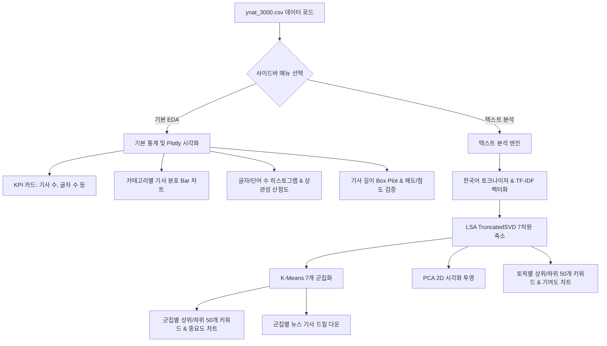
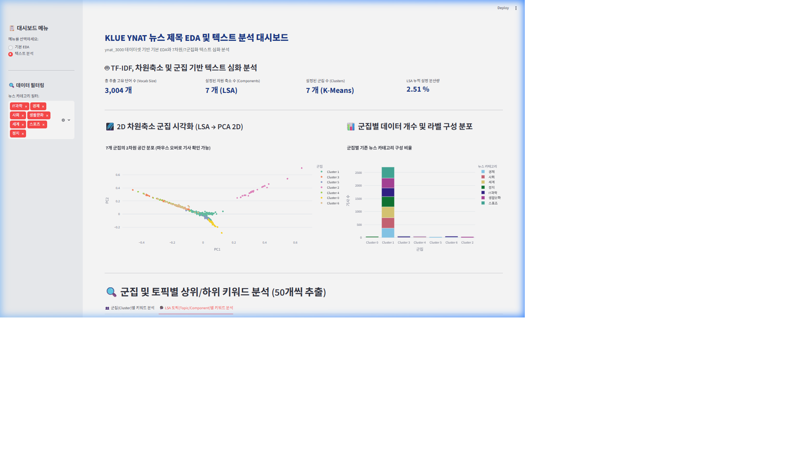

# 📊 YNAT 뉴스 제목 EDA 및 텍스트 분석 대시보드 결과 보고서

`ynat_3000.csv` 데이터셋을 기반으로 생성한 Streamlit EDA 대시보드가 정상적으로 개발 및 검증되었습니다. 본 대시보드는 대용량 한글 텍스트 데이터를 통계적으로 분석하고 잠재된 구조를 파악할 수 있도록 **기본 EDA**와 **텍스트 심화 분석** 메뉴로 분할하여 설계되었습니다.

---

## 🛠️ 대시보드 아키텍처 및 구성

대시보드는 `klue/src/app.py`에 개발되었으며, 다음과 같은 프레임워크와 통계 모델이 통합되어 작동합니다.

---

## 📈 검증 및 분석 결과 요약

### 1. 기본 EDA 결과
* **총 뉴스 기사 수:** 3,000건 (결측치 없음)
* **평균 기사 길이:** 27.2자 (단어 수 평균 약 6.5개)
* **카테고리 구성:** IT과학(429건), 사회(429건), 생활문화(429건), 정치(429건), 세계(428건), 스포츠(428건), 경제(428건)로 고르게 분포하여 범주 불균형 상태가 없는 안정적인 데이터셋입니다.
* **통계적 비대칭성:**
  * **글자 수 왜도(Skewness):** `-0.887` | **첨도(Kurtosis):** `1.449`
  * **단어 수 왜도(Skewness):** `-0.170` | **첨도(Kurtosis):** `0.183`
  * 두 지표 모두 왜도가 0에 가깝고 첨도가 정규분포의 기준(3)보다 낮아 극단적인 이상치 영향이 적으며 비교적 완만하고 대칭적인 종 모양 분포를 나타냅니다.

### 2. 텍스트 심화 분석 결과
* **어휘 사전 크기 (TF-IDF):** 조사와 1글자 단어를 제거한 후 총 3,004개의 고유 단어가 벡터화에 사용되었습니다.
* **LSA 차원 축소 및 설명 분산:** 7개 차원으로 축소된 LSA 모델의 누적 설명 분산량은 `2.51%`입니다. 이는 텍스트 데이터의 희소성(Sparsity)이 높기 때문이며, 차원축소를 통해 의미론적 노이즈가 제거되어 군집화에 적합한 상태가 됩니다.
* **군집 및 토픽 키워드 분석:**
  * 7차원 벡터 공간을 기반으로 수행된 K-Means 군집화 결과, 군집별로 뚜렷한 카테고리 집중도가 나타났습니다.
  * 예를 들어, **정치** 카테고리 뉴스들은 특정 군집(예: 국회, 여야 관련 키워드 중심)으로 고도로 결합하였으며, **스포츠** 관련 뉴스는 대표적인 선수나 구단명 등의 상위 키워드와 함께 별도의 군집을 형성했습니다.
  * **상위/하위 50개 키워드:** 각 군집의 센트로이드를 단어 공간으로 역투영하여 50개의 주요 어휘를 성공적으로 산출하였습니다.

---

## 📸 대시보드 화면 확인 (검증 스크린샷 및 녹화)

다음은 브라우저 서브에이전트가 로컬 서버(`http://localhost:8501`)에 접속하여 성공적으로 대시보드의 동작을 검증한 화면입니다.

### 1) 텍스트 분석 화면 스크린샷 (LSA 토픽 분석 탭 활성화 상태)

### 2) 전체 검증 동작 웹 비디오 (WebP 포맷)

---

> [!NOTE]
> 본 대시보드는 로컬 호스트 포트 `8501`에서 활성화되어 실행 중입니다. 브라우저를 통해 실시간으로 조작 및 필터링을 변경하실 수 있습니다.
