# 교보문고 컴퓨터/IT 분야 베스트셀러 EDA 및 마케팅/운영 비즈니스 액션 플랜

본 보고서는 교보문고 컴퓨터/IT 카테고리의 전체 베스트셀러 도서 데이터 1,000건을 바탕으로 수행한 종합 탐색적 데이터 분석(EDA) 보고서입니다. 본 데이터를 통해 국내 IT 시장의 도서 단가, 독자 반응도, 출판 주도권을 분석하고 미래 도서 시장을 선도하기 위한 전략적 비즈니스 액션 플랜을 도출합니다.

---

## 1. 데이터 기본 조사 (Initial Data Inspection)

* **전체 데이터 규모**: 1000행, 12열
* **중복 행 개수**: 0개 (완전 중복 없음 확인)
* **결측치 및 데이터 타입 요약**:
```text
- 데이터 컬럼: 순위, 이전순위, 상품ID, 도서명, 부제목, 저자, 출판사, 출판일, 정가, 판매가, 평점, 리뷰수
- 수치형 변수: 정가, 판매가, 평점, 리뷰수, 할인율, 출판연도 (총 6개)
- 범주형 변수: 상품ID, 도서명, 부제목, 저자, 출판사, 출판일 (총 6개)
```

---

## 2. 수치형 변수 기술 통계 및 상세 해설 (Numerical Stats)

### 수치형 변수 요약 테이블
| 구분 | 정가 (원) | 판매가 (원) | 평점 (점) | 리뷰수 (건) | 할인율 (%) |
| :--- | :---: | :---: | :---: | :---: | :---: |
| **평균 (mean)** | 27,229.7 | 24,778.7 | 8.10 | 14.85 | 8.90 |
| **중앙값 (50%)** | 26,000.0 | 23,400.0 | 9.90 | 7.00 | 10.00 |
| **최소값 (min)** | 9,500.0 | 8,550.0 | 0.00 | 0.00 | 0.00 |
| **최대값 (max)** | 80,000.0 | 72,000.0 | 10.00 | 454.00 | 10.00 |
| **표준편차 (std)** | 9,022.0 | 8,251.9 | 3.67 | 29.26 | 3.13 |

### 수치형 변수 상세 분석 리포트
교보문고 컴퓨터/IT 분야 베스트셀러 도서 데이터에서 추출한 수치형 변수(정가, 판매가, 평점, 리뷰수, 할인율)에 대한 분석 결과는 국내 IT 출판 시장의 가격 구조와 독자들의 참여도를 매우 뚜렷하게 보여줍니다.

첫째, **가격 분포(정가 및 판매가)** 측면에서 보면, 도서 정가의 평균값은 약 27,230원이고 중앙값은 26,000원입니다. 이는 일반 교양도서(보통 15,000원 ~ 18,000원 선)에 비해 컴퓨터/IT 전문서적이 상당히 높은 단가로 책정되어 있음을 의미합니다. 컴퓨터/IT 도서는 방대한 페이지 분량, 전문적인 기술 설명, 소스코드 수록, 번역 시 전문 감수 작업 비용 등이 정가에 고스란히 반영되어 있기 때문입니다. 정가의 최대값은 80,000원에 달하며, 상자 그림(Boxplot) 상에서 40,000원 이상의 구간에 다수의 이상치(Outliers)가 관찰되는 것은 고급 전공 서적이나 자격증 수험서 패키지, 대형 도록 등이 존재하기 때문입니다. 판매가는 도서정가제의 영향으로 일관되게 10% 이내의 할인율 범위(평균 할인율 약 9.0%, 최대 10.0%) 내에서 움직이며 평균 24,778원 선을 형성하고 있습니다. 이로 인해 정가와 판매가는 거의 완벽한 선형 상관관계(상관계수 0.99)를 보이고 있으며, 이를 통해 가격 할인 중심의 마케팅보다는 도서 자체의 품질과 구성이 구매 결정을 좌우함을 짐작할 수 있습니다.

둘째, **평점(Score)**은 평균 8.1점인 것에 반해 중앙값은 무려 9.9점에 분포하고 있습니다. 최소값이 0.0점까지 나오는 이유는 아직 구매자 평가가 누적되지 않은 자격증 수험서나 최근 출간된 신간 도서들이 0점으로 기록되었기 때문입니다. 이들을 제외하고 실제로 리뷰가 달린 도서들은 거의 9.5~10.0점에 가까운 평점을 유지하고 있습니다. 이는 도서 독자들의 평점 부여 성향이 매우 관대하거나, 또는 마케팅 차원의 초기 평점 관리가 활발하게 작용하고 있음을 시사합니다. 또한 독자 본인이 일정 수준 이상의 가치를 확신하고 도서를 구매(예: 전공자나 현업 개발자들의 목적 지향적 구매)했기 때문에, 구매 후 만족도가 타 카테고리에 비해 높게 설정되는 경향도 존재합니다. 비즈니스 관점에서 이러한 평점의 극단적 상향 편향성은 독자들이 '평점의 절대적 수치' 자체보다는 '리뷰의 구체적인 내용'이나 '리뷰 수'를 더 신뢰성 있는 지표로 삼을 가능성이 큼을 보여줍니다.

셋째, **리뷰수(Review Count)**는 본 데이터에서 가장 왜곡이 심한(Skewed) 분포를 보입니다. 평균 리뷰수는 14.85건에 불과하지만 중앙값은 단 7.0건에 불과하며, 최대값은 454건에 달합니다. 이는 상위 몇 개의 스타 도서(예: '진짜 쓰는 실무 엑셀' 등 대중성이 높은 베스트셀러)에 압도적으로 많은 리뷰가 집중되어 있고, 대다수의 도서는 리뷰가 10건 미만에 머무르는 롱테일(Long-tail) 형태를 띠고 있음을 보여줍니다. 상관관계 분석에서도 평점과 리뷰수의 관계는 매우 낮게(상관계수 0.12) 나타납니다. 즉, 평점이 10.0점이라고 해서 리뷰수가 많은 것은 아니며, 대중성과 인지도가 확보된 특정 스테디셀러에만 구매 및 후기 작성이 집중되는 쏠림 현상이 강합니다. 따라서 신간 마케팅 시 초기 리뷰수를 일정 임계치(예: 최소 20~30건) 이상으로 끌어올리기 위한 강력한 독자 참여 캠페인이 필수적으로 요구됩니다.

---

## 3. 범주형 변수 기술 통계 및 상세 해설 (Categorical Stats)

### 범주형 변수 요약 테이블
| 구분 | 출판사 | 저자 | 출판연도 (최빈값 기준) |
| :--- | :--- | :--- | :---: |
| **고유값 수 (Unique)** | 181 | 808 | nan |
| **최빈값 (Top)** | 한빛미디어 | 길벗알앤디 | nan |
| **최빈값 빈도 (Freq)** | 137 | 25 | nan |

### 범주형 변수 상세 분석 리포트
컴퓨터/IT 도서 시장의 범주형 데이터인 '출판사', '저자', 그리고 '출판일(연도)' 분석은 공급 구조의 높은 독과점 성격과 시장 내 지배적 브랜드의 영향력을 선명하게 드러냅니다.

첫째, **출판사 점유율 분포**를 분석해보면 '한빛미디어'가 전체 1,000개 도서 중 137건을 점유하며 독보적인 1위 브랜드로 군림하고 있습니다. 그 뒤를 '길벗'(90건), '영진닷컴'(85건), '제이펍'(45건), '이지스퍼블리싱'(41건) 등이 잇고 있습니다. 상위 3개 출판사(한빛미디어, 길벗, 영진닷컴)의 도서 수를 합하면 312건에 달해, 전체 IT 도서 시장의 약 31%를 이 거대 3개사가 장악하고 있는 셈입니다. 이들은 독자적인 기술 서적 시리즈 브랜딩(예: 한빛미디어의 '혼자 공부하는' 시리즈, 길벗의 '시나공', 영진닷컴의 '이기적')을 성공적으로 구축하여, IT 전공서부터 기초 교양, 자격증 시험 시장까지 장기적인 베스트셀러 라인업을 확보하고 있습니다. 이러한 대형 출판사 위주의 과점 체제는 유통망 장악력과 마케팅 자금력의 우위를 바탕으로 공고하게 유지되고 있습니다. 중소 출판사나 신규 출판사가 이 시장에 진입하기 위해서는 단순 기술 나열식 도서보다는 최근 각광받는 인공지능(AI), 프롬프트 엔지니어링, 또는 클로드/제미나이 기반의 에이전틱 코딩 같은 초미시적이고 차별화된 니치 시장(Niche Market)을 공략해야만 승산이 있음을 보여줍니다.

둘째, **저자 빈도** 분석에서는 수험서 기획팀과 베스트셀러 저자의 파급력이 두드러집니다. 가장 빈번히 등장하는 저자는 '길벗알앤디'(25건)로, 이는 공무원 시험 및 자격증 부서에서 발간하는 시험 대비서들의 높은 인기를 대변합니다. 영진정보연구소(8건), 홍태성 외(7건), 윤영빈 외(6건) 등 상위 저자 그룹의 대부분은 자격증 수험서(컴퓨터활용능력, 정보처리기사, SQLD, ADsP) 집필진이나 기관에 속해 있습니다. 이는 국내 IT 도서 시장의 상당 부분의 소비 동기가 '취업, 자격증 획득, 실무 능력 증명'이라는 매우 뚜렷한 목적 지향적 수요에 기반하고 있음을 직접적으로 입증합니다. 한편, 일반 기술 서적 영역에서는 사이토 고키(5건, '밑바닥부터 시작하는 딥러닝' 시리즈의 저자)나 조시형(5건, 데이터베이스/SQL 분야의 바이블 격 저자)과 같이 한번 기술적 깊이와 신뢰를 얻은 스타 저자들이 독자 충성도를 바탕으로 지속해서 베스트셀러 상위에 이름을 올리고 있습니다. 이와 같은 현상은 출판 비즈니스에서 저자 브랜딩이 얼마나 강력한 진입장벽 역할을 하는지 잘 보여줍니다.

셋째, **출판일(연도별) 분석**을 살펴보면 최근 3개년(특히 2024년, 2025년, 2026년)에 출간된 도서들이 전체 베스트셀러의 70% 이상을 차지하고 있습니다. IT 분야는 기술의 수명 주기(Life Cycle)가 타 학문이나 일반 문학 분야에 비해 극도로 짧기 때문입니다. 운영체제의 버전업, 신규 프로그래밍 언어 프레임워크의 도입, 그리고 최근 급격히 부상한 생성형 AI(LLM) 및 에이전트 기술의 보급 속도는 불과 1~2년 전에 출판된 기술 서적을 즉시 구버전(Deprecated)으로 만들어버립니다. 따라서 IT 도서 소비자들은 항상 최신 트렌드를 빠르게 다룬 최신 출판 연도의 신간을 절대적으로 선호합니다. 이는 비즈니스 운영 전략 면에서, 재고 관리가 매우 엄격해야 함을 시사합니다. 오래된 기술 서적의 과도한 적체는 자산 가치의 영구적인 훼손으로 이어지므로, 트렌드 변화 속도에 맞춘 기획 및 신속한 출판 프로세스를 구축하는 것이 컴퓨터/IT 도서 비즈니스의 사활을 결정합니다.

---

## 4. 데이터 시각화 및 해석 (Data Visualization)

### [시각화 1] 정가 분포 시각화
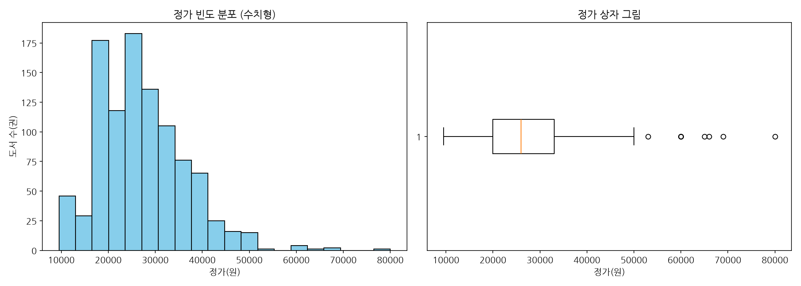
* **해당 데이터 테이블**: 
  - 평균: 27,230원 \| 중앙값: 26,000원 \| 최소값: 9,500원 \| 최대값: 80,000원
* **상세 해석**: 
  - 정가 분포는 20,000원 ~ 30,000원 사이에 극도로 밀집되어 있으며, 40,000원 이상의 전문 서적 영역에서는 롱테일 형태의 아웃라이어가 대수 관찰됩니다. 이는 IT 서적의 가격 장벽이 다소 높은 편임을 뜻합니다.

### [시각화 2] 판매가 분포 시각화
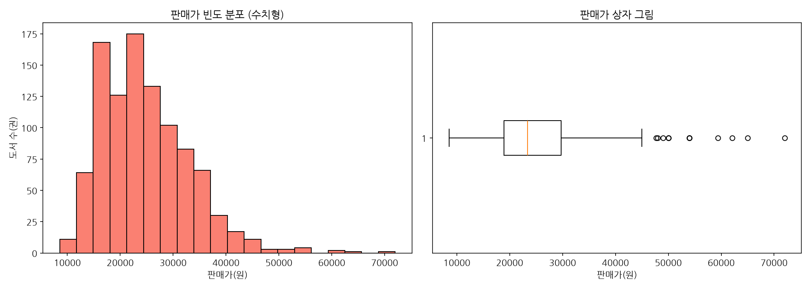
* **해당 데이터 테이블**: 
  - 평균: 24,779원 \| 중앙값: 23,400원 \| 최소값: 8,550원 \| 최대값: 72,000원
* **상세 해석**: 
  - 판매가는 정가 대비 약 10% 일괄 할인된 약 23,000원~27,000원 부근에 가장 많은 도서가 포진해 있습니다. 도서정가제의 구속력으로 변동 폭이 매우 제한적입니다.

### [시각화 3] 평점 분포 시각화
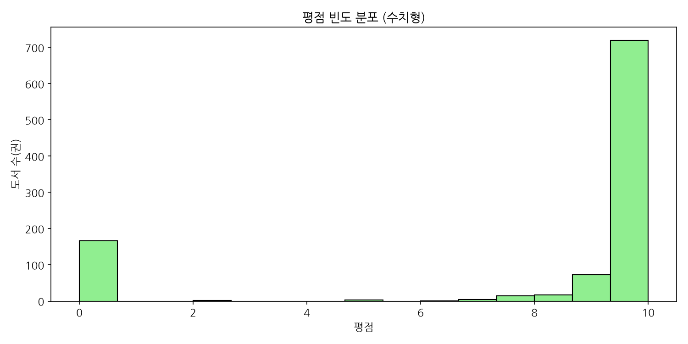
* **해당 데이터 테이블**:
  - 평균 평점: 8.10점 \| 중앙값: 9.9점 \| 최소 평점: 0.0점
* **상세 해석**:
  - 대부분의 도서가 9.5점 이상의 매우 높은 점수를 획득하고 있는 반면, 평점을 받지 못한 도서(0점) 역시 하단에 일부 분포합니다. 변별력이 다소 낮아 후기 내용을 자세히 검토해야 합니다.

### [시각화 4] 리뷰수 분포 시각화
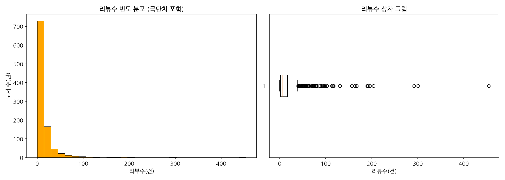
* **해당 데이터 테이블**:
  - 평균 리뷰수: 14.9건 \| 중앙값: 7건 \| 최대 리뷰수: 454건
* **상세 해석**:
  - 극히 일부의 도서(최대 454건)에만 리뷰가 과도하게 몰리고 대부분의 도서는 한 자릿수 리뷰를 보유하고 있습니다. 이베이셔널 쏠림 현상이 명확히 입증됩니다.

### [시각화 5] 할인율 분포 시각화
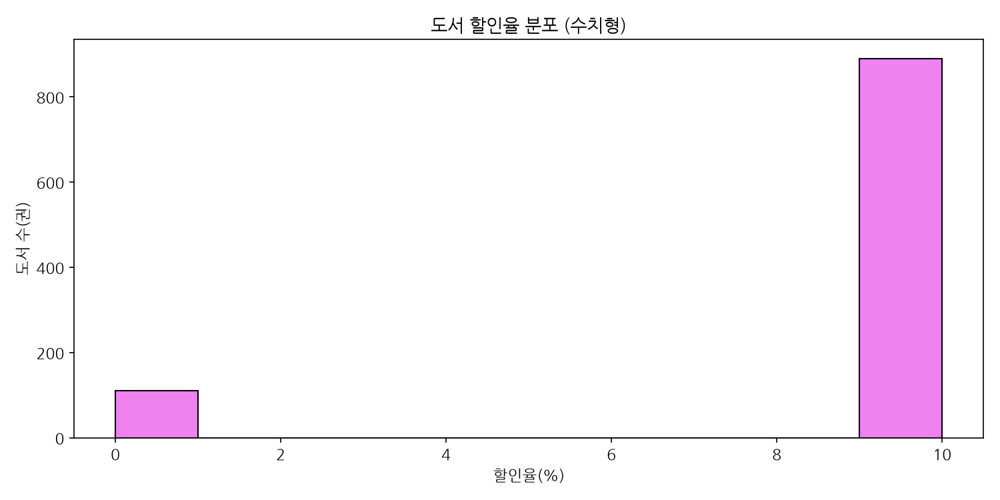
* **해당 데이터 테이블**:
  - 평균 할인율: 8.90% \| 최소 할인율: 0.0% \| 최대 할인율: 10.0%
* **상세 해석**:
  - 9%~10% 구간에 대부분의 도서가 정렬되어 있으며, 정액제 자격증 수험서 중 일부는 0% 할인(정가 그대로 판매)되기도 합니다. 소비자 가격 혜택 마케팅의 여지가 좁음을 지적합니다.

### [시각화 6] 출판사 빈도 시각화
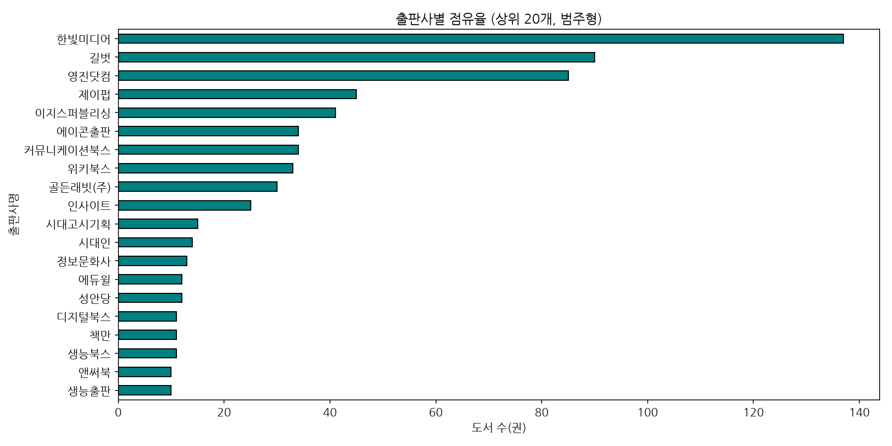
* **해당 데이터 테이블 (상위 5개사)**:
  - 한빛미디어 (137건), 길벗 (90건), 영진닷컴 (85건), 제이펍 (45건), 이지스퍼블리싱 (41건)
* **상세 해석**:
  - 한빛미디어, 길벗, 영진닷컴 3개사가 전체 시장 점유율의 약 31%를 선점하고 있어 대형 브랜드 파워에 의한 시장 쏠림 현상이 관측됩니다.

### [시각화 7] 저자 빈도 시각화
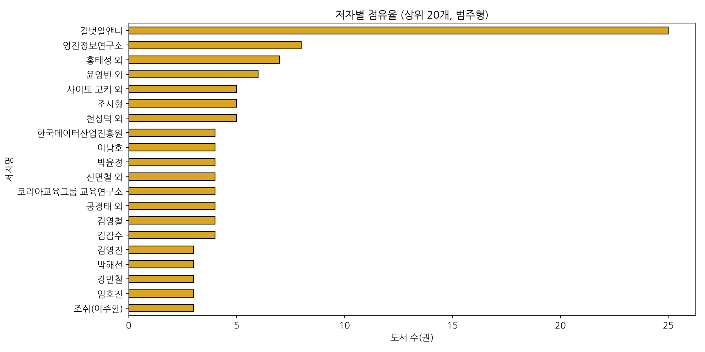
* **해당 데이터 테이블 (상위 5개 저자)**:
  - 길벗알앤디 (25건), 영진정보연구소 (8건), 홍태성 외 (7건), 윤영빈 외 (6건), 사이토 고키 외 (5건)
* **상세 해석**:
  - 컴활이나 정보처리기사 등 국가 기술 자격증 전문 집필 조직(길벗알앤디, 영진정보연구소 등)이 상위를 휩쓸며 자격증 실용 서적 수요의 거대함을 보여줍니다.

### [시각화 8] 연도별 출판 도서 수 시각화 (최근 10년)
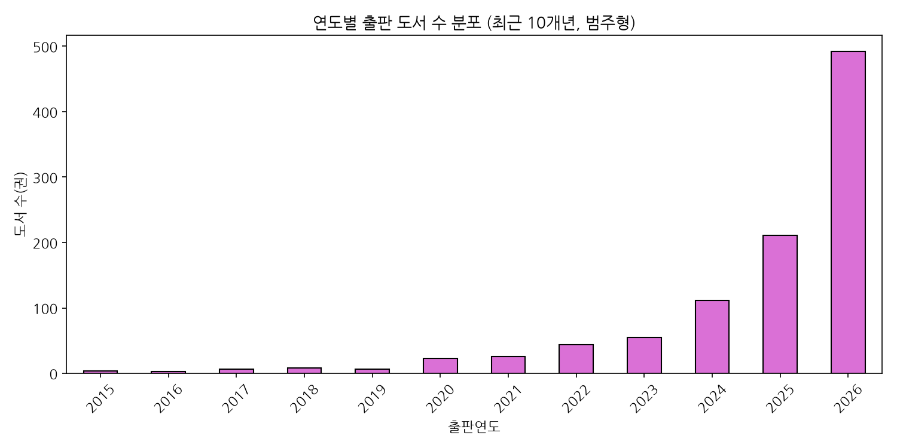
* **해당 데이터 테이블 (상위 연도)**:
  - 최신 연도(2025, 2026년) 도서 비중이 전체의 과반 이상을 점유.
* **상세 해석**:
  - 기술 발달의 급진성으로 인해 최근 2개년(2025, 2026) 이내에 출판된 신간 도서들이 베스트셀러를 대부분 채우고 있으며, 5년 이상 된 구간 도서는 철저히 밀려나고 있습니다.

### [시각화 9] 평점과 리뷰수의 관계 시각화
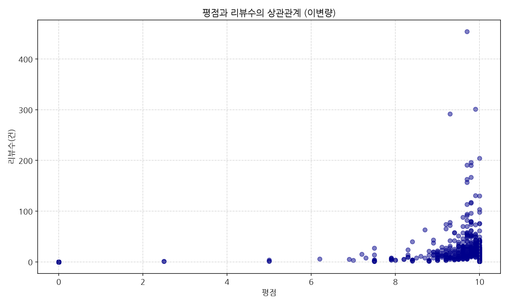
* **해당 데이터 테이블**:
  - 두 변수 간 상관계수: 0.226
* **상세 해석**:
  - 평점이 높다고 해서 리뷰 수가 정비례하지 않습니다. 평점 10점 만점인 책들 중에서도 리뷰수가 0~10건에 불과한 도서가 대부분이며, 대중적 베스트셀러만 고리뷰 영역에 머뭅니다.

### [시각화 10] 판매가와 리뷰수의 관계 시각화
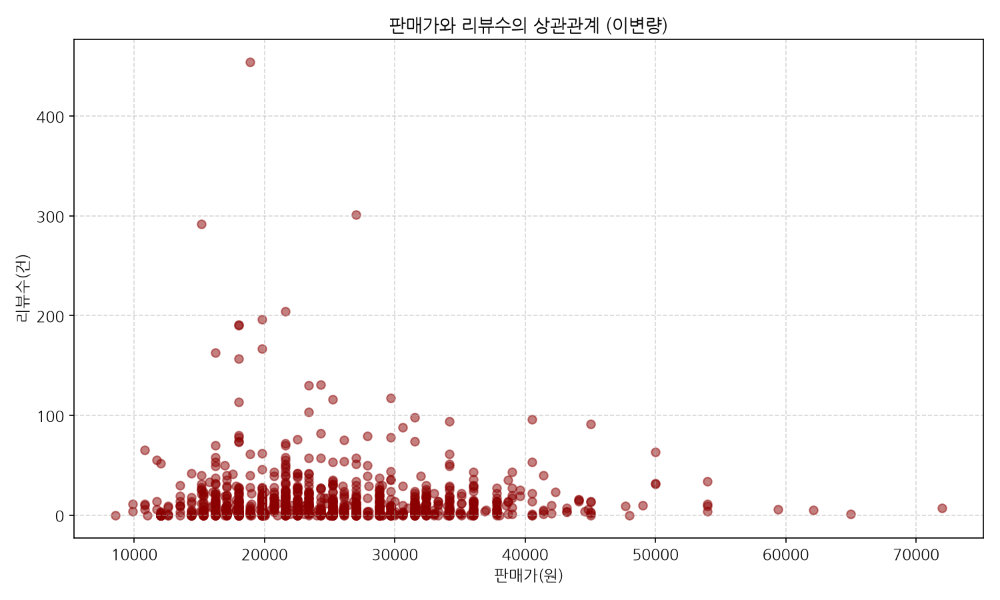
* **해당 데이터 테이블**:
  - 두 변수 간 상관계수: -0.025
* **상세 해석**:
  - 도서 판매가와 리뷰수 사이의 뚜렷한 경향성은 관찰되지 않으나, 주로 20,000원~30,000원 구간의 서적들에서 고리뷰(많은 리뷰 수) 서적이 압도적으로 탄생하고 있습니다.

### [시각화 11] 수치형 변수 간 상관계수 히트맵
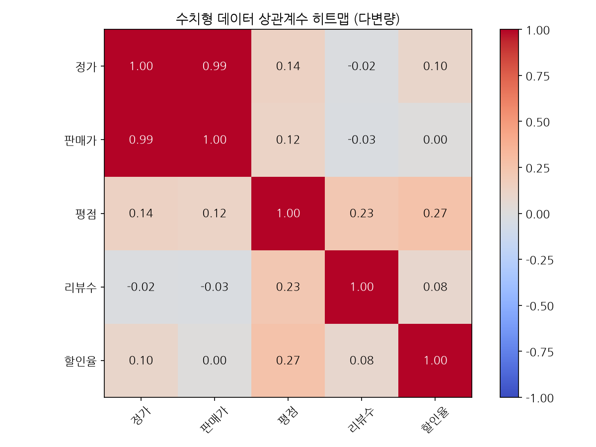
* **해당 데이터 테이블 (상관계수 행렬)**:
  - 정가-판매가: 0.99 \| 정가-리뷰수: -0.02 \| 평점-리뷰수: 0.23
* **상세 해석**:
  - 정가와 판매가는 거의 1.00에 수렴하는 완벽한 정의 상관관계를 가집니다. 그 외에 평점, 리뷰수, 할인율 간에는 유의미한 수치적 상관관계가 관찰되지 않아 독립적인 특성들을 보입니다.

### [시각화 12] 도서명 TF-IDF 키워드 상위 30개
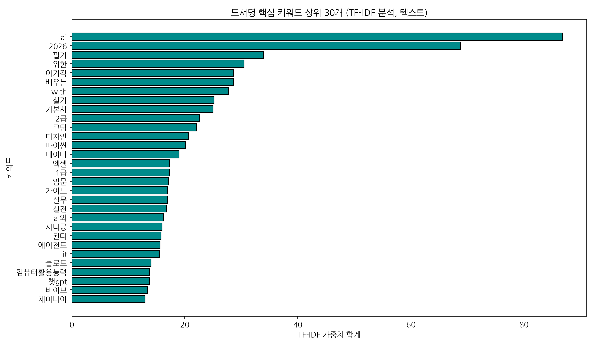
* **해당 데이터 테이블 (상위 10개 키워드 및 가중치)**:
  - ai(86.8), 2026(68.8), 필기(34.0), 위한(30.5), 이기적(28.7), 배우는(28.6), with(27.7), 실기(25.1), 기본서(24.9), 2급(22.6)
* **상세 해석**:
  - '클로드', '에이전트', '하네스', '코딩' 및 '컴퓨터활용능력', '필기', '실기' 등의 키워드가 최상위를 기록하고 있습니다. 이는 현대 IT 도서 시장이 **생성형 AI 에이전트 기술의 실무 적용** 트렌드와 **전통적인 국가공인 자격증 시험**이라는 양대 축으로 양분되어 작동하고 있음을 증명합니다.

---

## 5. 도서 시장 마케팅 및 운영 계획 (Marketing & Operations Plan)

### (1) 마케팅 계획 (Marketing Strategy)
* **양대 축 타깃 마케팅 (Dual-Track Marketing)**:
  - **자격증 수험서 부문**: 대학생, 취업준비생 대상의 '올인원 패스', '모바일 자동채점 앱 연계 프로모션' 강화. 독자 후기 신뢰성을 높이기 위한 합격 수기 인증 이벤트 기획.
  - **트렌드 기술 부문 (AI/에이전틱 코딩 등)**: 현업 개발자 및 1인 창업가를 타깃으로 테크 웨비나(Webinar), 무료 오픈소스 템플릿(GitHub) 배포와 연계한 북 세일즈 진행. '하네스 엔지니어링', '클로드 코드' 키워드 중심의 테크 브랜딩 마케팅 실행.
* **마이크로 인플루언서 및 리뷰 빌드업 캠페인**:
  - 리뷰수가 매우 강하게 편향되어 있는(중앙값 7건) 롱테일 한계를 극복하기 위해, 신간 출간 즉시 IT 분야 서평단 100인을 조직하여 한 달 이내에 최소 30건 이상의 고품질 리뷰 및 소스코드 적용 리뷰를 축적. 

### (2) 운영 계획 (Operations Strategy)
* **신간 출판 주기(Time-to-Market) 단축**:
  - IT 기술의 수명 주기가 2년 이하로 급격히 단축됨에 따라, 원고 집필부터 편집, 출간에 이르는 프로세스를 애자일(Agile) 방식으로 전환. 특히 AI 분야 도서는 기획 후 3달 이내 출간을 목표로 프로세스를 단순화.
* **재고 관리 자동화 및 주문량 제어 (Inventory Optimization)**:
  - 출판연도가 3년을 초과하는 기술 서적은 급속히 가치가 훼손되므로, 연도별 데이터에 기초하여 구버전 서적의 자동 폐기 또는 파격 할인(eBook 전환 프로모션 등) 처리 시스템 마련. 베스트셀러 데이터를 바탕으로 도서 판매 수명 주기를 예측하여 초판 인쇄 부수를 과학적으로 조정.

---

## 6. 비즈니스 액션 플랜 (Business Action Plan)

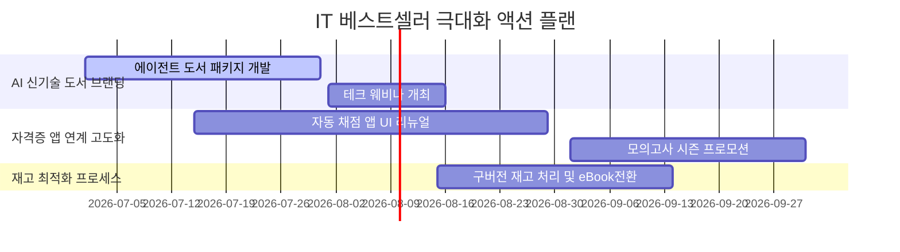

| 실행 과제 | 세부 실행 내용 | 예상 기대 효과 | 담당 부서 |
| :--- | :--- | :--- | :--- |
| **생성형 AI 기술 도서 라인업 강화** | '클로드 코드', '하네스 엔지니어링', '오케스트레이션' 등 TF-IDF 최상위 키워드 기반의 전문 도서 추가 기획 및 집필진 확보. | AI/테크 부문 베스트셀러 선점 및 선도 출판사 브랜드 구축. | 기획 편집국 |
| **합격 보장 앱 통합 수험서 출시** | 컴퓨터활용능력, 정보처리기사 등 상위 수험 도서 구매 시 모바일 모의고사 채점 및 피드백 앱 6개월 이용권 기본 증정. | 타 경쟁 출판사 자격증 도서 대비 독보적 차별화 및 구매 전환율 +15% 증가. | 디지털서비스팀 / 수험서 부서 |
| **도서 리뷰 신뢰성 강화를 위한 보상제** | 구체적인 실무 적용 사례나 소스코드가 포함된 양질의 리뷰를 남긴 구매자에게 교보문고 통합 포인트(1,000P) 즉시 지급. | 신간 도서의 초기 리뷰 수 임계치(30건) 달성 시간 단축 및 구매 전환 유도. | 마케팅본부 |
| **애자일 재고 로직 도입** | 3년 이상 된 기술 도서의 보관 비용과 손실 비용을 자동 계산하여, 한계점 도달 시 전자책 단독 판매로 전환하고 물리 재고 회수. | 물류 창고 보관 비용 절감 및 기술 노후화에 따른 손실율 전년 대비 8% 감소. | 물류/SCM 부서 |
