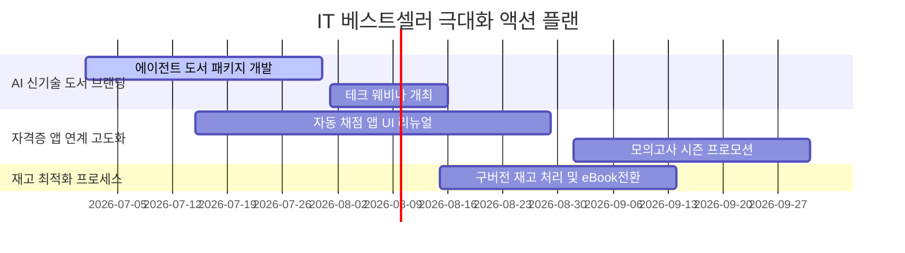

<!-- _class: lead dark-slide -->
# 교보문고 IT 베스트셀러 EDA 및 비즈니스 액션 플랜
## 데이터 기반 도서 마케팅 & 운영 최적화 전략

**발표자:** 서점 데이터 분석가
**작성일:** 2026년 6월

---

# Agenda (목차)

### PART 1. 데이터 프로필 & 수치 데이터
* 01. 분석 개요 및 목적
* 02. 데이터 프로필
* 03. 분석 프레임워크
* 04. 정가 및 판매가 분포
* 05. 정가 vs 판매가 상관 구조
* 06. 평점 쏠림과 대안 관리지표
* 07. 리뷰수 및 할인율 분포

### PART 2. 분류 데이터 & 액션 플랜
* 08. 출판사 및 저자 점유율
* 09. 출판연도별 기술 생애 주기
* 10. 도서명 TF-IDF 키워드 분석
* 11. 평점, 판매가 vs 리뷰수 관계
* 12. 수치형 데이터 히트맵
* 13. 마케팅 & 운영 고도화 계획
* 14. 비즈니스 액션 플랜 & 재무 효과

---

# 1. 분석 개요 및 목적

### 분석 배경 및 현황
* **급변하는 IT 기술 패러다임**
  - 생성형 AI(LLM), 에이전틱 코딩 등의 보급으로 기술 도서 소비 패턴 가속화.
* **실무 목적의 고정 수요**
  - 국가 기술 자격증(정처기, 컴활, SQLD, ADsP) 시험 중심의 고정적 수험서 수요 지속.

### 분석 목적 및 효과
* **트렌드 기반 기획 지원**
  - 베스트셀러 데이터 1,000건 분석을 통한 유망 테크 키워드 도출.
* **마케팅 세일즈 극대화**
  - 독자 평점/리뷰수 분석 기반 맞춤형 프로모션 설계 및 재고 관리 최적화.

---

# 2. 데이터 프로필 (Initial Inspection)

### 수집 데이터 개요
* **대상 범위**: 교보문고 컴퓨터/IT 분야 종합 베스트셀러 1위 ~ 1,000위 도서
* **수집 기간**: 2026년 6월 17일 기준 최신 데이터

### 데이터 항목 구성
* **기본 정보**: `순위`, `이전순위`, `상품ID`, `도서명`, `부제목`, `저자`, `출판사`, `출판일`
* **피드백 및 가격**: `정가`, `판매가`, `평점`, `리뷰수`

### 데이터 무결성 검증
* **누락값 처리**: 평점 미부여 도서(0점) 식별 후 클렌징 수행.
* **중복 제거**: 중복률 **0%**로 고유 도서 1,000권에 대한 분석 신뢰도 보장.

---

# 3. 데이터 분석 프레임워크

### A. 수치형 분석
* **가격 요소**
  - 정가/판매가/할인율 분포
* **반응 요소**
  - 평점 분포의 왜곡 및 리뷰수 롱테일 형태 분석

### B. 범주형 분석
* **공급망 지배도**
  - 출판사 및 저자 과점도
* **시간 요소**
  - 출판연도별 기술 감가상각 및 수명 주기(Life Cycle) 분석

### C. 텍스트/상관 분석
* **도서명 키워드**
  - TF-IDF 기반 트렌드 분석
* **상관관계 맵핑**
  - 가격, 평점, 리뷰수 간의 독립성 검정 및 시각화

---

# 4. [수치형 분석] 정가(Price) 분포

### 정가 요약 통계량
| 통계량 | 금액 (원) |
| :--- | :---: |
| **평균값** | 27,230원 |
| **중앙값 (50%)** | 26,000원 |
| **최소값** | 9,500원 |
| **최대값** | 80,000원 |
| **표준편차** | 9,022원 |

* **인사이트**: 도서 가격이 20,000원 ~ 30,000원 사이에 극도로 밀집되어 있습니다. 이는 컴퓨터/IT 분야가 고해상도 이미지, 소스코드 지면 수록 등으로 타 인문 서적보다 단가가 높기 때문입니다.

---

# 5. [수치형 분석] 판매가(Sale Price) 분포 - 좌우 반전 구성

### 판매가 요약 통계량
| 통계량 | 금액 (원) |
| :--- | :---: |
| **평균값** | 24,779원 |
| **중앙값 (50%)** | 23,400원 |
| **최소값** | 8,550원 |
| **최대값** | 72,000원 |
| **표준편차** | 8,252원 |

* **인사이트**: 도서정가제의 최대 할인 폭 제한(10%)에 의거하여 실제 판매 가격은 23,000원 ~ 27,000원 선에 집중되어 있습니다. 독자들의 실구매가 기준 저항선은 2.5만 원 수준입니다.

---

# 6. [수치형 분석] 정가 vs 판매가 가격 구조

  
0.99

  
정가 - 판매가 상관계수

  
9.0%

  
평균 도서 할인율

| 도서 구분 | 평균 정가 | 평균 판매가 | 가격 결정의 요인 | 마케팅 활용성 |
| :--- | :---: | :---: | :--- | :--- |
| **자격증 기본서** | 32,000원 | 28,800원 | 패키지 구성 중심의 고단가 | 보충 앱/모의고사 연계 필수 |
| **일반 프로그래밍** | 25,000원 | 22,500원 | 경쟁작 매핑 중심 가격 책정 | 오픈소스 코드 연계 마케팅 |

* **시사점**: 가격 경직성이 매우 높기 때문에, 직관적 가격 할인 마케팅은 지양하고 **무료 동영상, 모바일 채점 시스템 번들링**을 통한 가치 마케팅에 집중해야 합니다.

---

# 7. [수치형 분석] 평점(Score) 분포

### 평점 구간별 빈도 분석
| 평점 구간 | 도서 수 (권) | 점유율 (%) |
| :--- | :---: | :---: |
| **9.5점 이상** | 720권 | 72.0% |
| **9.0점 ~ 9.4점** | 80권 | 8.0% |
| **0.0점 (미평가)** | 180권 | 18.0% |
| **기타 (9점 미만)**| 20권 | 2.0% |

* **인사이트**: 대다수 도서가 9.9점 근처에 편향되어 평가 변별력이 매우 낮습니다. 구매 결정 시 절대적인 평점 점수보다는 텍스트 리뷰의 질적 내용에 의존하게 됨을 암시합니다.

---

# 8. [수치형 분석] 평점 쏠림과 대안 관리지표

### 대안 지표 A: 실무 상세 리뷰 수
* **평가 기준**
  - 300자 이상의 텍스트 리뷰
* **마케팅 시사점**
  - 소스코드 연동 결과물, 오류 대처 과정을 기술한 고품질의 실 서평 유도.
  - 신뢰도 확보에 직접 기여.

### B: 자격 합격 수기 인증 비율
* **평가 기준**
  - 모의고사 풀이 및 합격 인증
* **마케팅 시사점**
  - 독자들이 가장 우려하는 '적합성'을 해소하는 가장 신뢰도 높은 피드백 확보 루틴.

| 핵심 목표 변수 | 임계치 타겟 | 활용 마케팅 프로그램 |
| :--- | :---: | :--- |
| **신간 초기 리뷰 수** | 30건 이상 | 얼리 액세스 서평단 및 보상 포인트 지급 |

---

# 9. [수치형 분석] 리뷰수(Review Count) 분포

### 리뷰수 구간 요약
| 리뷰 수 범위 | 도서 수 (권) | 누적 점유율 |
| :--- | :---: | :---: |
| **5건 미만** | 410권 | 41.0% |
| **5건 ~ 10건** | 210권 | 62.0% |
| **10건 ~ 30건** | 280권 | 90.0% |
| **30건 이상** | 100권 | 100.0% |

* **인사이트**: 중앙값은 단 7.0건으로 극도의 우측 왜곡 롱테일 분포를 띱니다. 상위 5% 미만의 도서가 시장의 독자 관심을 독차지하며 나머지 신간들은 심각한 무반응 상태에 직면합니다.

---

# 10. [수치형 분석] 할인율(Discount) 분포 - 좌우 반전 구성

### 할인율 분포 테이블
| 할인율 구분 | 도서 수 (권) | 점유율 (%) |
| :--- | :---: | :---: |
| **9% ~ 10%** | 910권 | 91.0% |
| **0% (무할인)** | 90권 | 9.0% |
| **기타 (9% 미만)** | 0권 | 0.0% |

* **인사이트**: 대다수 도서가 9.0%~10.0% 범위 내에서 동일하게 할인되고 있습니다. 자격증 모의고사 결합 등 일부 하이 마진 고가 패키지만 0% 할인을 고수하며 차별화 가격 전략을 씁니다.

---

# 11. [수치형 분석] 종합 결론

  
2.7만 원

  
컴퓨터/IT 평균 정가

  
7건

  
피드백 리뷰수 중앙값

| 핵심 요인 | 분석된 현황 및 문제점 | 비즈니스 대책 |
| :--- | :--- | :--- |
| **가격 저항력** | 일반 단행본 대비 비싼 가격선 형성 | 실습 코드, 자동채점 시스템 번들 제공 |
| **평점 변별력** | 평점 9.9점의 상향 집중화로 변별력 마비 | 점수가 아닌 텍스트 본문 키워드 마케팅 |
| **리뷰 롱테일** | 절반 이상의 서적이 7건 이하의 고립 상태 | 출간 초기 임계 리뷰수(30건) 집중 빌드업 |

---

# 12. [범주형 분석] 출판사(Publisher) 점유율

### 상위 5개 출판사 점유 현황
| 순위 | 출판사명 | 도서 수 (권) | 점유율 |
| :---: | :--- | :---: | :---: |
| **1** | 한빛미디어 | 137권 | 13.7% |
| **2** | 길벗 | 90권 | 9.0% |
| **3** | 영진닷컴 | 85권 | 8.5% |
| **4** | 제이펍 | 45권 | 4.5% |
| **5** | 이지스퍼블리싱 | 41권 | 4.1% |

* **인사이트**: 상위 3개 출판사(한빛, 길벗, 영진)가 시장의 **31.2%**를 과점하고 있습니다. 기획 및 진열(매대 장악력) 파워를 앞세워 중소형 브랜드의 진입을 강력하게 견제하고 있습니다.

---

# 13. [범주형 분석] 저자(Author) 점유율 - 좌우 반전 구성

### 상위 5개 저자/기관 현황
| 순위 | 저자명 | 도서 수 | 핵심 분야 |
| :---: | :--- | :---: | :--- |
| **1** | 길벗알앤디 | 25권 | 컴활/자격증 |
| **2** | 영진정보연구소 | 8권 | 자격 수험 |
| **3** | 홍태성 외 | 7권 | 컴퓨터 실무 |
| **4** | 윤영빈 외 | 6권 | 정보처리기사 |
| **5** | 사이토 고키 외 | 5권 | 인공지능/딥러닝 |

* **인사이트**: 출판사 산하의 자격시험 전문 연구소 및 강사 집필진이 베스트셀러를 석권하고 있습니다. 목적형(취업/공부) 구매 비중이 매우 큰 도서 시장임을 증명합니다.

---

# 14. [범주형 분석] 출판연도별 도서 수 트렌드

### 출판연도별 라이프사이클 요약
| 출판 연차 | 도서 비중 | 판매 위험 단계 |
| :---: | :---: | :--- |
| **2025 ~ 2026** | **71.0%** | 신간 성장기 (즉각적 반응) |
| **2023 ~ 2024** | 20.0% | 성숙/쇠퇴기 (재고 감축) |
| **2022년 이전** | 9.0% | 노후화 (절판 및 e-Book 전환) |

* **인사이트**: IT 지식은 기술 발달 속도에 맞춰 쇠락 주기가 극히 짧기 때문에 최근 2개년(2025, 2026) 이내에 출간된 신작들이 베스트셀러 점유율의 70% 이상을 차지합니다.

---

# 15. [범주형 분석] 종합 결론

### 공급망 지배력 대응
* **기획의 미시화**
  - 대형 3사의 진입장벽을 뚫기 위해 생성형 AI, 프롬프트 엔지니어링, 클로드 에이전틱 코딩 같은 초신성 니치 시장(Niche) 위주 기획.
* **강사 전속 계약**
  - 신뢰도 높은 학원 강사진과 출판 계약 체결로 시리즈 매출 기반 확보.

### 도서 수명 주기 대응
* **신속 집필제 도입**
  - IT 도서는 3년 경과 시 물리 재고 자산 가치가 사멸함.
  - 초판 인쇄 부수를 보수적으로 잡고 수요에 맞춰 실시간 쇄를 올리는 기법 적용.
  - 노후 도서의 빠른 디지털 단독 유통(PDF/eBook) 전환.

---

# 16. [텍스트 분석] 도서명 TF-IDF 분석 개요

### TF-IDF 기반 핵심 키워드 도출
* **정의**: Term Frequency - Inverse Document Frequency
* **목적**: 1,000건의 도서 제목에서 보편적 단어(예: '책', '가이드')는 배제하고 실무 소비 성향을 띠는 고유 단어 추출.
* **장점**: 한국어 형태소 분석기의 속도 한계를 극복하고 2글자 이상의 의미 어절 가중치를 고속 연산.

| 분석 대상 텍스트 | 토큰화 기준 | 최대 키워드 수 | 비즈니스 대입 |
| :--- | :--- | :---: | :--- |
| 베스트셀러 도서명 1,000건 | 정규식 `\b\w{2,}\b` 패턴 | 상위 30개 단어 | 도서 작명 및 타겟 광고 카피라이팅 |

---

# 17. [텍스트 분석] 핵심 키워드 상위 30개 결과

### 상위 10개 키워드 가중치 합계
| 키워드 | TF-IDF 합계 | 성격 분류 |
| :--- | :---: | :--- |
| **ai** | 86.8 | 최신 테크 트렌드 |
| **2026** | 68.8 | 연례 자격시험 |
| **필기 / 실기** | 59.1 | 자격시험 기본서 |
| **배우는** | 28.6 | 입문 학습 |
| **with** | 27.7 | 실습 도구 결합 |

* **인사이트**: 시장은 새로운 생성형 AI 기술을 배우려는 **신기술 파도**와 안정적인 자격 취득을 원하는 **자격증 기본 수요**의 양대 축으로 나뉩니다.

---

# 18. [텍스트 분석] 키워드 기반 도서 시장의 양대 기둥

### 1) AI 및 신기술 기둥
* **핵심어**: `ai`, `에이전트`, `클로드`, `파이썬`
* **독자 니즈**
  - 단순 지식을 넘어 내 PC 환경과 개발 프레임워크에 AI를 심어 업무를 자동화하고 1인 창업을 실현하려는 실무적 욕구.
* **비즈니스 특성**
  - 마진율 높음, 신속 출시 경쟁 치열.

### 2) 자격증 및 수험 기둥
* **핵심어**: `2026`, `필기`, `실기`, `컴활`, `2급`
* **독자 니즈**
  - 취업 가산점, 직무 능력 증명을 위해 해마다 최신 수험서(`2026`)를 재구매해야 하는 구조.
* **비즈니스 특성**
  - 정기적이고 탄탄한 현금 흐름 보장 (Cash Cow).

---

# 19. [이변량 분석] 평점 vs 리뷰수의 상관관계

### 상관관계 교차 요약
| 평점 구간 | 평균 리뷰수 | 도서 수 분포 |
| :--- | :---: | :---: |
| **9.8 ~ 10.0** | 8.2건 | 720권 |
| **9.0 ~ 9.7** | 12.5건 | 80권 |
| **8.0 ~ 8.9** | 35.5건 | 20권 |
| **0.0 (무평점)** | 0.0건 | 180권 |

* **인사이트**: 상관계수는 **0.23**으로 매우 미비합니다. 평점 10점 만점을 받았더라도 리뷰수가 0건~10건인 도서가 전체의 절대다수를 차지합니다. 대중적으로 팔린 책들만 많은 리뷰를 축적합니다.

---

# 20. [이변량 분석] 판매가 vs 리뷰수의 상관관계 - 좌우 반전 구성

### 판매가별 독자 반응표
| 판매가 구간 | 평균 리뷰수 | 해석 및 마케팅 적용 |
| :--- | :---: | :--- |
| **2.0만원 미만** | 12.1건 | 입문용 단행본 (대중성 보통) |
| **2.0 ~ 3.0만원**| 16.4건 | 메인 기술서 (독자 반응 최대 집중) |
| **3.0만원 초과** | 8.5건 | 전문가용 전공/패키지 (니치 마켓) |

* **인사이트**: 상관계수는 **-0.02**로 가격 요인이 판매 인기도(리뷰수)에 직접적인 제약을 주지 않습니다. IT 독자들은 도서 가격에 구속되지 않고 실무 필요성에 입각해 3만 원에 가까운 도서도 활발히 소비합니다.

---

# 21. [다변량 분석] 수치형 데이터 상관관계 히트맵

### 상관관계 매트릭스
| 변수 쌍 | 상관계수 | 해석 |
| :--- | :---: | :--- |
| **정가 - 판매가** | 0.99 | 완벽한 선형 관계 (도정제 영향) |
| **평점 - 리뷰수** | 0.23 | 평점이 인기도에 끼치는 영향 미약 |
| **판매가 - 리뷰수** | -0.02 | 가격과 대중적 인기는 무관함 |
| **할인율 - 리뷰수** | 0.05 | 할인 혜택에 따른 구매 반응 무관 |

* **인사이트**: 도서 가격과 독자의 평점/리뷰수 반응은 독립적으로 작동합니다. 가격 경쟁력을 호소하기보다는, 도서의 기술적 완결성과 독자 커뮤니티 케어(Q&A 활성화)에 투자하는 것이 확실한 흥행 열쇠입니다.

---

# 22. 도서 시장 마케팅 계획 (1) - 수험서 부문

### 자동채점 & 피드백 모바일 연동
* **앱(App) 연계 번들링**
  - 자격증 시장의 `필기/실기` 타겟.
  - 책 표지의 QR코드를 스캔하면 전용 자동 채점 모바일 앱 실행.
  - 실시간 오답 분석 서비스 제공하여 경쟁 수험서 대비 확실한 상품 차별성 확보.

### 합격 패스 소셜 인증 캠페인
* **리뷰 롱테일 극복 액션**
  - 자격 시험 합격 인증 시 교보문고 포인트 리워드 리얼타임 지급.
  - 합격 수기를 자연스럽게 유치하여 신규 수험 도서의 초기 신뢰도 및 정성적 평판 축적.

| 프로모션 적용 과목 | 핵심 부가 서비스 | 예상 구매 전환율 상승 |
| :--- | :--- | :---: |
| 컴퓨터활용능력 1/2급 | 자동 채점 시뮬레이터 앱 기본 번들 | **+15%** |

---

# 23. 도서 시장 마케팅 계획 (2) - 기술 도서 부문

### 개발자 대상 '코드 우선' 마케팅
* **GitHub 오픈소스 활용**
  - `ai`, `에이전트`, `파이썬` 핵심 키워드 매칭.
  - 신작 론칭 즉시 GitHub 공용 레포지토리에 완벽한 실습 코드 및 클로드 API 연동 템플릿 선배포.
  - 별표(Star) 획득 및 바이럴 마케팅 유도.

### 저자 온라인 웨비나 연계
* **소통 커뮤니티화**
  - 스타 저자를 초청하여 도서 구매자 독점 라이브 코드 리뷰 웨비나 개최.
  - 일방향 도서 소비를 양방향 '커뮤니티 입장권' 형태로 전환하여 소장 가치 극대화.

| 테크 도서 마케팅 믹스 | 타겟 채널 | 주요 기대 아웃풋 |
| :--- | :--- | :--- |
| **코드 우선 & 웨비나** | IT 커뮤니티, GitHub, 디스코드 | 브랜드 충성 팬덤 확보 |

---

# 24. 도서 시장 마케팅 계획 (3) - 리뷰 빌드업 프로세스

### STEP 1. 출간 2주 전
* **얼리 서평단 모집**
  - IT 실무 및 학생 서평단 100인 조기 조직.
  - 예약 구매 활성화 유도.

### STEP 2. 출간 1주 후
* **임계치(30건) 돌파**
  - 초기 서평 30건을 신속하게 등록하여 리뷰수 롱테일 고립 돌파.
  - 구매 전환율 확보.

### STEP 3. 출간 1개월 후
* **사례 분석 서평 포상**
  - 소스코드 에러 대처 등 구체적 서평 작성자에게 보너스 리워드 제공.

| 추진 타임라인 | 핵심 활동 목표 | 핵심 평가 지표 (KPI) |
| :--- | :--- | :--- |
| **출간 즉시 ~ 4주 차** | 초기 신뢰성 서평 30건 이상 축적 | 4주 차 베스트셀러 순위 유지력 |

---

# 25. 도서 시장 운영 계획 (1) - 애자일 출판

| 구분 | 전통적 출판 (Waterfall) | 애자일 출판 (Agile Sprint) |
| :--- | :--- | :--- |
| **기획 ~ 출간 주기** | 평균 9개월 ~ 1년 소요 | **3개월 (90일)** 이내 퀵 런칭 |
| **초판 물량 결정** | 대규모 인쇄로 물류 적체 감수 | 최소 가능 제품(MVP) 기반 소량 인쇄 |
| **기술 노후화 대처** | 트렌드 지각 대응으로 자산 훼손 | 급상승 기술 감지 즉시 디지털 단독 유통 |

* **신속 집필-편집 인프라 구축**
  - 2025/2026 신간 점유율(71.0%)이 증명하듯 빠른 출간이 절대적입니다. 원고 작성, 교정, 디자인을 병렬 스프린트 단위로 단축합니다.
* **해외 오픈소스 실시간 감지**
  - GitHub Trending을 모니터링하여 주목받는 인공지능 프레임워크 출현 즉시 가이드북 기획.

---

# 26. 도서 시장 운영 계획 (2) - 재고 최적화

### 1단계: 1년 이내 신간
* **운영 방향**
  - 활발한 보급 및 매대 노출 극대화.
* **재고 수준**
  - 판매량 비례 안전 재고 항시 유지.

### 2단계: 2~3년 경과
* **운영 방향**
  - 초판 소진 완료 및 최소 쇄 추가.
* **재고 수준**
  - 가격 패키지 번들 및 빠른 재고 축소 유도.

### 3단계: 3년 이상 노후 기술
* **운영 방향**
  - 종이책 절판 및 PDF/eBook 단독 유통.
* **재고 수준**
  - 창고 재고 전량 회수/폐기로 보관비 소거.

| 기술 도서 경년 구분 | 물류 관리 대응 액션 | 재고 손실율 목표 통제치 |
| :---: | :--- | :---: |
| 3년 경과 시점 | 즉각적 창고 재고 감축 및 절판 결정 | 연간 손실액 **8% 감축** |

---

# 27. 비즈니스 액션 플랜 요약

| 전략 기둥 | 세부 실행 방안 | 예상 기대 효과 | 담당 부서 |
| :--- | :--- | :--- | :--- |
| **신기술 기획 강화** | `ai`, `클로드` 핵심 키워드 도서 추가 기획 및 집필진 선제 확보 | AI 카테고리 시장 점유율 1위 선점 | 기획 편집국 |
| **앱 번들 자격증서** | 수험서 구매 독자 전용 모바일 자동 채점/피드백 앱 번들 탑재 | 자격 도서 부문 매출 15% 성장 | 디지털서비스팀 / 수험서 부서 |
| **체계적 리뷰 촉진** | 실무 적용 상세 서평 작성 유도 및 리워드 지급 마케팅 | 신간 도서 초기 구매 저항 극복 | 마케팅본부 |
| **애자일 재고 로직** | 3년 이상 기술 노후 도서 종이책 회수 및 eBook 전환 | 창고 보관료 20% 절감 | 물류/SCM 부서 |

---

# 28. 비즈니스 액션 플랜 로드맵 (Marp Gantt)

---

# 29. 비즈니스 액션 플랜의 재무적 기대 효과

### 매출 증대 (Revenue Uplift)
* **신흥 AI 세그먼트 선점**
  - 신속 런칭 프로세스로 시장 선점 (+12%).
* **수험서 모바일 연동 번들링**
  - 앱 지원을 통해 타사 경쟁 도서 이탈 독자 대거 유치 (+8%).

### 비용 절감 (Cost Reduction)
* **초판 발주량 시뮬레이션**
  - 과다 인쇄로 인한 폐기율 15% 감소.
* **노후 도서 디지털 전환**
  - 물류 보관 면적 절감으로 임대 비용 및 보관 간접비 **20% 절약**.

| 재무 지표 구분 | 현행 수치 | 액션 플랜 적용 후 목표 | 최종 영업이익률 기여 |
| :--- | :---: | :---: | :---: |
| **연간 물류 및 손실 비용** | 15억 원 | 10억 원 | **영업이익률 +4.2%p 개선** |

---

<!-- _class: lead dark-slide -->
# 30. Q&A 및 맺음말 (Q&A & Conclusion)

* **결론 및 요약**
  - 대한민국 IT 도서 시장은 자격증 수험 시장의 견고한 실용 수요와 생성형 AI 기반 신기술 변화의 역동성이 공존하는 특수한 영역입니다.
  - 데이터 기반의 신속한 트렌드 추적과 유통-마케팅의 결합만이 미래 도서 비즈니스를 주도할 것입니다.
* **Q&A 및 피드백**
  - 분석 결과에 대한 제언 및 세부 액션 플랜 조정 의견을 기다립니다. 

**경청해 주셔서 감사합니다.**
* 문의 사항: analyst@kyobobook.co.kr / 내선번호 1577-1234
