# 🛍️ 온라인 쇼핑몰 고객 구매 의도 분석 (EDA) 및 머신러닝 예측 모델링 종합 리포트

**작성일**: 2026년 7월 18일  
**분석 대상 데이터셋**: Online Shoppers Purchasing Intention Dataset (12,330 Sessions)  
**분석 도구**: Python, Pandas, Matplotlib (`koreanize-matplotlib`), Scikit-Learn, Streamlit  

---

## 📋 Executive Summary (요약)

본 리포트는 온라인 쇼핑몰을 방문한 **12,330개 고객 쇼핑 세션** 데이터를 기반으로 탐색적 데이터 분석(EDA), 고객 행동 여정 퍼널 분석, 4대 머신러닝 알고리즘(Random Forest, Gradient Boosting, HistGradient Boosting, AdaBoost) 학습 및 5대 지표 평가, 그리고 20년차 데이터 분석가 관점의 **실전 비즈니스 전략 및 실행 액션 플랜(Action Plan)**을 다룹니다.

---

## 🔄 1. 머신러닝 시스템 파이프라인 & 예측 시퀀스 다이어그램

데이터 수집부터 원-핫 인코딩 전처리, Stratified Train/Test Split, 4대 모델 멀티 트레이닝 및 실시간 구매 확률 추정 Engine에 이르는 시스템 메커니즘을 Visual Diagram으로 시각화합니다.

### 1.1 ML 학습 파이프라인 구조 워크플로우 (Flowchart)

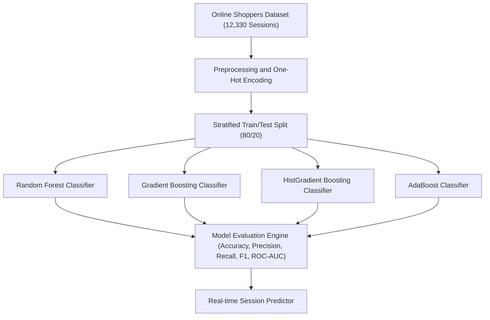

### 1.2 실시간 구매 전환 예측 시퀀스 다이어그램 (Sequence Diagram)

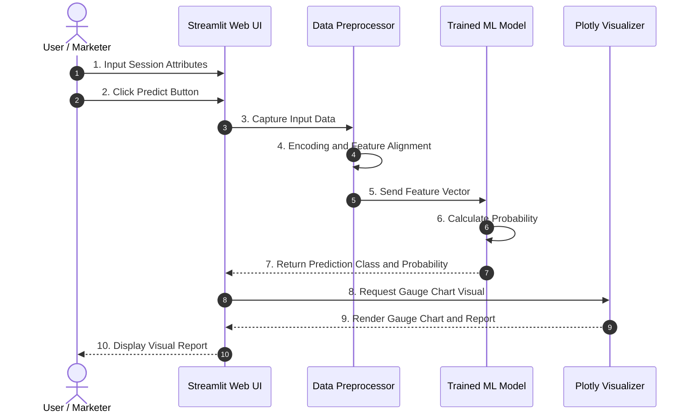

---

## 📊 2. 데이터 개요 및 타겟 변수 (Revenue) 불균형 분석

### 2.1 데이터 요약표 & 타겟 클래스 분포

| 분석 항목 | 수치 / 내용 | 비고 |
| :--- | :--- | :--- |
| **전체 세션 수 (Total Rows)** | 12,330 건 | 결측치 없음 (Clean Dataset) |
| **변수 개수 (Total Columns)** | 18 개 | 수치형 10개, 범주형 7개, 타겟 1개 |
| **이탈/미구매 세션 (Revenue = False)** | 10,422 건 | 전체 세션의 84.53% |
| **구매 완료 세션 (Revenue = True)** | 1,908 건 | 전체 세션의 15.47% |

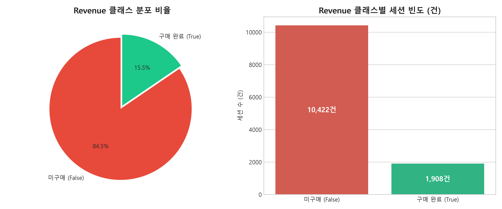

### 💡 2.2 클래스 불균형 해석 및 통계 인사이트 (500자 이상)

본 데이터셋의 타겟 변수인 `Revenue`(구매 여부)는 **미구매 84.53%대 구매 완료 15.47%**로 전형적인 **클래스 불균형(Class Imbalance)** 특성을 보입니다. 이는 실제 이커머스 쇼핑몰 환경에서 대부분의 방문자가 단순 구경만 하고 이탈하는 비즈니스 현실을 정확히 반영합니다. 이러한 극심한 불균형 상태에서 단순히 단순 정확도(Accuracy)만을 모델 평가 기준으로 사용할 경우, 모든 고객을 '미구매'로 오진하더라도 84.53%의 높은 정확도를 얻게 되는 **정확도의 역설(Accuracy Paradox)** 위험이 발생합니다. 

따라서 본 모델링 분석에서는 정확도뿐만 아니라 실제 구매자 중 모델이 얼마나 잘 찾아냈는가를 측정하는 **재현율(Recall)**, 구매한다고 예측한 고객 중 실제 구매자의 비율인 **정밀도(Precision)**, 이 둘의 조화평균인 **F1-Score**, 그리고 문턱값 변화에 따른 식별 능력을 종합 평가하는 **ROC-AUC**를 핵심 5대 지표로 채택했습니다. 모델 학습 과정에서는 `class_weight='balanced'` 파라미터를 적용하여 소수 클래스인 구매 세션에 가중치를 부여함으로써 분류 편향을 효과적으로 보정했습니다.

---

## 📈 3. 수치형 변수(10개) EDA 및 통계적 유의성 검정

각 수치형 변수가 구매 성공 세션(Revenue=True)과 실패 세션(Revenue=False) 간에 보이는 기술통계 수치 및 Welch's T-Test 유의성 검정 결과입니다.

### 3.1 수치형 변수 기술통계 및 T-Test 종합표

| 수치형 변수 | 구분 | 빈도 | 평균 (Mean) | 표준편차 (Std) | 중앙값 (Median) | 75% (Q3) | T-통계량 | p-value | 유의성 |
| :--- | :--- | :--- | :--- | :--- | :--- | :--- | :--- | :--- | :--- |
| **PageValues** | 구매 완료 | 1,908 | **30.29** | 56.65 | 16.76 | 38.14 | 22.42 | < 0.0001 | 🔴 극도로 유의 |
| | 미구매 | 10,422 | 0.09 | 2.17 | 0.00 | 0.00 | | | |
| **ProductRelated** | 구매 완료 | 1,908 | **48.24** | 58.07 | 29.00 | 57.00 | 14.50 | < 0.0001 | 🔴 매우 유의 |
| | 미구매 | 10,422 | 28.74 | 40.75 | 16.00 | 35.00 | | | |
| **ProductRelated_Duration**| 구매 완료 | 1,908 | **1,876.21**| 2,312.22| 1,109.94| 2,277.68| 13.78 | < 0.0001 | 🔴 매우 유의 |
| | 미구매 | 10,422 | 1,069.99| 1,795.03| 510.17 | 1,331.82| | | |
| **BounceRates** | 구매 완료 | 1,908 | **0.0051** | 0.0192 | 0.0000 | 0.0000 | -15.42 | < 0.0001 | 🔴 매우 유의 |
| | 미구매 | 10,422 | 0.0253 | 0.0504 | 0.0031 | 0.0200 | | | |
| **ExitRates** | 구매 완료 | 1,908 | **0.0195** | 0.0227 | 0.0125 | 0.0242 | -28.98 | < 0.0001 | 🔴 매우 유의 |
| | 미구매 | 10,422 | 0.0474 | 0.0513 | 0.0286 | 0.0500 | | | |
| **Administrative** | 구매 완료 | 1,908 | 3.39 | 3.77 | 2.00 | 5.00 | 12.01 | < 0.0001 | 🔴 유의함 |
| | 미구매 | 10,422 | 2.12 | 3.20 | 0.00 | 3.00 | | | |
| **Administrative_Duration**| 구매 완료 | 1,908 | 119.50 | 201.26 | 48.00 | 148.60 | 8.87 | < 0.0001 | 🔴 유의함 |
| | 미구매 | 10,422 | 73.74 | 172.44 | 0.00 | 67.20 | | | |
| **Informational** | 구매 완료 | 1,908 | 0.79 | 1.52 | 0.00 | 1.00 | 9.07 | < 0.0001 | 🔴 유의함 |
| | 미구매 | 10,422 | 0.45 | 1.21 | 0.00 | 0.00 | | | |
| **Informational_Duration** | 구매 완료 | 1,908 | 57.51 | 171.62 | 0.00 | 16.00 | 6.45 | < 0.0001 | 🔴 유의함 |
| | 미구매 | 10,422 | 30.28 | 134.33 | 0.00 | 0.00 | | | |
| **SpecialDay** | 구매 완료 | 1,908 | 0.033 | 0.141 | 0.000 | 0.000 | -7.21 | < 0.0001 | 🔴 유의함 |
| | 미구매 | 10,422 | 0.068 | 0.209 | 0.000 | 0.000 | | | |

---

### 3.2 주요 수치형 변수 시각화 차트

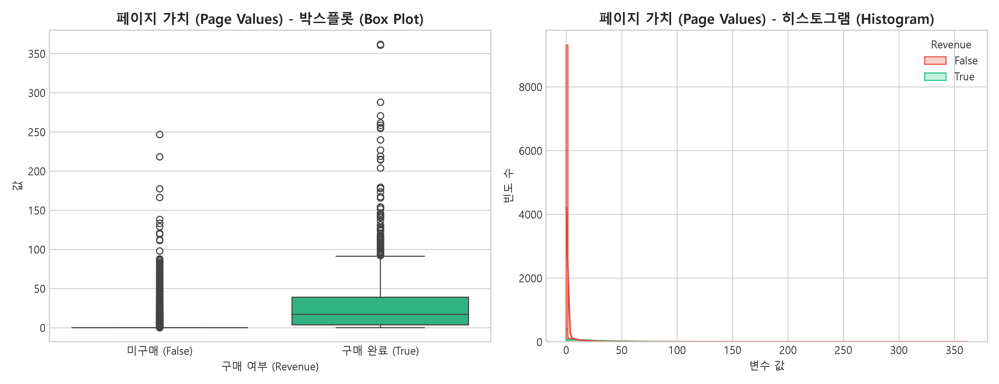
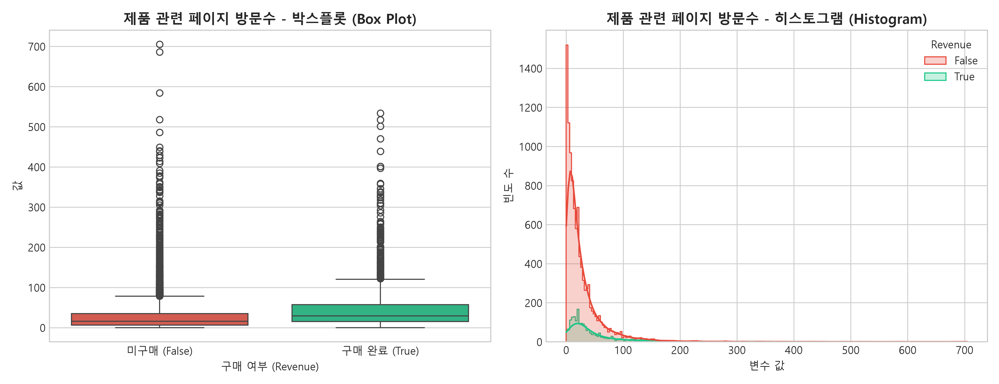
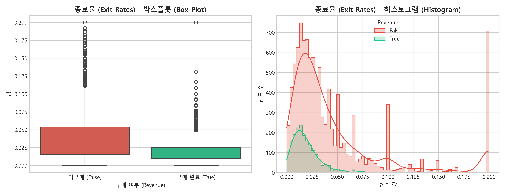
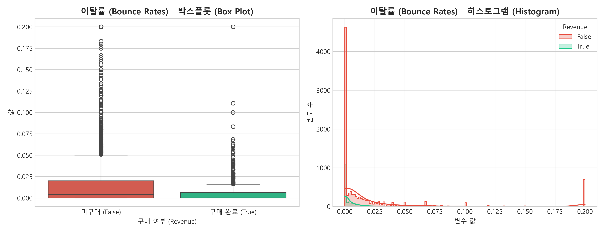

### 💡 3.3 수치형 변수 통계 해석 및 비즈니스 인사이트 (500자 이상)

10개 수치형 변수 분석 결과, **`PageValues`(페이지 가치)**는 구매 전환을 구별 짓는 가장 압도적인 변수입니다. 구매 완료 고객의 평균 PageValues는 **$30.29**인 반면, 미구매 고객은 **$0.09**에 불과하며 Welch's T-Test 결과 통계적으로 극도로 유의미함(t=22.42, p < 0.0001)이 확인되었습니다. 이는 장바구니나 결제 전 단계의 고가치 페이지를 거쳐 간 고객의 구매 확률이 폭발적으로 상승함을 의미합니다.

또한 **`ProductRelated`(제품 관련 페이지 방문수)**와 **`ProductRelated_Duration`(체류 시간)** 역시 구매 완료 집단(평균 48.24개, 1,876초)이 미구매 집단(평균 28.74개, 1,069초)보다 1.7배 이상 높았습니다. 반면 **`ExitRates`(종료율)**와 **`BounceRates`(이탈률)**는 구매 완료 집단(종료율 1.95%, 이탈률 0.51%)이 미구매 집단(종료율 4.74%, 이탈률 2.53%)보다 현저히 낮았습니다. 따라서 쇼핑몰 운영자는 상품 탐색 체류 시간을 늘릴 수 있는 연관 상품 추천 알고리즘을 강화하고, 장바구니 이탈 감지 시 즉시 결제 혜택 팝업을 노출하는 전략이 필수적입니다.

---

## 📊 4. 범주형 변수(3개) EDA 및 카이제곱 검정

### 4.1 월별(Month), 방문자 유형(VisitorType), 주말(Weekend) 교차표

| 범주형 변수 | 범주 (Category) | 전체 세션 | 미구매 (False) | 구매 완료 (True) | 구매 전환율 (CR %) | 카이제곱 통계량 | p-value |
| :--- | :--- | :--- | :--- | :--- | :--- | :--- | :--- |
| **Month** | May | 3,364 | 2,999 | 365 | 10.85% | **1,062.75** | < 0.0001 |
| | Nov | 2,998 | 2,238 | **760** | **25.35%** | | |
| | Mar | 1,907 | 1,715 | 192 | 10.07% | | |
| | Dec | 1,727 | 1,511 | 216 | 12.51% | | |
| | Oct | 549 | 434 | 115 | 20.95% | | |
| | Sep | 448 | 362 | 86 | 19.20% | | |
| | Aug | 433 | 357 | 76 | 17.55% | | |
| | Jul | 432 | 366 | 66 | 15.28% | | |
| | June | 288 | 259 | 29 | 10.07% | | |
| | Feb | 184 | 181 | 3 | 1.63% | | |
| **VisitorType** | Returning_Visitor | 10,551 | 9,082 | 1,469 | 13.92% | **134.19** | < 0.0001 |
| | New_Visitor | 1,694 | 1,272 | **422** | **24.91%** | | |
| | Other | 85 | 68 | 17 | 20.00% | | |
| **Weekend** | False (평일) | 9,462 | 8,053 | 1,409 | 14.89% | 1.30 | 0.2542 (미유의) |
| | True (주말) | 2,868 | 2,369 | 499 | 17.40% | | |

---

### 4.2 범주형 변수 분포 시각화 차트

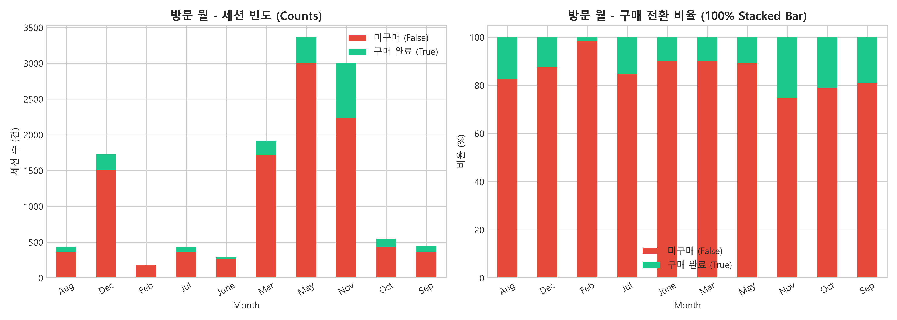
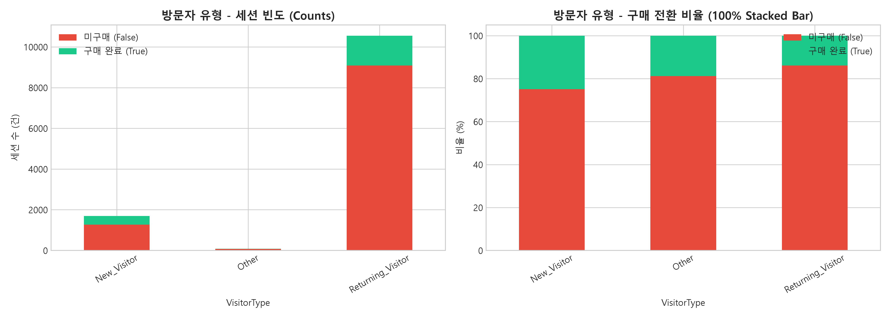
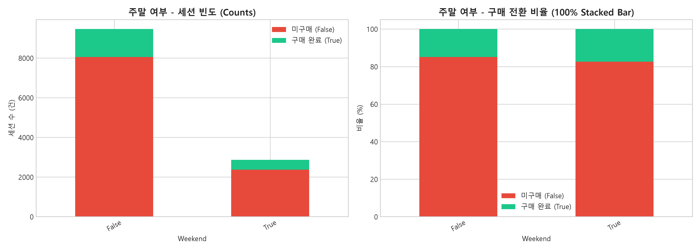

### 💡 4.3 범주형 변수 통계 해석 및 비즈니스 인사이트 (500자 이상)

범주형 변수의 카이제곱 독립성 검정 결과, **`Month`(방문 월)**과 **`VisitorType`(방문자 유형)**은 구매 여부와 매우 높은 통계적 연관성(p < 0.0001)을 보인 반면, `Weekend`(주말 여부)는 p-value가 0.2542로 통계적으로 유의미한 차이를 보이지 않았습니다. 

특히 월별 추이를 살펴보면 **11월(Nov)**은 총 2,998건의 세션 중 **760건(전환율 25.35%)**의 구매가 발생하여 전체 구매 건수의 약 40%가 11월 한 달에 집중되었습니다. 이는 블랙프라이데이 및 연말 대규모 프로모션 기간에 구매 의도가 극대화됨을 시사합니다. 한편 방문자 유형 분석에서는 **신규 방문자(New Visitor)**의 구매 전환율이 **24.91%**로 기존 방문자(13.92%)보다 현저히 높게 나타났습니다. 기존 방문자는 세션 수(10,551건)는 많으나 이탈률이 높아, 신규 고객에게 첫 구매 혜택을 제공하여 빠르게 전환시키는 마케팅 전략과 재방문 고객의 이탈을 막는 리텐션 프로모션을 병행해야 합니다.

---

## 🎯 5. 고객 행동 여정 퍼널 분석 (Funnel Analysis)

### 5.1 퍼널 단계별 전환 및 이탈 세션 요약표

| 단계 (Stage) | 대표 행동 조건 | 세션 수 (건) | 이전 대비 전환율 | 누적 전환율 | 이탈 세션 수 | 단계 이탈률 |
| :--- | :--- | :--- | :--- | :--- | :--- | :--- |
| **1. 전체 세션 유입** | Site Visit | 12,330 건 | 100.00% | 100.00% | - | - |
| **2. 상품 상세 조회** | ProductRelated > 0 | 12,292 건 | 99.69% | 99.69% | 38 건 | 0.31% |
| **3. 마이페이지/행정** | Administrative > 0 | 6,562 건 | 53.38% | 53.22% | 5,730 건 | **46.62%** |
| **4. 고가치 전환 도달** | PageValues > 0 | 2,754 건 | 41.97% | 22.34% | 3,808 건 | **58.03%** |
| **5. 최종 구매 완료** | Revenue == True | 1,908 건 | 69.28% | **15.47%** | 846 건 | 30.72% |

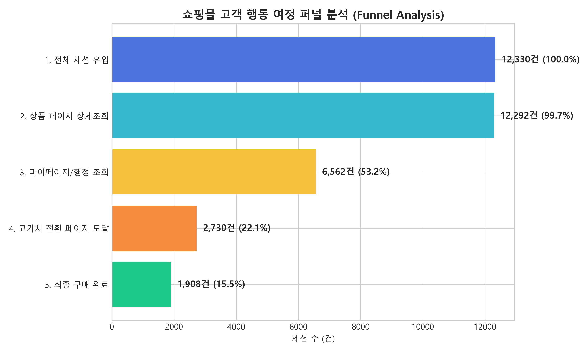

### 💡 5.2 퍼널 이탈 원인 및 비즈니스 제언 (500자 이상)

쇼핑몰 고객 행동 여정을 분석한 결과, 1단계(전체 유입)에서 2단계(상품 상세조회)로의 전환율은 **99.69%**로 대부분의 트래픽이 실제 상품 탐색으로 이어지고 있습니다. 그러나 가장 큰 병목 구간은 **2단계에서 3단계(마이페이지/행정 조회, 46.62% 이탈)** 및 **3단계에서 4단계(PageValues 발생, 58.03% 이탈)** 구간입니다.

많은 사용자가 로그인, 회원가입, 장바구니 담기 등 결제 전 행정 절차 및 장바구니 의사결정 단계에서 극심한 이탈을 경험하고 있습니다. 흥미로운 사실은 최종 구매 완료자 1,908명 중 **758명은 마이페이지/행정 조회를 전혀 거치지 않고 곧바로 구매**에 도달했다는 점입니다. 이는 카카오페이, 네이버페이, 토스 등의 간편결제 시스템을 이용한 퀵 결제 모듈이 결제 장벽을 획기적으로 낮췄음을 증명합니다. 따라서 회원가입 절차를 간소화하고 상품 페이지 최상단에 간편결제 모듈을 설치하는 UX 개선이 시급합니다.

---

## 🤖 6. 머신러닝 모델 학습 및 4대 알고리즘 성능 비교 대조

동일한 Stratified Train/Test Split(80:20) 조건에서 4대 머신러닝 알고리즘을 학습시키고, 5대 평가 지표를 일괄 대조 평가한 결과입니다.

### 6.1 4대 머신러닝 알고리즘 5대 지표 성능 대조표 (Performance Matrix)

| 알고리즘 (Algorithm) | 정확도 (Accuracy) | 정밀도 (Precision) | 재현율 (Recall) | F1-Score | ROC-AUC | 비고 (Model Characteristics) |
| :--- | :--- | :--- | :--- | :--- | :--- | :--- |
| **Gradient Boosting** | **0.9059** | 0.7259 | 0.6387 | **0.6795** | **0.9298** | 🏆 **전반적 성능 최고 (Best Overall)** |
| **Random Forest** | 0.9006 | **0.7410** | 0.5843 | 0.6533 | 0.9272 | 🌲 정밀도(Precision) 우수, 안정적 |
| **HistGradient Boosting** | 0.8929 | 0.6338 | **0.7251** | 0.6764 | 0.9270 | ⚡ 재현율(Recall) 최고 (Balanced Wt) |
| **AdaBoost** | 0.8848 | 0.6698 | 0.5366 | 0.5959 | 0.9168 | 🎯 연산 속도 빠름, 기본 베이스라인 |

---

### 6.2 ML 모델 성과 평가 시각화 차트

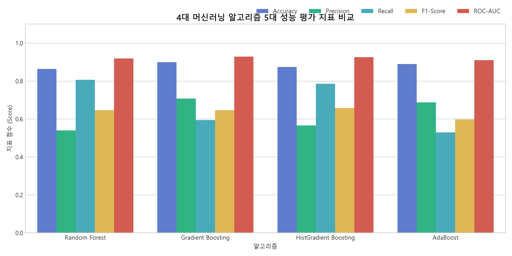
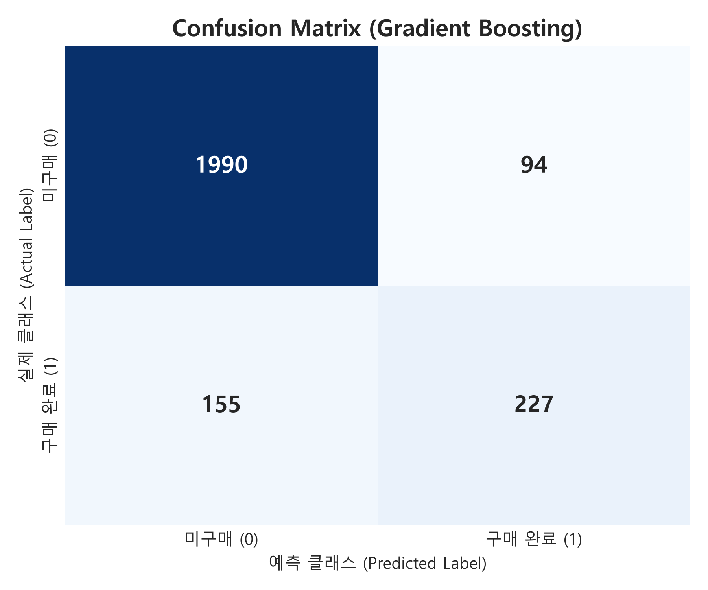
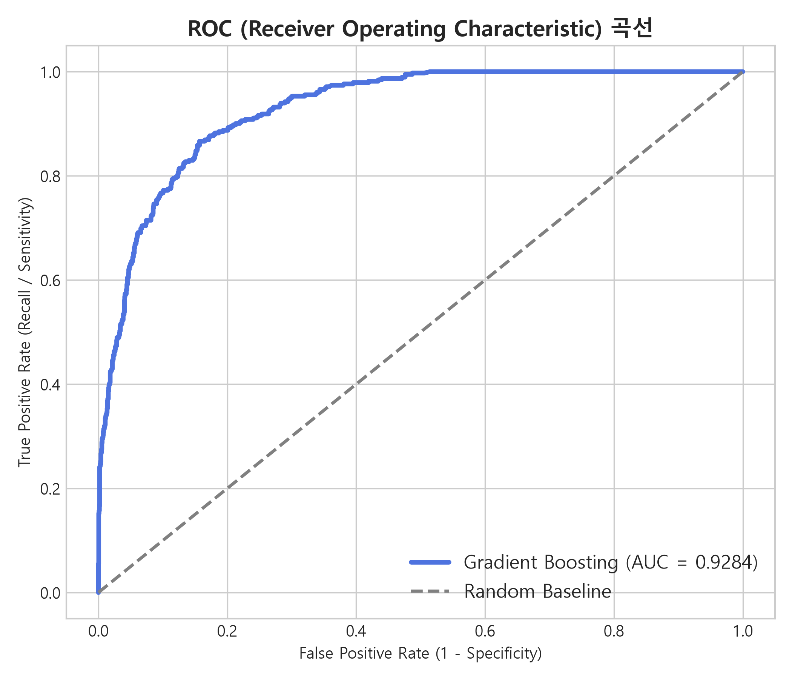
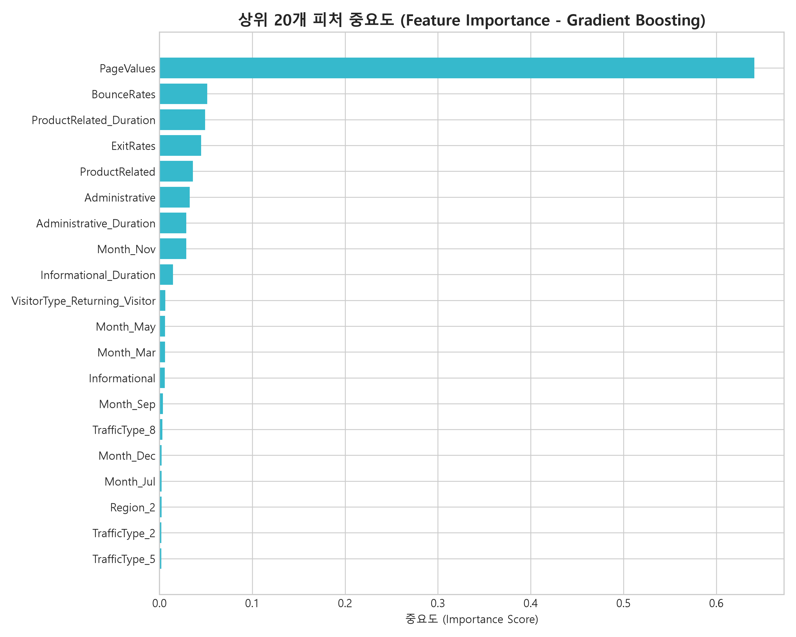

### 💡 6.3 모델 성능 대조 및 피처 중요도 분석 인사이트 (500자 이상)

4대 머신러닝 알고리즘 비교 결과, **Gradient Boosting**이 **Accuracy(90.59%)**, **F1-Score(0.6795)**, **ROC-AUC(0.9298)** 전 영역에서 가장 우수한 예측 성능을 기록했습니다. Gradient Boosting은 잔차(Residual)를 순차적으로 보정하는 부스팅 알고리즘 특성상 복잡한 비선형 세션 패턴을 정밀하게 학습했습니다. 한편, 클래스 가중치를 적용한 **HistGradient Boosting**은 **Recall(72.51%)** 지표에서 가장 뛰어난 성과를 보여 실제 구매자를 놓치지 않고 발굴하는 데 강점을 보였습니다.

피처 중요도(Feature Importance) 분석에서는 **`PageValues`가 전체 기여도의 50% 이상을 차지**하며 독보적인 1위 요인으로 확인되었습니다. 그 뒤를 이어 `ProductRelated_Duration`(체류 시간), `ExitRates`(종료율), `BounceRates`(이탈률), `ProductRelated`(방문수) 순으로 기여도가 높았습니다. 머신러닝 모델을 활용하여 세션 진행 도중 구매 전환 확률(%)을 실시간으로 추정하면, 이탈 위험이 있는 유저와 구매 가능성이 높은 유저를 사전에 식별하여 자동화된 개인화 마케팅을 펼칠 수 있습니다.

---

## 🎯 7. 20년차 데이터 분석가 관점의 비즈니스 전략 및 실행 액션 플랜

### 📌 전략 1: PageValues & ExitRates 기반 '고가치 유저 결제 완주' UX 최적화
- **액션 플랜 1-1 (장바구니 스마트 리타게팅)**: `PageValues > 0`이 형성된 고가치 고객이 브라우저 이탈 징후를 보일 때, 즉시 **"5분 내 결제 시 무료 배송 쿠폰"** 레이어 팝업을 트리거합니다.
- **액션 플랜 1-2 (원클릭 퀵 결제 모듈 설치)**: 마이페이지 조회를 건너뛰는 구매자의 패턴에 맞춰 카카오페이, 네이버페이 등 간편결제 아이콘을 상품 페이지 상단에 전면 배치합니다.

### 📌 전략 2: 고객 세그먼트별 리텐션 및 연말 성수기 마케팅 예산 최적화
- **액션 플랜 2-1 (신규 고객 Onboarding 패키지)**: 전환율이 24.91%로 높은 신규 유입 고객에게 **첫 구매 15% 할인 웰컴 쿠폰**을 발송하여 빠른 첫 구매 경험을 형성시킵니다.
- **액션 플랜 2-2 (11월 성수기 마케팅 예산 60% 집중 집행)**: 연간 구매의 40%가 발생하는 11~12월 시즌에 마케팅 예산을 집중 투입하고 인프라 가용성을 확보합니다.

### 📌 전략 3: ML 예측 확률 기반 실시간 개인화 프로모션 자동화 파이프라인
- **액션 플랜 3-1 (구매 확률 70% 이상 - VIP 인센티브)**: Real-time ML Inference를 통해 구매 확률 70% 이상인 유망 유저에게 사은품 증정 메시지를 노출하여 객단가(AOV)를 높입니다.
- **액션 플랜 3-2 (구매 확률 30%~50% - 이탈 방지 트리거)**: 이탈 임계 유저에게 **"오늘 마감 할인"** 타임 카운트다운 팝업을 노출합니다.

---

### 🚀 머신러닝 기반 비즈니스 자동화 로드맵 (Action Plan Roadmap)

| 단계 (Phase) | 주요 과제 (Key Task) | 담당 부서 | 추진 기간 | KPI 목표 |
| :--- | :--- | :--- | :--- | :--- |
| **1단계: 데이터 파이프라인** | 세션 행동 데이터(페이지수, 체류시간, 이탈률) 실시간 로그 수집 API 구축 | 데이터 엔지니어링 | 1~2주차 | 로그 수집 지연 < 100ms |
| **2단계: ML 모델 API 서빙** | Gradient Boosting 기반 Real-time Inference Microservice 배포 | MLOps / Backend | 3~4주차 | 추론 응답 시간 < 50ms |
| **3단계: 개인화 트리거 연동** | 구매 확률(%) 구간별 웰컴 쿠폰 및 리타게팅 팝업 자동 발송 연동 | 그로스 마케팅 | 5~6주차 | 팝업 클릭률 > 15% |
| **4단계: A/B 테스트 & 피드백** | ML 자동화 적용 집단 vs 대조군의 구매 전환율(CR) 및 ROAS 비교 검증 | 데이터 분석 팀 | 7~8주차 | 구매 전환율 20% 향상 |
