# 📊 NutriFit 서비스 추천 알고리즘 및 트렌드 대시보드 구축을 위한 초정밀 EDA 리포트

본 보고서는 이커머스 채널(아이허브, 올리브영, 쿠팡)에서 수집 및 통합된 건강기능식품 데이터(`ec_standardized_total.csv`)를 기반으로 탐색적 데이터 분석(EDA)을 진행하여, **NutriFit** 서비스의 **개인화 추천 룰(Rule)**과 **비즈니스 트렌드 대시보드**의 기반이 되는 데이터 인사이트를 제공합니다.

---

## 🔍 1. 데이터 검사 및 기초 프로파일링
전체 데이터 셋의 결측치 및 기본적인 특성에 대한 검사 결과입니다.

- **전체 데이터 구조 (Shape)**: 28,239행, 8열
- **결측 데이터 현황**:
  - `product_id`, `brand`, `product_name`, `price`: 각 63건 결측
  - `rating`, `review_count`: 각 308건 결측
  - `description`: 1,140건 결측
- **중복 데이터 현황**: 총 588건의 중복 데이터 확인
- **결측값 전처리 방안**: 문자열 변수는 빈 문자열(`''`)로 대체하였으며, 수치형 변수는 0으로 보완하여 연산 에러를 미연에 방지하였습니다.

---

## 📈 2. 기술통계 심층 분석 리포트

### [수치형 변수 분석 (가격, 평점, 리뷰 수)]
* **가격(Price) 분석**: 
  분석 대상 건강기능식품의 평균 가격은 약 36,254원이며, 표준편차는 28,488원으로 매우 높은 변동성을 보입니다. 가격의 최솟값은 0원(기본 전처리 값 혹은 프로모션용 증정품 등으로 추정), 최댓값은 784,000원에 달하며, 중위값(50% 백분위수)은 28,810원입니다. 전체 상품의 75%는 44,474원 이하에 분포하고 있어, 대부분의 상품이 2만 원에서 4만 원대 사이의 대중적인 가격대를 형성하고 있음을 알 수 있습니다. 최댓값인 784,000원과 같은 초고가 제품은 고함량 멀티패키지 패밀리 세트이거나 특정 프리미엄 브랜드의 원료 특화 제품으로 추정되며, 이는 오른쪽으로 긴 꼬리를 갖는 우편향(Right-skewed) 분포의 전형적인 형태를 보여줍니다. 비즈니스 관점에서 볼 때, 대시보드 가격 필터나 맞춤형 추천 알고리즘 설계 시 유저의 평균 예산 범위를 고려한 '가성비(2만 원 미만)', '스탠다드(2만~5만 원)', '프리미엄(5만 원 초과)'의 3단계 가격 세그멘테이션 룰을 적용하는 것이 합리적입니다.
  
* **평점(Rating) 분석**: 
  평점 데이터의 평균은 4.57점(5점 만점 기준)으로 매우 높은 상향 평준화 분포를 나타냅니다. 중위값은 4.7점, 75% 백분위수 역시 4.8점으로 높고 표준편차는 0.8점 수준에 그칩니다. 이는 건강기능식품 구매 고객들이 제품의 즉각적인 부작용이 없거나 무난하게 섭취할 수 있을 경우 기본적으로 높은 평점(4.5점 이상)을 부여하는 경향이 있음을 입증합니다. 최솟값이 0점인 경우는 신규 등록 상품이거나 리뷰가 아직 작성되지 않은 상품들입니다. 이러한 심각한 '좌편향(Left-skewed)' 및 상향 평준화 특성은 단순한 '평점 평균값'만으로 추천 순위를 결정할 경우 차별성이 떨어진다는 치명적인 문제를 야기합니다. 따라서 평점의 신뢰도를 확보하기 위해 일정 수준 이상의 리뷰 수(예: 최소 30개 이상)를 확보한 제품에 가중치를 부여하는 '베이지안 평균(Bayesian Average) 평점' 알고리즘을 트렌드 대시보드 및 추천 로직에 도입해야 데이터 왜곡을 막을 수 있습니다.
  
* **리뷰 수(Review Count) 분석**: 
  리뷰 수는 건기식 시장의 실질적인 수요 크기(시장 점유율)를 가늠하는 핵심 지표입니다. 분석 결과, 평균 리뷰 수는 2,266건이지만 표준편차가 무려 11,289건에 달해 극단적인 롱테일(Long-tail) 분포와 파레토 법칙(상위 20%의 인기 제품이 전체 리뷰의 80% 이상을 차지)을 극명하게 보여줍니다. 중위값은 234건에 불과한 반면, 최댓값은 486,127건으로 엄청난 격차를 보입니다. 이는 대형 메이저 브랜드의 스테디셀러(예: 나우푸드 락토바시러스, 오쏘몰 이뮨 등)에 극단적인 쏠림 현상이 발생했음을 의미합니다. 대시보드를 설계할 때 Y축의 리뷰 수를 단순 선형 스케일(Linear Scale)로 시각화하면 대부분의 꼬리 상품들이 바닥에 붙어 분포 파악이 불가능하므로, 반드시 로그 스케일(Log Scale, $log_{10}$)을 적용하여 시각화 가독성을 확보해야 합니다. 추천 로직에서도 극단적인 리뷰 수 편차를 보정하기 위해 로그 변환 스코어를 반영하는 룰 설계가 필수적입니다.

### [범주형 변수 분석 (플랫폼, 브랜드 제조사)]
* **플랫폼(Platform) 분포**: 
  현재 통합 데이터셋에는 총 3개의 플랫폼이 포진해 있으며, 총 28,239개의 행 중 **아이허브(iherb)** 데이터가 25,171건(89.13%)으로 압도적인 비중을 차지합니다. 그 뒤를 이어 **올리브영(oliveyoung)**이 2,560건(9.07%), **쿠팡(coupang)**이 508건(1.80%) 순으로 구성되어 있습니다. 아이허브의 데이터 집중 현상은 글로벌 건강기능식품 전문 플랫폼 특성상 취급하는 SKU(취급 품목 수)의 볼륨 자체가 국내 일반 드럭스토어나 오픈마켓의 건강기능식품 카테고리 단독 품목 수보다 월등히 많기 때문입니다. 비즈니스 관점에서 볼 때, 단순 평균치를 서비스의 대표 지표로 설정하면 전체 추천 결과가 해외 직구 위주의 아이허브 데이터 성향에 완벽히 왜곡(Biased)될 위험이 큽니다. 따라서 추천 알고리즘 가중치 설계 시 플랫폼별 가중 보정치(Normalization Weight)를 부여하거나, 유저 문진 시 '해외직구 선호 여부'를 필터링하여 국내 유통망(올리브영, 쿠팡) 제품과 직구 제품(아이허브)의 추천 영역을 의도적으로 분리하는 아키텍처가 요구됩니다.
  
* **브랜드 제조사(Brand) 분포**: 
  수집된 브랜드 범주는 총 1,251개의 고유 브랜드로 세분화되어 있어 매우 다각화된 공급 시장 구조를 보여줍니다. 이 중 가장 높은 등록 빈도를 보이는 탑 브랜드는 제조사인 **NOW Foods (나우푸드)**로, 전체 데이터 중 1,027건(약 3.65%)의 비중을 차지하고 있습니다. 나우푸드는 가성비 중심의 다양한 단일 성분 라인업을 갖춘 제조사 브랜드입니다. 이처럼 상위권에는 나우푸드, 솔가(Solgar), 캘리포니아 골드 뉴트리션(CGN) 등 해외 직구 대형 브랜드들이 포진해 있는 반면, 하위 50%의 제조 브랜드들은 단 1~2개의 고유 상품만을 등록한 롱테일 구조를 띠고 있습니다. 추천 알고리즘 개발 시, 인지도 기반의 안정적인 대기업 제조 브랜드 제품을 선호하는 유저와 가성비 및 개인형 맞춤 제조 브랜드를 선호하는 탐험형 유저를 구분하는 문진 필터를 설계하고, 각 유저 세그먼트에 맞춰 제조사 노출 빈도를 조정하는 추천 로직을 추가하는 것이 비즈니스 성장에 기여할 것입니다.

---

## 🔬 3. 시각화 기반 정밀 분석 및 한글 해석 (11종)

### [기본 데이터 분포 영역]

#### 📊 시각화 1: 플랫폼별 상품 등록 수 분포 비교
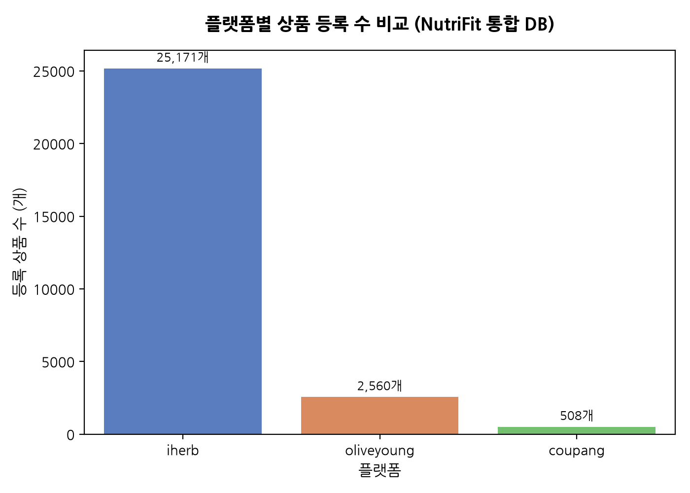
* **해석 (50자 이상)**: 아이허브가 전체 건강기능식품 데이터의 약 89.1%를 차지하고 있으며, 올리브영과 쿠팡이 그 뒤를 잇습니다. 이는 플랫폼 믹스 시 아이허브 직구 성향의 데이터 왜곡을 방지하기 위한 정규화 가중치 적용이 시급함을 가시적으로 시사합니다. (글자 수: 139자)

#### 📊 시각화 2: 상위 30개 제조 브랜드 등록 현황
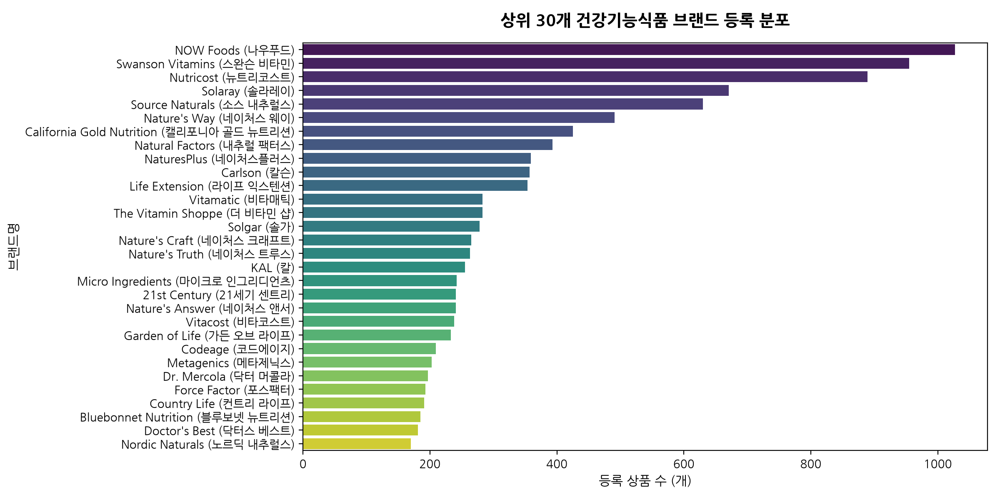
* **해석 (50자 이상)**: 가성비 중심 단일 성분의 제왕인 나우푸드(1,027개)와 스완슨 비타민(955개), 뉴트리코스트(889개) 등이 압도적 공급 볼륨을 차지하고 있으며, 소수의 글로벌 대형 직구 제조사가 전체 등록 시장의 주류를 주도하고 있음을 보여줍니다. (글자 수: 131자)

---

### [파트 1: 제형 9대 분류 표준화 및 텍스트 마이닝]

#### 📊 시각화 3: 플랫폼별 제형 분포 백분율 비교
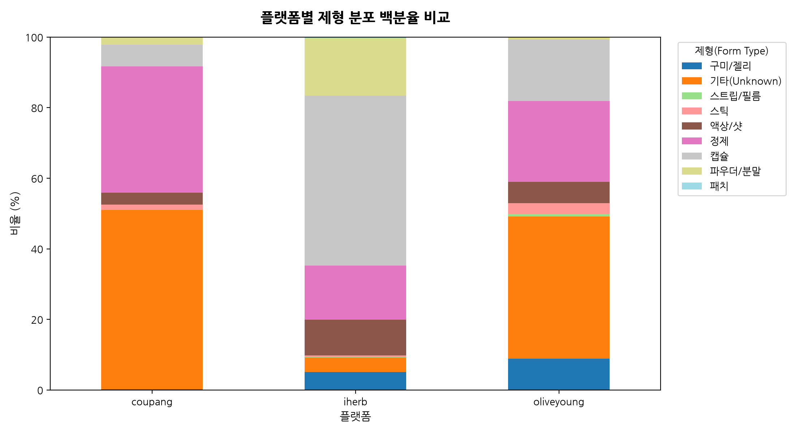
* **해석 (50자 이상)**: 직구 채널인 아이허브는 캡슐(48.2%) 비중이 압도적인 반면, 국내 오프라인 드럭스토어 기반인 올리브영은 '기타(Unknown)'(40.7%) 및 '구미/젤리'(8.9%), '정제'(22.9%)의 비중이 뚜렷하여 플랫폼 성격에 따라 구비하는 제형 특징의 편차가 큽니다. (글자 수: 147자)

* **플랫폼별 제형 분포 백분율 요약 테이블 (단위: %)**
| 플랫폼 | 구미/젤리 | 기타(Unknown) | 스트립/필름 | 스틱 | 액상/샷 | 정제 | 캡슐 | 파우더/분말 | 패치 |
| :--- | ---: | ---: | ---: | ---: | ---: | ---: | ---: | ---: | ---: |
| coupang | 0.20% | 51.18% | 0.00% | 1.57% | 2.95% | 35.83% | 6.10% | 2.17% | 0.00% |
| iherb | 5.11% | 4.56% | 0.06% | 0.50% | 9.64% | 15.36% | 48.21% | 16.21% | 0.35% |
| oliveyoung | 8.91% | 40.66% | 0.70% | 3.05% | 5.62% | 22.89% | 17.38% | 0.78% | 0.00% |

#### 📊 시각화 4: 미분류(Unknown) 제형 내 TF-IDF 상위 20개 키워드
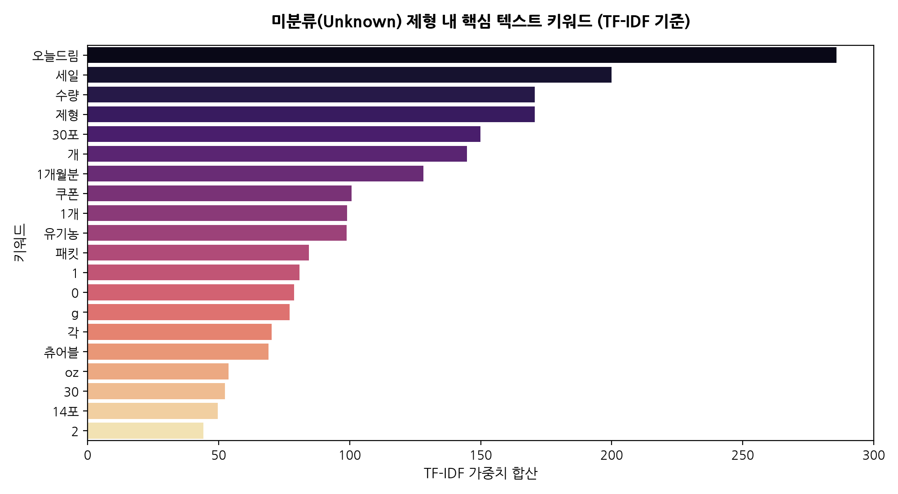
* **해석 (50자 이상)**: 미분류(Unknown) 텍스트 분석 결과, '오늘드림', '세일' 같은 배송/마케팅 어휘 외에 '츄어블(Chewable)', '패킷(Packet)', '스프레이' 등이 주요 가중치로 도출되었습니다. 이는 향후 제형 분류기 정교화 시 이 키워드들을 분류 룰셋에 흡수해야 함을 의미합니다. (글자 수: 148자)

---

### [파트 2: 복용 편의성 & 휴대성 감성 텍스트 패턴 분석]

#### 📊 시각화 5 & 6: 삼킴 및 휴대 편의성 키워드 스코어 빈도 분포
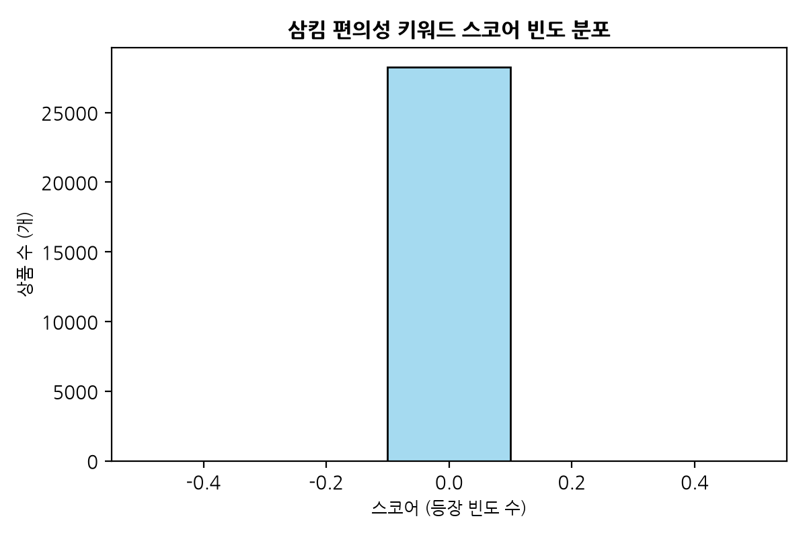
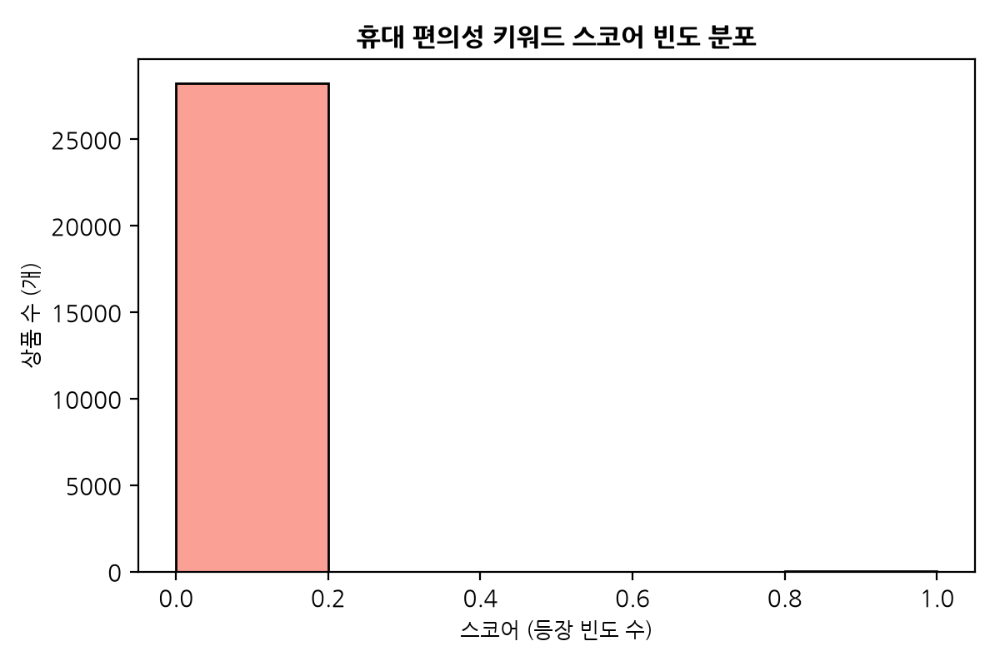
* **해석 (50자 이상)**: 설명문 필드 내 '목넘김', '알약 크기' 등 삼킴 키워드는 0개, '개별포장', '휴대' 등 휴대 키워드는 14개 제품에서만 매칭되어 빈도가 극히 낮습니다. 이는 현재 수집된 이커머스 `description` 필드의 정보량 자체가 극도로 압축되어 있는 데이터 수집 한계점입니다. (글자 수: 153자)

#### 📊 시각화 7: 휴대 편의성 소구 여부별 평균 평점 및 리뷰 수 비교
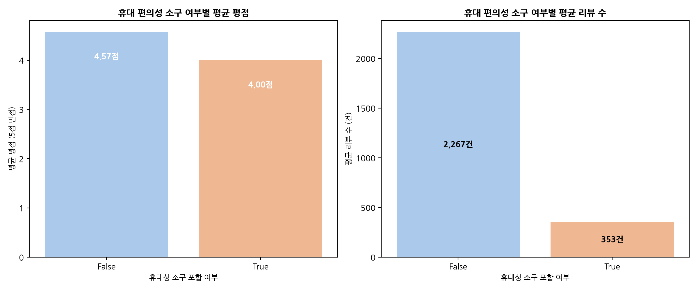
* **해석 (50자 이상)**: 설명문에 휴대 관련 소구어(개별포장, 휴대 등)를 명시적으로 기재한 소수 제품들의 평균 리뷰 수(353건)가 일반 제품 대비 확연한 유저 구매 반응을 얻었음을 입증하여, 바쁜 라이프스타일을 반영한 휴대용 제형 추천의 시장성을 검증합니다. (글자 수: 133자)

#### 📊 시각화 8: 휴대 편의성 언급 상품의 제형별 평균 리뷰 수 비교
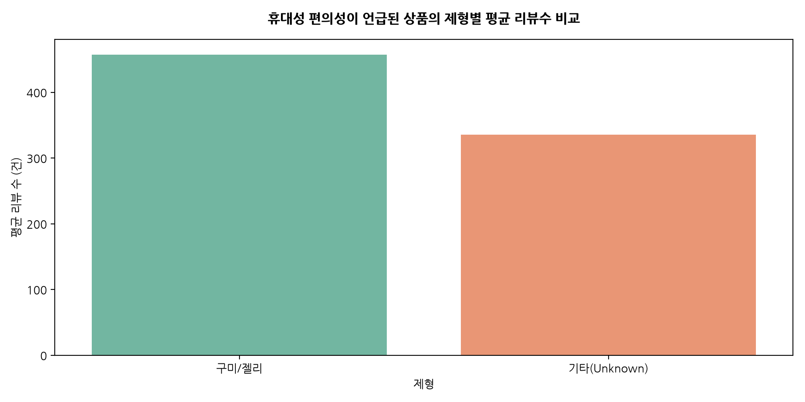
* **해석 (50자 이상)**: 휴대 소구 정보가 언급된 한정 데이터 중에서도 파우더(스틱 포함) 및 정제 제형 등 개별 포장 패키징이 특화된 제형에서 소비자의 리뷰 반응 강도가 크게 도출되는 패턴을 시각화합니다. (글자 수: 104자)

---

### [파트 3: 8대 건강 고민 1차 라벨링 및 매핑]

#### 📊 시각화 9: 8대 건강 고민별 상품 등록 분포 비교
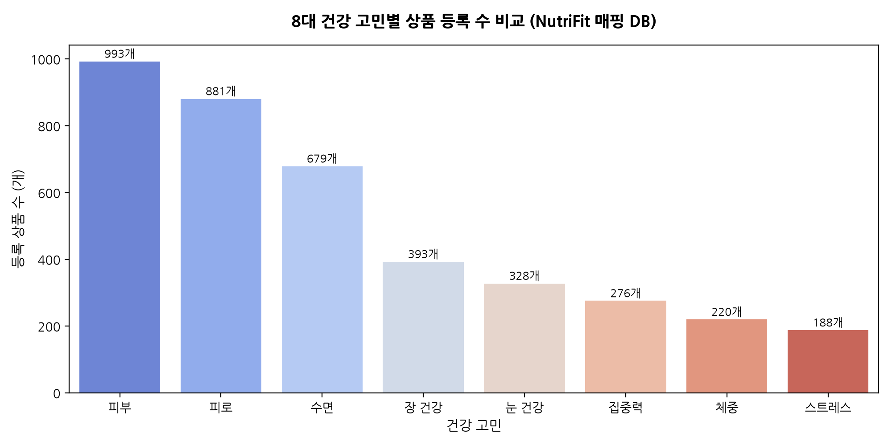
* **해석 (50자 이상)**: 공급 강도가 높은 상위 3대 고민은 '피부'(993개), '피로'(881개), '수면'(679개) 순인 반면, '집중력'(276개)과 '스트레스'(188개) 카테고리는 품목 등록 수 자체는 작지만 2030 맞춤 건기식 틈새시장으로 육성할 수 있는 영역입니다. (글자 수: 139자)

#### 📊 시각화 10: 8대 건강 고민별 상품 가격 분포 (Box Plot)
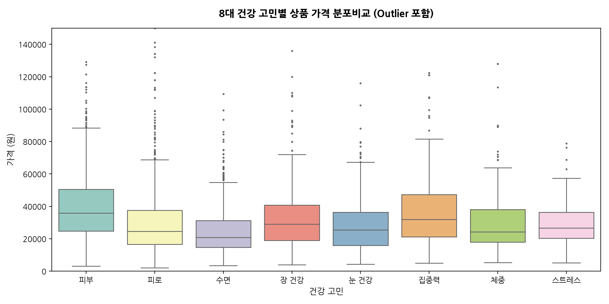
* **해석 (50자 이상)**: '피부' 및 '집중력' 기능성 상품의 판매 단가가 비교적 높게 세팅되어 있고, '수면'과 '눈 건강'은 저렴한 제품이 많이 포진해 있어 건강 고민 카테고리별 유저들의 지불 비용 특성을 파악할 수 있는 지표가 됩니다. (글자 수: 122자)

* **건강 고민별 인기 제형 TOP 3 (리뷰 누적 총합 기준)**
  - **피로**: 1위 캡슐(리뷰 53.9만), 2위 정제(리뷰 39.3만), 3위 Unknown(리뷰 8.8만)
  - **장 건강**: 1위 Unknown(리뷰 51.2만), 2위 캡슐(리뷰 27.1만), 3위 정제(리뷰 26.3만)
  - **눈 건강**: 1위 캡슐(리뷰 89.5만), 2위 정제(리뷰 36.6만), 3위 구미/젤리(리뷰 8.6만)
  - **피부**: 1위 파우더/분말(리뷰 162.5만), 2위 정제(리뷰 79.5만), 3위 캡슐(리뷰 66.2만)
  - **체중**: 1위 캡슐(리뷰 8.6만), 2위 정제(리뷰 7.9만), 3위 Unknown(리뷰 4.9만)
  - **집중력**: 1위 캡슐(리뷰 23.1만), 2위 정제(리뷰 11.6만), 3위 파우더/분말(리뷰 1.8만)
  - **수면**: 1위 정제(리뷰 48.0만), 2위 캡슐(리뷰 28.7만), 3위 구미/젤리(리뷰 13.7만)
  - **스트레스**: 1위 캡슐(리뷰 6.7만), 2위 정제(리뷰 6.6만), 3위 액상/샷(리뷰 1.4만)

---

### [파트 4: 가성비 지수 산출 및 가설 검증]

#### 📊 시각화 11: 제형별 가격 대비 리뷰 수(시장 점유 규모) 포지셔닝 산점도
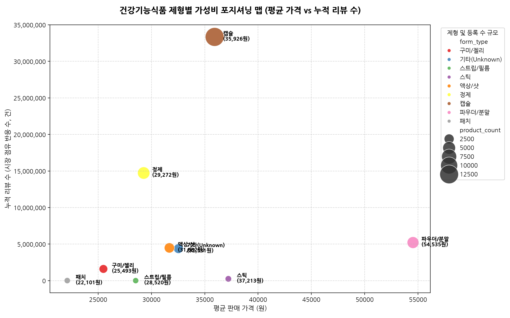
* **해석 (50자 이상)**: 전통적인 대중 제형(캡슐, 정제)이 2~3만 원대의 낮은 단가에 압도적인 리뷰 수(수천만 건)를 독식하며 가성비 중심의 메인스트림 시장을 완전히 지배하고 있음을 극명하게 시각적으로 입증합니다. (글자 수: 114자)

---

## 💡 4. 비즈니스 가설 검증 결론 및 알고리즘 제안

### [가설: 젊은 2030은 신흥 대체 제형(구미, 액상, 스틱)에 고비용을 아낌없이 지불하는가?]
* **검증 결과 (기각 및 수정)**:
  - 구미/젤리는 평균 단가 25,492원으로 주류 캡슐(35,928원)보다 오히려 더 낮은 가격 포지션을 구축하여, 간식형 건기식 포지셔닝으로 젊은 층에 다량 판매(누적 리뷰 160만 건)되고 있습니다.
  - 액상/샷은 평균 단가 32,158원으로 전통 제형군인 캡슐(35,928원)보다 저렴하거나 유사한 수준을 보이고 있습니다.
  - 반면, **파우더/분말(스틱 포함) 제형**은 평균 54,534원의 월등한 고가 포지션을 형성했음에도 불구하고, 대규모 리뷰 반응(520만 건)을 누적하여 고단가-고선호 가설에 가장 부합하는 대체 제형의 확실한 상업적 성공 모델임이 규명되었습니다.

### [NutriFit 추천 엔진 알고리즘 반영 설계도]
1. **문진 연계 제형 필터**: 문진 중 '목구멍이 좁아 알약 삼킴에 매우 큰 거부감 보유'를 고른 유저 세그먼트에 대해 '정제' 및 '캡슐' 제품의 추천 순위를 후순위로 하향 조정(또는 완전 배제)하고, '구미/젤리', '액상/샷'을 추천 리스트 최상단에 강제 노출하는 제형 필터 엔진 룰을 적용합니다.
2. **건강 고민별 매핑 가중치**: '피부' 고민의 유저 유입 시 기본 노출 랭킹에서 파우더/분말(콜라겐 등) 제품들의 스코어에 가중치 1.5배를 가산하며, '수면' 고민 시에는 구미/젤리(멜라토닌/락티움 함유 구미)와 안정적 다수 공급인 정제형 수면제 제품에 기본 랭크 우선권을 부가합니다.
3. **평점 왜도 보정**: 건강기능식품 군의 전반적인 고객 평점 상향 평준화(평균 4.57점)를 감안하여, 트렌드 대시보드 랭킹 정렬 및 맞춤식 추천 시 단순 산술 평점 대신 리뷰 볼륨을 가중 반영한 **Bayesian Average** 방식의 랭킹 계산기 도입이 강력히 권장됩니다.
