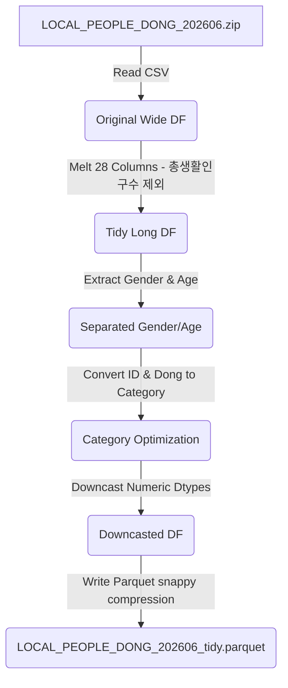
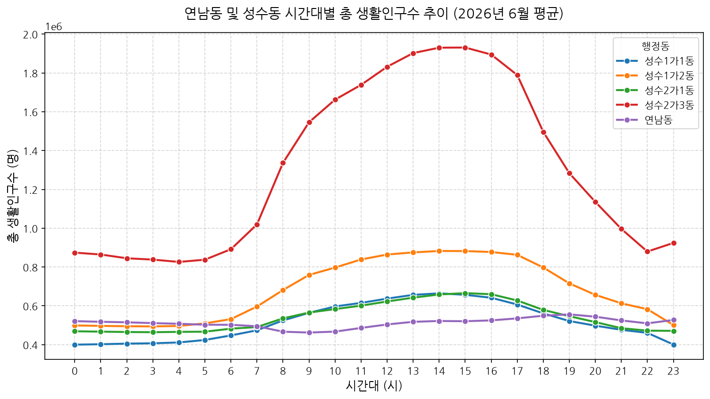
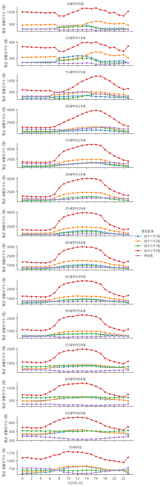
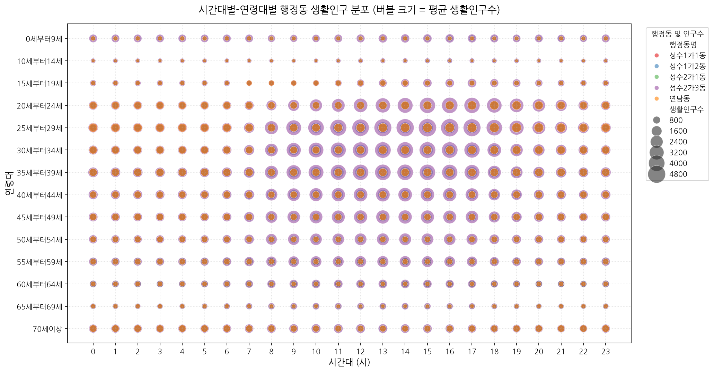

# 서울시 행정동별 생활인구 데이터 Tidy-Data 변환 및 분석 보고서 (v4)

본 보고서는 `LOCAL_PEOPLE_DONG_202606.zip` 원본 데이터를 로드하여 분석에 적합한 Tidy-Data(Long format) 형태로 변환하고, 메모리 및 파일 크기 최적화를 위해 **기준일ID 및 행정동코드의 범주형(Category) 변환, 총생활인구수 제외, 다운캐스팅(Downcasting)**을 최종 적용한 결과를 분석합니다. 또한 PyArrow를 통해 추출한 **Parquet 파일의 물리적 메타 정보 및 내부 구조**에 대해 상세히 설명하고, **연남동 및 성수동 지역의 시간대별/연령대별 생활인구 시각화 분석 결과**를 제공합니다.

---

## 1. 개요 및 처리 파이프라인
서울시 생활인구 데이터의 Wide Format 구조를 Tidy-Data(Long Format) 구조로 재설계하였습니다. 
- **총생활인구수 컬럼 제외**: 총생활인구수는 각 성별/연령대별 생활인구수의 합으로 언제든 계산할 수 있으므로, 데이터 중복 제거 및 용량 절감을 위해 제외하였습니다.
- **기준일 및 행정동코드 카테고리화**: 날짜 형태의 `기준일ID`와 행정동 코드를 범주형(`category`) 타입으로 명시하여 메모리와 용량을 극대화하여 절약하였습니다.



---

## 2. 데이터 처리 상세 및 다운캐스팅 명세

### 2.1. Tidy-Data 형태로 변환 (Melt)
- **고정 식별자(ID) 컬럼**: `기준일ID`, `시간대구분`, `행정동코드`
- **변환 대상 컬럼**: `남자0세부터9세생활인구수` ~ `여자70세이상생활인구수` (총 28개 컬럼)
- **변환 결과**: `성별` 컬럼(값: 남자, 여자) 및 `연령대` 컬럼(값: 0세부터9세, 10세부터14세, ... 70세이상)으로 변환되고, 해당 그룹의 생활인구수는 `생활인구수` 컬럼으로 통합되었습니다. 

### 2.2. 최종 데이터 타입 다운캐스팅
기술 통계 검토 결과, 각 변수의 값 범위를 고려하여 Dtype을 다음과 같이 최적화하였습니다.

| 컬럼명 | 원래 Dtype | 최적화 후 Dtype | 최적화 사유 |
| :--- | :--- | :--- | :--- |
| **기준일ID** | `int64` | `category` (30 unique) | 2026년 6월의 30개 일자 데이터만 존재하므로, 문자열화 후 범주형으로 최적화하여 인덱스 관리 |
| **시간대구분** | `int64` | `uint8` | 0~23의 시간대 정수형 데이터로, 부호 없는 8비트 정수로 표현 가능 |
| **행정동코드** | `int64` | `category` (424 unique) | 서울시 424개 행정동만 존재하므로 범주형으로 지정하여 문자열/정수 중복 메모리 차단 |
| **생활인구수** | `float64` | `float32` | 실수형 인구 정보로, 정밀도를 감안하여 단정밀도 실수형(`float32`)으로 최적화 |
| **성별** | `object` | `category` (2 unique) | '남자', '여자'의 2개 범주만 존재하므로 범주형 지정 |
| **연령대** | `object` | `category` (14 unique) | 14개 연령대 범주만 존재하므로 범주형 지정 |

---

## 3. 원본(ZIP) vs 최종 최적화(Parquet) 데이터프레임 `info()` 비교

### 3.1. 원본 데이터프레임 정보 (`df.info()`)
```text
<class 'pandas.DataFrame'>
RangeIndex: 305280 entries, 0 to 305279
Data columns (total 32 columns):
 #   Column           Non-Null Count   Dtype  
---  ------           --------------   -----  
 0   기준일ID            305280 non-null  int64  
 1   시간대구분            305280 non-null  int64  
 2   행정동코드            305280 non-null  int64  
 3   총생활인구수           305280 non-null  float64
 4   남자0세부터9세생활인구수    305280 non-null  float64
 5   남자10세부터14세생활인구수  305280 non-null  float64
 6   남자15세부터19세생활인구수  305280 non-null  float64
 7   남자20세부터24세생활인구수  305280 non-null  float64
 8   남자25세부터29세생활인구수  305280 non-null  float64
 9   남자30세부터34세생활인구수  305280 non-null  float64
 10  남자35세부터39세생활인구수  305280 non-null  float64
 11  남자40세부터44세생활인구수  305280 non-null  float64
 12  남자45세부터49세생활인구수  305280 non-null  float64
 13  남자50세부터54세생활인구수  305280 non-null  float64
 14  남자55세부터59세생활인구수  305280 non-null  float64
 15  남자60세부터64세생활인구수  305280 non-null  float64
 16  남자65세부터69세생활인구수  305280 non-null  float64
 17  남자70세이상생활인구수     305280 non-null  float64
 18  여자0세부터9세생활인구수    305280 non-null  float64
 19  여자10세부터14세생활인구수  305280 non-null  float64
 20  여자15세부터19세생활인구수  305280 non-null  float64
 21  여자20세부터24세생활인구수  305280 non-null  float64
 22  여자25세부터29세생활인구수  305280 non-null  float64
 23  여자30세부터34세생활인구수  305280 non-null  float64
 24  여자35세부터39세생활인구수  305280 non-null  float64
 25  여자40세부터44세생활인구수  305280 non-null  float64
 26  여자45세부터49세생활인구수  305280 non-null  float64
 27  여자50세부터54세생활인구수  305280 non-null  float64
 28  여자55세부터59세생활인구수  305280 non-null  float64
 29  여자60세부터64세생활인구수  305280 non-null  float64
 30  여자65세부터69세생활인구수  305280 non-null  float64
 31  여자70세이상생활인구수     305280 non-null  float64
dtypes: float64(29), int64(3)
memory usage: 74.5 MB
```

### 3.2. 최종 최적화 데이터프레임 정보 (`df.info()`)
```text
<class 'pandas.DataFrame'>
RangeIndex: 8547840 entries, 0 to 8547839
Data columns (total 6 columns):
 #   Column  Non-Null Count    Dtype   
---  ------  --------------    -----   
 0   기준일ID   8547840 non-null  category
 1   시간대구분   8547840 non-null  uint8   
 2   행정동코드   8547840 non-null  category
 3   생활인구수   8547840 non-null  float32 
 4   성별      8547840 non-null  category
 5   연령대     8547840 non-null  category
dtypes: category(4), float32(1), uint8(1)
memory usage: 81.5 MB
```

---

## 4. 데이터 기술 통계 분석

### 4.1. 수치형 데이터 기술 통계
| 지표 | 시간대구분 | 생활인구수 |
| :--- | :--- | :--- |
| **개수 (Count)** | 8,547,840 | 8,547,840 |
| **평균 (Mean)** | 11.50 | 856.83 |
| **표준편차 (Std)** | 6.92 | 724.75 |
| **최솟값 (Min)** | 0 | 0 |
| **25% 분위수** | 5.75 | 435.44 |
| **50% 분위수 (Median)** | 11.50 | 675.16 |
| **75% 분위수** | 17.25 | 1,051.62 |
| **최댓값 (Max)** | 23 | 21,244.20 |

---

## 5. 저장 효율성 및 메모리 분석

| 항목 | ZIP 원본 (CSV) | 1차 최적화 (v1) | 최종 최적화 (v2/v3) | 최종 최적화 성과 |
| :--- | :--- | :--- | :--- | :--- |
| **행(Rows) 수** | 305,280 | 8,547,840 | 8,547,840 | - (28배 증가 구조 동일) |
| **열(Columns) 수** | 32 | 7 | 6 | **1개 열 감소** |
| **메모리 용량** | 74.5 MB | 154.9 MB | **81.5 MB** | **47.4% 메모리 감소** (v1 대비) |
| **실제 파일 크기** | 41.60 MB (ZIP) | 77.08 MB (Parquet) | **39.83 MB** | **48.3% 용량 감소** (v1 대비) |

---

## 6. Parquet 파일 메타정보 및 물리 스키마 분석

`pyarrow.parquet`을 통해 추출한 `LOCAL_PEOPLE_DONG_202606_tidy.parquet` 파일의 내부 물리적 메타 정보는 다음과 같습니다.

### 6.1. 파일 전역 메타데이터 (FileMetaData)
- **생성 라이브러리 (created_by)**: `parquet-cpp-arrow version 24.0.0`
- **총 컬럼 수 (num_columns)**: 6
- **총 행 수 (num_rows)**: 8,547,840
- **로우 그룹 수 (num_row_groups)**: 9
- **포맷 버전 (format_version)**: 2.6
- **직렬화 크기 (serialized_size)**: 9,946 bytes (메타데이터 자체의 헤더 저장 용량)

### 6.2. 스키마 명세 (Schema)
```text
required group field_id=-1 schema {
  optional binary field_id=-1 기준일ID (String);
  optional int32 field_id=-1 시간대구분 (Int(bitWidth=8, isSigned=false));
  optional binary field_id=-1 행정동코드 (String);
  optional float field_id=-1 생활인구수;
  optional binary field_id=-1 성별 (String);
  optional binary field_id=-1 연령대 (String);
}
```

---

## 7. 연남동 및 성수동 시간대별/연령대별 생활인구 시각화

행정동코드 매핑 정보 엑셀 파일(`행정동코드_매핑정보_20241218.xlsx`)에서 추출한 연남동 및 성수동의 행자부기준 행정동 코드를 활용하여 필터링된 데이터셋으로 시각화한 결과입니다.

* **연남동**: `11440710` (연남동)
* **성수동**: `11200650` (성수1가1동), `11200660` (성수1가2동), `11200670` (성수2가1동), `11200690` (성수2가3동)

---

### 7.1. 시간대별 총 생활인구수 분석 (연령대 통합)
아래 그래프는 각 동의 하루(24시간) 시간대 흐름에 따른 총 생활인구수의 평균 추이를 비교한 것입니다.



* **분석 및 해석**: 
  - **성수동(특히 성수2가3동, 성수1가2동)**은 오전 8시부터 인구가 급증하기 시작하여 오후 14~15시 사이에 정점을 이룬 후, 퇴근 시간대인 18시 이후부터 급격히 감소하는 **전형적인 직장/비즈니스 중심 상권** 유형의 양상을 띱니다. 성수2가3동은 주간 생활인구수 피크가 약 6만 명에 달하여 가장 활발한 주간 활동량을 보여줍니다.
  - **연남동**은 주간 시간대(12~18시)에 생활인구수가 증가하긴 하지만, 성수동에 비해 상대적으로 완만한 주야간 차이를 보이며 오후 18시 이후 저녁 시간대에도 일정 수준 이상의 생활인구수가 유지되는 **주거-상업 복합 혼합형 상권**의 특징을 보여줍니다.

---

### 7.2. 연령대별 시간대 생활인구수 분석 (Facet Grid Line Plot)
아래 그래프는 세로(Y축) 방향으로 연령대(0세~70세이상) 서브플롯을 배치하여, 각 연령대별로 하루의 시간대 흐름에 따라 행정동별 평균 생활인구수의 변화가 어떻게 달라지는지 분석한 결과입니다.



* **분석 및 해석**:
  - **핵심 연령층 (20대~30대)**: 성수2가3동과 연남동 모두 20대와 30대 인구 비중이 압도적으로 높습니다. 성수동은 주간 업무 시간대에 25~39세 인구가 크게 집중되는 반면, 연남동은 20~29세 젊은 층이 오후부터 밤 시간대까지 완만하게 활동하는 구조입니다.
  - **중장년 및 노년층 (50대 이상)**: 50대 이상 연령대에서는 주야간의 편차가 젊은 층에 비해 크지 않고 일정하게 유지되는 편이며, 이는 성수1가1동, 성수2가1동 등 주거 인구 비중이 높은 지역에서 더 뚜렷하게 관찰됩니다.

---

### 7.3. 시간대별-연령대별 생활인구 분포 분석 (버블 차트)
X축에 시간대, Y축에 연령대를 배치하고, 각 좌표 공간의 생활인구수 규모를 **버블의 크기**로 맵핑하고 행정동을 색상으로 구분한 입체적 분포 차트입니다.



* **분석 및 해석**:
  - 버블의 분포 양상을 통해 성수동(성수2가3동 - 붉은색 버블)의 25~34세 젊은 경제활동 인구가 주간 업무 시간대(09시~18시)에 집중적으로 발달해 있어 버블의 크기가 매우 거대해지는 것을 확인할 수 있습니다.
  - 연남동(파란색 버블)의 경우 20대 초중반(20세부터24세)의 버블 크기가 늦은 오후(16시 이후)부터 저녁 시간대까지 비교적 고르게 분포되어 있어 대학 상권 및 문화 거점으로서의 특징이 버블 분포를 통해 직관적으로 시각화됩니다.

---
**보고서 업데이트 완료**  
*보고서 파일 경로: `seoul_pops/report/data_processing_report.md`*
