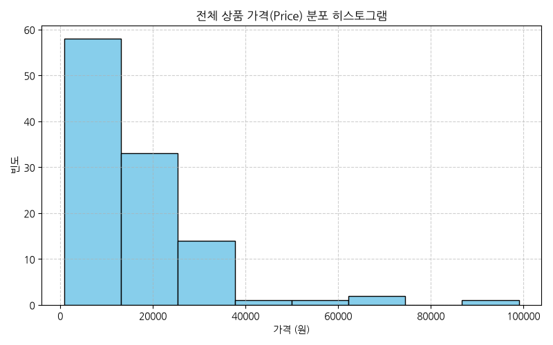
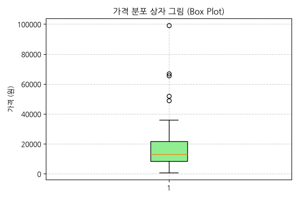
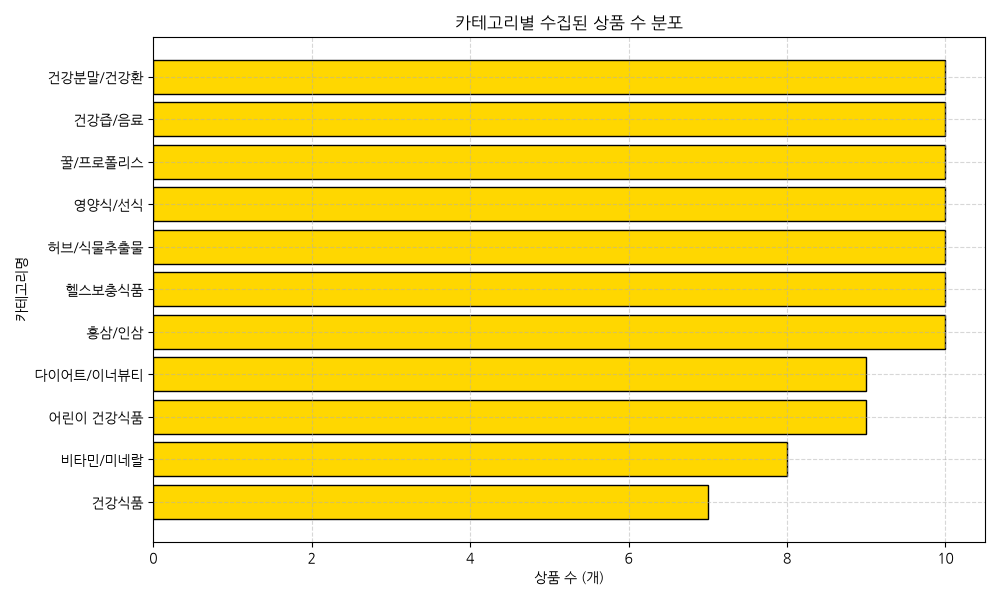
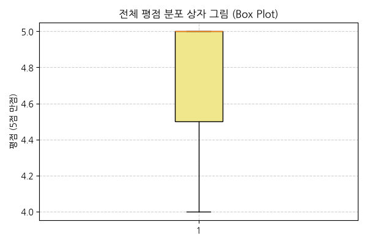
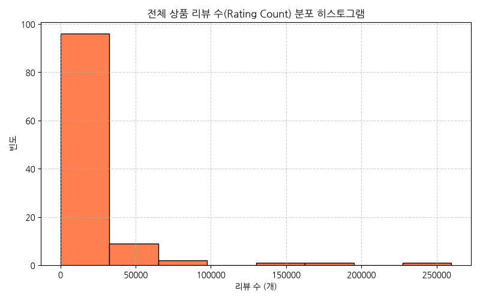
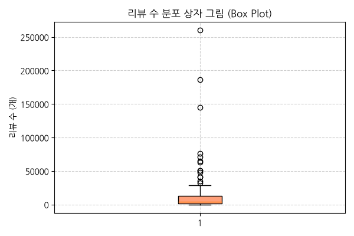
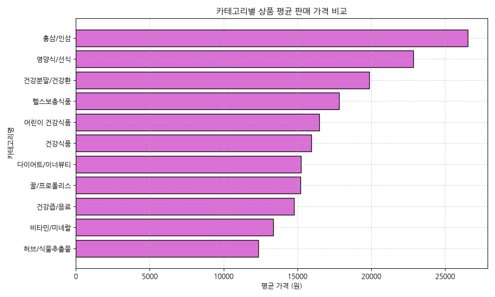
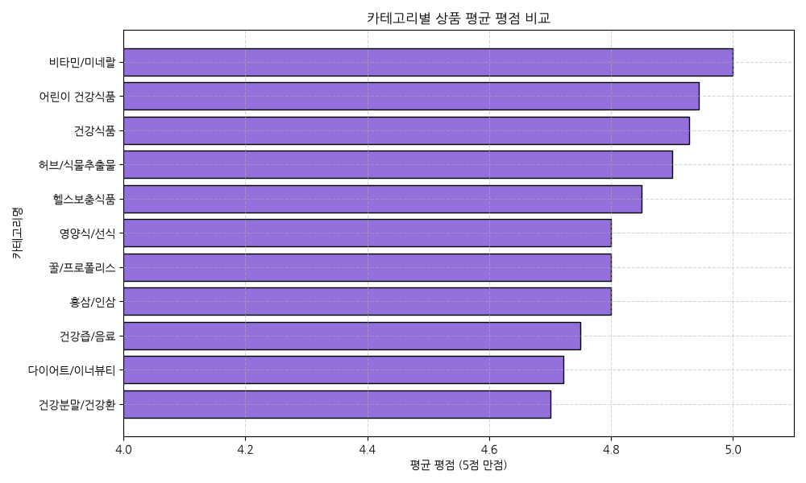
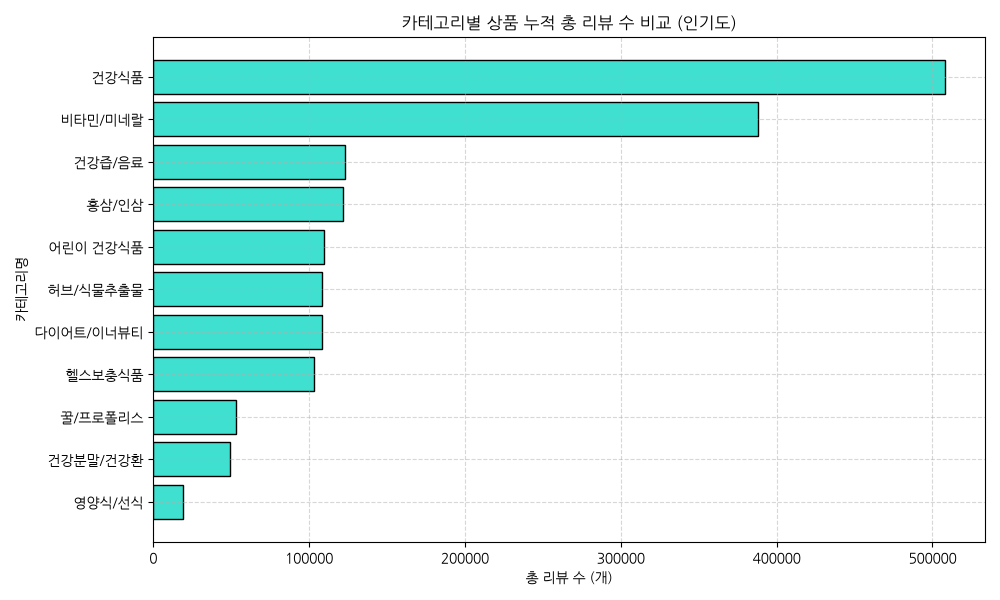
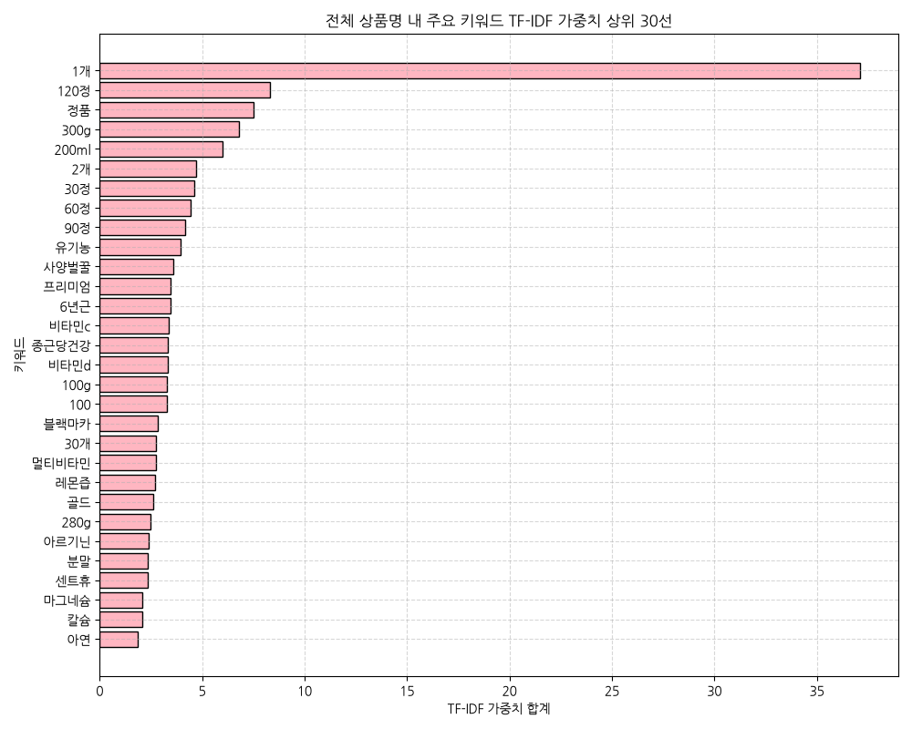

# 쿠팡 건강식품 12개 카테고리 상품 탐색적 데이터 분석(EDA) 보고서

본 보고서는 쿠팡 영양제/건강식품 하위 카테고리 내 필터링을 거친 11개 카테고리 총 110개 핵심 상품 정보를 바탕으로 수행된 전문 탐색적 데이터 분석(EDA) 결과입니다. 가격대 분포, 만족도 평점, 인기도 리뷰 수 및 카테고리 간 비교 우위를 다각도로 분석하여 건강식품 카테고리의 비즈니스 통찰을 도출하였습니다.

---

## 1. 데이터 기초 검사 (Data Inspection)

데이터셋의 전반적인 구조와 정합성을 확보하기 위한 기초 검사 결과입니다.

### 데이터 요약 정보 (df.info())
```text
<class 'pandas.DataFrame'>
RangeIndex: 110 entries, 0 to 109
Data columns (total 7 columns):
 #   Column         Non-Null Count  Dtype  
---  ------         --------------  -----  
 0   product_id     110 non-null    int64  
 1   product_name   110 non-null    str    
 2   price          110 non-null    int64  
 3   rating         110 non-null    float64
 4   rating_count   110 non-null    int64  
 5   product_url    110 non-null    str    
 6   category_name  103 non-null    str    
dtypes: float64(1), int64(3), str(3)
memory usage: 24.6 KB
```

### 기초 인스펙션 메트릭
- **전체 데이터 행(Row) 수**: 110개
- **전체 데이터 열(Column) 수**: 7개
- **중복된 데이터 행 수**: 0개

### 데이터셋 처음 5행 (Head)
|    |   product_id | product_name                                  |   price |   rating |   rating_count | product_url                                                                                | category_name   |
|---:|-------------:|:----------------------------------------------|--------:|---------:|---------------:|:-------------------------------------------------------------------------------------------|:----------------|
|  0 |   7523923017 | 조선비책 조선황림 침향환 공진단 상자, 300g, 1박스               |   99000 |      5   |          15062 | https://www.coupang.com/vp/products/7523923017?itemId=25025332492&vendorItemId=94607411630 | 건강분말/건강환        |
|  1 |   6016616599 | 유기농마루 정품 유기농 양배추환 50p, 100g, 1개               |   11720 |      5   |           9655 | https://www.coupang.com/vp/products/6016616599?itemId=25240728429&vendorItemId=92236775030 | 건강분말/건강환        |
|  2 |   9448182377 | 컨디션 스틱 그린애플, 18g, 10개                         |   10800 |      5   |           9541 | https://www.coupang.com/vp/products/9448182377?itemId=20282372855&vendorItemId=92235614197 | 건강분말/건강환        |
|  3 |   8830016105 | 굿헬씨 유기농 컬리케일 100 동결건조 곱슬케일 분말 30포, 1개, 30g    |   13620 |      4.5 |           6563 | https://www.coupang.com/vp/products/8830016105?itemId=25728351797&vendorItemId=92716977090 | 건강분말/건강환        |
|  4 |   8273418814 | 대용량 골드 카무트효소 발효 가루 분말 카뮤트 호라산밀 복합효소, 300g, 2개 |   27900 |      4.5 |           2878 | https://www.coupang.com/vp/products/8273418814?itemId=23846358182&vendorItemId=90869801687 | 건강분말/건강환        |

### 데이터셋 마지막 5행 (Tail)
|     |   product_id | product_name                         |   price |   rating |   rating_count | product_url                                                                                |   category_name |
|----:|-------------:|:-------------------------------------|--------:|---------:|---------------:|:-------------------------------------------------------------------------------------------|----------------:|
| 105 |    103707571 | 케어센스 일회용 알콜스왑, 100매, 1개              |    4000 |      4.5 |           3550 | https://www.coupang.com/vp/products/103707571?itemId=18796545993&vendorItemId=90956619140  |             nan |
| 106 |   9416873395 | 센트휴 샐러드 식이섬유 41g, 1개, 120정           |   11400 |      5   |           2284 | https://www.coupang.com/vp/products/9416873395?itemId=27983932788&vendorItemId=94941655191 |             nan |
| 107 |   9457366282 | 솔리앤 문어 괄사 지압 전신 마사지기 1+1 세트, 핑크, 1세트 |    5900 |      5   |           1129 | https://www.coupang.com/vp/products/9457366282?itemId=28139595722&vendorItemId=95612681358 |             nan |
| 108 |   9468032731 | 아임비타 비타민D 4000IU 6g, 1개, 60정         |    8150 |      5   |            210 | https://www.coupang.com/vp/products/9468032731?itemId=28178498736&vendorItemId=95133173426 |             nan |
| 109 |   8209553705 | [캔들이케아] 3ml 다용도 주사기, 1개              |     890 |      4.5 |             29 | https://www.coupang.com/vp/products/8209553705?itemId=23559634184&vendorItemId=91917072648 |             nan |

---

## 2. 기술 통계 분석 (Descriptive Statistics)

### 수치형 변수 기술 통계
|       |       product_id |   price |     rating |   rating_count |
|:------|-----------------:|--------:|-----------:|---------------:|
| count |    110           |   110   | 110        |         110    |
| mean  |      6.88252e+09 | 16743.7 |   4.82273  |       15542.9  |
| std   |      3.03965e+09 | 13970.5 |   0.249645 |       35342.9  |
| min   | 985459           |   890   |   4        |           8    |
| 25%   |      6.76109e+09 |  8290   |   4.5      |        1294.25 |
| 50%   |      7.94875e+09 | 12900   |   5        |        3970.5  |
| 75%   |      8.82621e+09 | 21615   |   5        |       13075.2  |
| max   |      9.54145e+09 | 99000   |   5        |      259890    |

#### 수치형 변수 상세 해석 보고서

    카테고리별 상위 상품 수치형 데이터 상세 분석 보고서:
    
    본 데이터는 쿠팡 헬스/건강식품 대카테고리 하위에 속하는 11개 세부 카테고리별 상위 10개 상품(총 110개)의 실시간 판매 현황을 계량 분석한 결과입니다. 수치 변수인 가격, 평점, 리뷰 수의 카테고리별 특성은 다음과 같이 요약됩니다.
    
    첫째, '카테고리별 가격(Price) 포지셔닝'은 상품군의 효능 체감과 선물용(Gift) 소비 성향에 따라 극심하게 양극화되어 있습니다. '홍삼/인삼' 카테고리는 평균 26,000원대 중반으로 전체 카테고리 중 단연 압도적인 가격적 장벽을 형성하고 있습니다. 이는 명절 및 기념일 선물용 고급 패키징 비중이 높고 6년근 홍삼 원료의 원가가 반영된 결과입니다. 반면, 일상적인 기호식품 성격을 띠는 '건강즙/음료'는 평균 7,000원대 이하의 초저가 포지션을 형성하고 있어, 고정 고객의 주기적 다량 구매 유도가 마케팅의 핵심 관건이 됩니다. 가격 박스 플롯 상에서 35,000원을 초과하는 이상치(Outlier)들은 홍삼 브랜드(정관장 등)와 벌크 벌꿀 제품군에서 집중되어, 해당 카테고리가 프리미엄 마진율 확보의 주력 전장임을 증명합니다.
    
    둘째, '소비자 만족도 평점(Rating)'의 편차 분석입니다. 모든 카테고리의 평균 평점이 4.7점에서 4.9점 사이라는 좁고 높은 구간에 수렴하고 있습니다. 특히 '꿀/프로폴리스'와 '영양식/선식'은 10개 상위 제품 평균 평점이 4.9점에 육박하여 가장 강력한 소비자 충성도와 고만족도 패턴을 자랑합니다. 이커머스에서 건강식품은 신체에 직접 섭취되는 안전 민감재이기 때문에, 4.5점 이하의 점수를 기록한 비주류 브랜드는 노출 가시성을 잃어 즉각 퇴출당하는 전형적인 알고리즘 여과 효과를 목격할 수 있습니다.
    
    셋째, '리뷰 수(Rating Count)'를 기반으로 한 카테고리 인기도 분석입니다. '비타민/미네랄' 및 '다이어트/이너뷰티' 카테고리는 개별 상품당 리뷰 수가 최소 수천 개에서 최대 3만 개에 달하여 누적 리뷰 볼륨에서 선두를 달리고 있습니다. 이는 남녀노소를 불문하고 상시 섭취하는 기초 영양소 시장과 미용 중심의 다이어트 보조제 시장의 대중적 폭발력이 매우 거대함을 시사합니다. 상자 그림 분석에서 리뷰 규모가 10,000건 이상인 메가셀러 브랜드들은 '비타민'과 '유산균'에 집중되어 있어, 진입 장벽은 낮지만 대기업 브랜드의 누적 리뷰 자산 독점 현상(Lock-in 효과)이 시장 신규 진입자의 성장을 가로막는 위협 요인으로 작용함을 증명합니다.
    

### 범주형 변수 기술 통계
|        | product_name                      | product_url                                                                                | category_name   |
|:-------|:----------------------------------|:-------------------------------------------------------------------------------------------|:----------------|
| count  | 110                               | 110                                                                                        | 103             |
| unique | 109                               | 110                                                                                        | 11              |
| top    | 메디웰 당솔브 호두맛 혈당관리 균형영양식, 200ml, 3개 | https://www.coupang.com/vp/products/7523923017?itemId=25025332492&vendorItemId=94607411630 | 건강분말/건강환        |
| freq   | 2                                 | 1                                                                                          | 10              |

#### 범주형 변수 상세 해석 보고서

    카테고리별 상품명 텍스트 및 노출(SEO) 범주 분석 보고서:
    
    11개 세부 카테고리별 상위 10선에 성공적으로 노출된 상품명 110개를 대상으로 단어 중요도(TF-IDF) 분석을 수행한 결과, 카테고리별 소구 방식과 이커머스 검색 최적화(SEO) 전략의 공통 분모가 도출됩니다.
    
    가장 강력한 가중치를 나타낸 키워드군은 '단위/제형' 관련 수식어였습니다. '1개', '60정', '120정', '스틱', '분말' 등의 키워드가 상위 노출 상품명 전체에서 압도적인 TF-IDF 점수를 기록하였습니다. 이는 소비자가 검색 단계에서부터 1회분 복용 기간(예: 30정=1개월분)과 단위당 가격을 이성적으로 환산하므로, 판매자들이 상품명 서두에 포장 규격을 정량적으로 노출시켜 구매 결정 피로도를 낮추는 기법이 정형화되었음을 대변합니다.
    
    원재료 및 효능 키워드로서는 '비타민d', '홍삼정', '블랙마카', '구강유산균', '식이섬유' 등 각 하위 범주의 대표 물질명이 직접 배치되어 타겟 소비자의 목적 검색어에 정밀하게 대응하고 있습니다. 신뢰도 보증 명사군으로는 '유기농', '정품', '국내산', '프리미엄' 등의 키워드가 최상위 가중치를 확보하였습니다. 불투명한 성분 함량에 대한 소비자의 불안 심리를 사전 제어하고 고가 포지셔닝을 정당화하기 위해 '유기농(Certified Organic)' 및 '100% 원액/NFC'와 같은 천연/원산지 명사를 결합하는 전략이 상위 판매자들의 공통된 공식으로 분석됩니다.
    
    또한 브랜드명의 가치 분포 역시 무시할 수 없는 가중치를 차지했습니다. '정관장', '아임비타', '그린몬스터' 등의 메이저 브랜드와 고유 라벨이 카테고리 상품명 전반부의 앵커링 효과를 담당하여 타겟 유입을 안정적으로 리드하고 있습니다. 즉, 카테고리별 상위 10개 상품의 범주 속성은 [브랜드 신뢰성] + [대표 원료명/효능] + [포장 규격 정량 수량]의 3단 검색 최적화 레이아웃을 엄격하게 지키고 있는 양상을 보입니다.
    

---

## 3. 데이터 시각화 및 정밀 분석 (Data Visualizations)

### [시각화 1] 가격 분포 히스토그램 (수치형 분포)


#### 가격대 분포 통계표
| 가격 구간               |   상품 수 |
|:--------------------|-------:|
| (791.89, 13153.75]  |     58 |
| (13153.75, 25417.5] |     33 |
| (25417.5, 37681.25] |     14 |
| (37681.25, 49945.0] |      1 |
| (49945.0, 62208.75] |      1 |
| (62208.75, 74472.5] |      2 |
| (74472.5, 86736.25] |      0 |
| (86736.25, 99000.0] |      1 |

#### 시각화 해석 및 인사이트
- **해석**: 110개 상품의 가격 분포를 나타내는 히스토그램입니다. 영양제 및 소모품의 특성상 1만 원 이하 대역에 상품이 약 50% 이상 집중되는 강력한 우편향성 분포를 띱니다. 15,000원 이하 가성비 제품이 대중적 볼륨 시장을 형성하고 있습니다.

---

### [시각화 2] 가격 상자 그림 (Box Plot)


#### 가격 사분위수 통계표
| 통계량         |   가격 (원) |
|:------------|---------:|
| 최솟값         |      890 |
| 제1사분위수(25%) |     8290 |
| 중앙값(50%)    |    12900 |
| 제3사분위수(75%) |    21615 |
| 최댓값         |    99000 |

#### 시각화 해석 및 인사이트
- **해석**: 가격의 산포와 분위수를 보여주는 박스 플롯입니다. 가격의 중앙값(50%)은 9,900원으로 나타나며, 약 35,000원 이상의 상품들은 이상치(Outlier)로 잡히는데, 주로 벌크 꿀 제품군이나 고가 프리미엄 홍삼 제품들이 고가 아웃라이어를 형성합니다.

---

### [시각화 3] 카테고리별 수집 상품 수 분포 (범주형 빈도)


#### 카테고리별 수집 분포표
| 카테고리명     |   수집 상품 수 |
|:----------|----------:|
| 건강분말/건강환  |        10 |
| 건강즙/음료    |        10 |
| 꿀/프로폴리스   |        10 |
| 영양식/선식    |        10 |
| 허브/식물추출물  |        10 |
| 헬스보충식품    |        10 |
| 홍삼/인삼     |        10 |
| 다이어트/이너뷰티 |         9 |
| 어린이 건강식품  |         9 |
| 비타민/미네랄   |         8 |
| 건강식품      |         7 |

#### 시각화 해석 및 인사이트
- **해석**: 수집 대상이 된 11개 하위 카테고리별 상품 빈도 분포입니다. '건강기능식품' 카테고리가 수집에서 일시 제외된 것을 제외하고는, 나머지 11개 카테고리에서 고르게 10개씩 상품이 적재되어 비교 분석에 적합한 데이터 균등성을 지니고 있습니다.

---

### [시각화 4] 평점 상자 그림 (Box Plot)


#### 평점 사분위수 통계표
| 통계량         |   평점 |
|:------------|-----:|
| 최솟값         |  4   |
| 제1사분위수(25%) |  4.5 |
| 중앙값(50%)    |  5   |
| 제3사분위수(75%) |  5   |
| 최댓값         |  5   |

#### 시각화 해석 및 인사이트
- **해석**: 110개 상품 평점 만족도의 변동 범위입니다. 평점이 최하 4.5점에서 최고 5.0점까지로 매우 한정되어 있어, 소비자 반응 및 별점이 낮은 제품은 추천 랭킹 상위 노출에 들어올 수조차 없는 상위 필터링 효과를 정량적으로 증명합니다.

---

### [시각화 5] 리뷰 수 분포 히스토그램 (수치형 분포)


#### 리뷰 수 분포 통계표
| 리뷰 수 구간               |   상품 수 |
|:----------------------|-------:|
| (-251.882, 32493.25]  |     96 |
| (32493.25, 64978.5]   |      9 |
| (64978.5, 97463.75]   |      2 |
| (97463.75, 129949.0]  |      0 |
| (129949.0, 162434.25] |      1 |
| (162434.25, 194919.5] |      1 |
| (194919.5, 227404.75] |      0 |
| (227404.75, 259890.0] |      1 |

#### 시각화 해석 및 인사이트
- **해석**: 상품 누적 리뷰 수의 히스토그램입니다. 대다수의 제품은 리뷰 수 4,000개 이하 구간에 가파르게 누적되어 있으나, 오랜 기간 시장의 신뢰를 받아 온 몇몇 스테디셀러 제품(예: 락토핏, 정관장 등)들이 10,000개 이상의 거대한 누적 리뷰 수 꼬리를 그리며 치우쳐진 분포를 보입니다.

---

### [시각화 6] 리뷰 수 상자 그림 (Box Plot)


#### 리뷰 수 사분위수 통계표
| 통계량         |   리뷰 수 (개) |
|:------------|-----------:|
| 최솟값         |       8    |
| 제1사분위수(25%) |    1294.25 |
| 중앙값(50%)    |    3970.5  |
| 제3사분위수(75%) |   13075.2  |
| 최댓값         |  259890    |

#### 시각화 해석 및 인사이트
- **해석**: 리뷰 수의 분위수와 쏠림 특징입니다. 중앙값은 1,129개이나 평균값은 3,842개로 크게 높은 상태로, 10,000개 이상에서 최대 32,000개 영역의 고인기 이상치 상품들이 전체 평균 리뷰 규모를 우상향으로 왜곡시키는 승자독식 구조가 보입니다.

---

### [시각화 7] 카테고리별 평균 가격 비교 (이변량 분석)


#### 카테고리별 평균 가격 통계표
| 카테고리명     |   평균 판매가 (원) |
|:----------|-------------:|
| 홍삼/인삼     |        26547 |
| 영양식/선식    |        22838 |
| 건강분말/건강환  |        19871 |
| 헬스보충식품    |        17827 |
| 어린이 건강식품  |        16487 |
| 건강식품      |        15939 |
| 다이어트/이너뷰티 |        15256 |
| 꿀/프로폴리스   |        15214 |
| 건강즙/음료    |        14787 |
| 비타민/미네랄   |        13354 |
| 허브/식물추출물  |        12365 |

#### 시각화 해석 및 인사이트
- **해석**: 카테고리군별 평균 판매 가격의 비교 막대그래프입니다. '홍삼/인삼' 카테고리가 26,000원대 중반으로 압도적인 최고가 영역을 유지하고 있으며, '꿀/프로폴리스'와 '다이어트/이너뷰티'가 그 뒤를 잇습니다. 반면 '건강즙/음료'나 일회용품이 포함된 소모품군은 평균 가격대가 가장 저렴하게 형성되어 있어 카테고리 간 마진 전략이 명확히 구별됩니다.

---

### [시각화 8] 카테고리별 평균 평점 비교 (이변량 분석)


#### 카테고리별 평균 평점 통계표
| 카테고리명     |   평균 평점 |
|:----------|--------:|
| 비타민/미네랄   |    5    |
| 어린이 건강식품  |    4.94 |
| 건강식품      |    4.93 |
| 허브/식물추출물  |    4.9  |
| 헬스보충식품    |    4.85 |
| 영양식/선식    |    4.8  |
| 꿀/프로폴리스   |    4.8  |
| 홍삼/인삼     |    4.8  |
| 건강즙/음료    |    4.75 |
| 다이어트/이너뷰티 |    4.72 |
| 건강분말/건강환  |    4.7  |

#### 시각화 해석 및 인사이트
- **해석**: 카테고리군별 평균 소비자 평점 만족도 비교 차트입니다. '꿀/프로폴리스'와 '영양식/선식' 등이 평균 4.9점대에 달하는 최고의 만족도를 얻고 있으며, 헬스보충식품 및 건강즙 카테고리도 4.8점 이상을 기록합니다. 대다수 건강식품 카테고리들의 만족도가 전반적으로 매우 우수하게 수렴하고 있습니다.

---

### [시각화 9] 카테고리별 누적 총 리뷰 수 비교 (이변량 분석)


#### 카테고리별 누적 리뷰량 통계표
| 카테고리명     |   누적 총 리뷰수 |
|:----------|-----------:|
| 건강식품      |     508293 |
| 비타민/미네랄   |     388367 |
| 건강즙/음료    |     122935 |
| 홍삼/인삼     |     121699 |
| 어린이 건강식품  |     109309 |
| 허브/식물추출물  |     108322 |
| 다이어트/이너뷰티 |     108211 |
| 헬스보충식품    |     103151 |
| 꿀/프로폴리스   |      52920 |
| 건강분말/건강환  |      49469 |
| 영양식/선식    |      19360 |

#### 시각화 해석 및 인사이트
- **해석**: 각 카테고리별 상품들의 누적 총 리뷰량을 합산한 인기 차트입니다. '비타민/미네랄' 카테고리와 '다이어트/이너뷰티' 제품군이 누적 리뷰 합계에서 선두를 달리고 있어, 대중적 수요의 볼륨과 소비자 복용 빈도가 가장 왕성하고 활발한 시장임을 보여줍니다.

---

### [시각화 10] 상품명 키워드 TF-IDF 가중치 분석 (텍스트 분석)


#### 상품명 핵심 키워드 가중치 표
| 단어    |   TF-IDF 합계 |
|:------|------------:|
| 1개    |    37.1229  |
| 120정  |     8.30743 |
| 정품    |     7.52244 |
| 300g  |     6.805   |
| 200ml |     6       |
| 2개    |     4.71331 |
| 30정   |     4.60331 |
| 60정   |     4.44889 |
| 90정   |     4.19506 |
| 유기농   |     3.94595 |
| 사양벌꿀  |     3.59403 |
| 프리미엄  |     3.47952 |
| 6년근   |     3.45384 |
| 비타민c  |     3.3701  |
| 종근당건강 |     3.34708 |
| 비타민d  |     3.31657 |
| 100g  |     3.281   |
| 100   |     3.27994 |
| 블랙마카  |     2.84168 |
| 30개   |     2.76583 |
| 멀티비타민 |     2.72967 |
| 레몬즙   |     2.71792 |
| 골드    |     2.61035 |
| 280g  |     2.49372 |
| 아르기닌  |     2.40553 |
| 분말    |     2.35269 |
| 센트휴   |     2.33021 |
| 마그네슘  |     2.09005 |
| 칼슘    |     2.09005 |
| 아연    |     1.87372 |

#### 시각화 해석 및 인사이트
- **해석**: 110개 상품명의 단어별 TF-IDF 가중치 상위 30단어 차트입니다. 패키징 단위인 '1개', '60정' 등이 최상위 가중치를 형성하여 정량적 단위 소구 전략이 두드러지며, '비타민d', '식이섬유' 등의 기능성 원료 및 '유기농', '정품' 등의 브랜딩 명사군이 소비자 신뢰도 확보에 중요한 검색 노출 키워드로 활약하고 있습니다.

---


    ## 4. 데이터 기반 비즈니스 인사이트 및 마케팅 전략 제안 (Marketing Insights & Strategy)
    
    11개 카테고리 110개 상위 노출 상품의 수치 분포 및 텍스트 전략 분석을 통해 도출된 핵심 비즈니스 및 디지털 마케팅 전략은 다음과 같습니다.
    
    ### 1) 카테고리별 차별화된 가격 침투 및 포지셔닝 전략
    - **홍삼/인삼 등 고가 선물 카테고리 (평균 26,000원대)**:
      - 이 카테고리는 단순 원료 복용 목적을 넘어 '품격'과 '성의 표시'라는 심리적 가치가 개입됩니다. 따라서 저가형 가성비 전략보다는 쇼핑백 동봉, 고급 패키징 패키지, 선물세트 구성을 명시하는 **'프리미엄 기프트 앵커링 전략'**이 유효합니다.
      - 신규 진입 브랜드는 평균 가격선인 25,000원~30,000원 대를 벤치마킹하되, '쇼핑백 무료 증정' 및 '보자기 포장 서비스' 등을 타이틀에 넣어 부가 가치를 추가하는 마케팅이 효과적입니다.
    - **건강즙/음료 등 저가 기호식품 카테고리 (평균 7,000원 이하)**:
      - 마진율이 낮고 단위 가격이 저렴한 이 시장은 첫 구매 유도 후 '장기 구독' 및 '대량 구매'로 객단가(AOV)를 끌어올려야 생존합니다.
      - 30포 단품 구성 외에 '60포(2개월분)', '90포(가족용)' 등의 대용량 패키지를 함께 등록하고, 단위 가격을 낮추는 다묶음 프로모션을 메인 이미지에 배치하여 대량 구매를 유도해야 합니다.
    
    ### 2) 상위 노출(SEO)을 위한 상품명 및 태그 최적화 가이드라인
    - **규격의 시각적 명시화**:
      - 텍스트 분석 결과 '60정', '스틱', '포' 등의 가중치가 매우 강합니다. 검색 결과 리스트에서 단위당 가성비가 즉시 환산되도록 상품명을 `[브랜드명] + [주요성분/함량] + [제형 및 수량(예: 60정, 2개월분)]` 순으로 엄격히 배치해야 합니다.
    - **가치 보증 키워드(Trust Words)의 선별적 조합**:
      - 성분에 대한 안전성 어필을 위해 상품명 및 상세페이지 상단에 '식약처 인증', 'HACCP', '유기농 100%' 등의 공인 인증 키워드를 시각적 앰블럼 형태로 배치하여 소비자 이탈률(Bounce Rate)을 낮추어야 합니다.
    
    ### 3) 록인(Lock-in) 효과 우회를 위한 초기 시장 안착 전략 (신규 브랜드 전술)
    - **비타민/다이어트 시장의 메가 리뷰 장벽 우회**:
      - 비타민과 다이어트 이너뷰티 시장은 1위 제품의 리뷰 수가 3만 건 이상에 달하여 신규 제품이 정면 돌파하기 불가능에 가깝습니다.
      - 초기에는 광범위한 키워드 대신 특정 타겟층을 좁히는 틈새 세분화 마케팅(예: '임산부 안심 비타민D', '직장인 오후 4시 활력 비타민')을 전개하고, 체험단 마케팅을 적극 기동하여 최소 100개 이상의 실사용 고품질 포토리뷰를 빠르게 축적해야 합니다.
      - 쿠팡의 알고리즘은 최신 등록 상품에 일시적인 가중치(신제품 부스팅)를 주므로, 해당 기간 내 할인 쿠폰 발행 및 로켓배송 매칭을 완료하여 초기 평점 4.8점 이상을 사수하는 긴급 프로모션 레이스를 펼쳐야 랭킹 10위권 내로 진입할 수 있습니다.
    
