<!-- _class: lead invert -->
<!-- _backgroundColor: #1e2761 -->

# iHerb 건강기능식품 특가 상품
## 탐색적 데이터 분석(EDA) & 비즈니스 액션 플랜

**발표자**: 데이터 분석팀
**일자**: 2026년 6월 20일

---

## 1. 프로젝트 분석 개요 및 핵심 목표

<div class="grid">
<div class="col">

### 📌 프로젝트 핵심 목표
* **제형 트렌드 분석**: 요즘 시장에 있는 다양한 제형 트렌드 및 연령대별 제형 선호도/순위를 파악합니다.
* **기능별 핵심 제품 요약**: 건강 기능별(관절, 에너지, 피로회복 등) 가장 인기 있는 **TOP 5 제품**을 도출하고, 상세 리뷰 연동을 설계합니다.
* **비즈니스 액션 플랜**: 데이터 분석에 기반하여 상품 소싱, 가격 전략, 물류 및 프로모션 계획을 수립합니다.

</div>
<div class="col">

### 📊 데이터 출처
* **대상 데이터**: 아이허브 스포츠 카테고리 특가 상품 데이터 (https://kr.iherb.com/c/sports?p=2)
* **데이터 규모**: 810개 상품 데이터 (중복 제외 실데이터 분석 대상 794개)
* **수집 주기**: 2026년 6월 기준 최신 데이터

</div>
</div>

---

## 2. 수집 데이터 구조 및 컬럼 명세

아이허브에서 수집된 스포츠 보충제 데이터의 데이터프레임 구조와 주요 변수들의 명세는 다음과 같습니다.

### [표 1] 데이터프레임(df) 컬럼 정보
| 컬럼명 | 데이터 타입 | 설명 | 비즈니스 가치 및 분석 활용도 |
| :--- | :---: | :--- | :--- |
| **productId** | int64 | 상품 고유 식별 번호 | 상품 매핑 및 리뷰 데이터 바인딩용 key |
| **displayName** | object | 상품명 (영문/국문 혼합) | 상품명 기반의 제형 추출 및 기능 매핑용 텍스트 |
| **url** | object | 상품 상세 페이지 URL | 대시보드 화면 내 제품 리뷰 링크 제공용 |
| **discountPrice** | object | 할인 적용 판매가 | 원화(₩) 기준 가격으로, 소비자 실구매가 분석에 활용 |
| **listPrice** | object | 상품 정상 정가 | 원화(₩) 기준 정가로, 할인율 계산에 활용 |
| **rating** | float64 | 상품 평점 (0.0 ~ 5.0) | 상품에 대한 글로벌 소비자의 만족도 지표 |
| **ratingCount** | int64 | 상품 리뷰 수 | 상품의 누적 구매 규모 및 신뢰도를 반영하는 척도 |
| **brandName** | object | 제조 브랜드명 | 브랜드별 프로모션 점유율 및 선호 브랜드 분석용 |

---

## 3. 데이터 기초 분석 및 정합성 검토

분석을 진행하기 전에 데이터의 이상치, 중복값 및 결측치 현황을 검토하여 정합성을 확인하였습니다.

<div class="card-grid">
<div class="card">

### 1️⃣ 전체 수집 규모 및 범위
* **전체 수집 행 수**: 810행
* **전체 컬럼 수**: 12개 변수
* **주요 타깃 카테고리**: 스포츠 뉴트리션 및 면역/기초 기능성 영양제

</div>
<div class="card">

### 2️⃣ 중복 데이터 처리 결과
* **중복 발견 건수**: 16건 (동일 productId 중복 수집)
* **정제 조치**: 중복행 제거 후 794개의 고유 상품을 대상으로 EDA를 진행하여 데이터 왜곡을 원천 차단함

</div>
<div class="card">

### 3️⃣ 결측치 검사 결과
* **결측 행**: `rating`, `ratingCount`, `displayName` 등 주요 분석 대상 필드에서 결측치 **0건**
* **이상치**: 평점 0점인 신규 등록 상품 일부 존재 (리뷰수 0건). 이를 제외한 전반적인 지표의 신뢰도 우수

</div>
<div class="card">

### 4️⃣ 데이터 타입 전처리 이슈
* `discountPrice`와 `listPrice`가 문자열(str) 타입으로 수집되어 쉼표(,)와 통화기호(₩)가 포함됨
* ➡️ 대시보드 활용을 위해 숫자 정형 데이터(`int`)로 파싱하는 전처리 파이프라인 개발 완료

</div>
</div>

---

## 4. 수치형 변수 기술 통계 요약

수치형 주요 변수들에 대해 요약 통계 분석을 실시하여 전체적인 데이터 분포를 파악하였습니다.

### [표 2] 수치형 변수 기술 통계
| 지표 | discountPrice (할인가) | listPrice (정가) | rating (평점) | ratingCount (리뷰 수) | salesDiscountPercentage (할인율) |
| :--- | :---: | :---: | :---: | :---: | :---: |
| **수량 (count)** | 794 | 794 | 794 | 794 | 794 |
| **평균 (mean)** | 26,191.6원 | 35,588.3원 | 4.69점 | 1,757.8회 | 25.93% |
| **표준편차 (std)** | 18,043.4원 | 24,323.8원 | 0.25점 | 10,900.9회 | 6.09% |
| **최솟값 (min)** | 4,190원 | 5,586원 | 0.00점 | 0회 | 10.00% |
| **중앙값 (50%)** | 21,547.5원 | 28,895.0원 | 4.70점 | 125.5회 | 25.00% |
| **최댓값 (max)** | 195,464원 | 260,618원 | 5.00점 | 165,767회 | 73.00% |

---

## 5. 수치형 변수 분석: 평점의 상향 평준화

평점 데이터 분포를 통해 드러난 글로벌 소비자들의 보충제 선호 트렌드를 진단합니다.

<div class="grid">
<div class="col">

### 📈 평점 상향 평준화 현상
* **평균 평점 4.69점, 중앙값 4.70점**: 특가 프로모션 대상 제품의 대다수가 매우 높은 평점대에 밀집해 있습니다.
* **최소 평점(0점 제외 시) 4.2점 수준**: 평가가 최악인 제품은 프로모션 대상에서 제외되거나 자연 도태되었음을 의미합니다.

</div>
<div class="col">

### 💡 마케팅 전략적 함의
* 평점이 모두 4.6~4.8점 사이에 밀집되어 있어, **단순 평점 수치 노출만으로는 상품 간 차별화가 어렵습니다.**
* 소비자는 평점 점수 자체보다는 **실제 리뷰의 절대적인 누적 개수(`ratingCount`)**와 키워드를 보고 신뢰도를 형성하므로, 대시보드 화면 설계 시 리뷰 수 노출을 최우선시해야 합니다.

</div>
</div>

<div class="stat">평균 평점 4.69점 / 중앙값 4.7점</div>

---

## 6. 수치형 변수 분석: 리뷰 수의 극단적 양극화

리뷰 수(`ratingCount`) 분포는 건강기능식품 시장의 전형적인 **독점적 쏠림 현상**을 여실히 보여줍니다.

<div class="grid">
<div class="col">

### ⚠️ 극단적 우편향(Right-Skewed) 분포
* **평균은 1,757회이지만, 중앙값은 단 125회**에 불과합니다.
* **최댓값은 165,767회**에 달해 소수의 스테디셀러 제품이 시장 신뢰 지표의 압도적인 파이를 독식하고 있습니다.
* 전체 상품의 75%는 리뷰 수가 405회 이하에 머물러 있습니다.

</div>
<div class="col">

### 💡 마케팅 전략적 함의
* 인지도가 부족한 신생 브랜드는 아무리 가격이 저렴해도 압도적 리뷰 수의 베스트셀러와 직접 경쟁이 불가합니다.
* ➡️ 신제품 기획 시에는 **마이크로 인플루언서 챌린지나 체험단 100인 모집** 등 초기 리뷰 수를 부스팅하는 패키지 지원이 동반되어야 시장 안착이 가능합니다.

</div>
</div>

---

## 7. 범주형 변수 기술 통계 요약

범주형 주요 변수들에 대한 고유값 수, 최빈값 및 빈도 데이터를 통해 보충제 유통 시장의 지배 구조를 분석합니다.

### [표 3] 범주형 변수 기술 통계
| 구분 | functionalCategory (기능성 성분) | formCategory (제형 분류) | assumedAgeGroup (가상 타겟 연령) | brandName (제조 브랜드) |
| :--- | :---: | :---: | :---: | :---: |
| **데이터 수 (count)** | 794 | 794 | 794 | 794 |
| **고유값 수 (unique)** | 11 | 7 | 4 | 231 |
| **최빈값 (top)** | 기타/특수영양제 | 캡슐 | 30대 | California Gold Nutrition |
| **최빈 빈도 (freq)** | 538 | 258 | 245 | 86 |
| **점유율 (%)** | 67.7% | 32.5% | 30.8% | 10.8% |

---

## 8. 범주형 변수 분석: 플랫폼 PB 브랜드 독점 현상

제조 브랜드 분포를 통해 아이허브 플랫폼의 유통 통제 및 마진 확보 전략을 해석합니다.

<div class="grid">
<div class="col">

### 🏢 PB 브랜드의 지배 구조
* **California Gold Nutrition (CGN)** 브랜드가 86회로 최다 등록되었습니다.
* CGN은 아이허브의 대표적인 자체 브랜드(PB)로, 전체 프로모션 특가의 10.8% 이상을 상시 장악하고 있습니다.

</div>
<div class="col">

### 💡 유통 및 소싱 함의
* 플랫폼은 마진율이 높은 PB 제품 노출을 의도적으로 극대화하여 미끼 상품으로 활용합니다.
* 이에 대항하는 일반 제조사들은 단순 단일 성분 제품(예: 비타민C)보다는 독자적인 복합 포뮬러 및 원료(예: 특허 성분 함유)를 내세워 플랫폼 PB 경쟁을 우회해야 합니다.

</div>
</div>

---

## 9. 범주형 변수 분석: 전통 제형 중심의 SCM 효율성

보충제 시장의 전통적인 제형 분포와 공급망 관리(SCM) 측면의 상관성을 도출합니다.

<div class="grid">
<div class="col">

### 💊 캡슐 및 정제 제형의 대중성
* 캡슐(258회), 기타(203회), 정제(132회) 순으로 높게 분포합니다.
* 캡슐/정제는 **보관이 쉽고 유통기한이 길며, 온도/습도에 덜 민감하여** 유통 물류(SCM) 관점에서 비용이 가장 적게 듭니다.

</div>
<div class="col">

### 💡 비즈니스 기회 요인
* 최근 2030 젊은 층을 중심으로 '맛있고 섭취가 편리한' 구미젤리나 액상 제형 보충제 수요가 폭증하고 있습니다.
* 구미/액상은 유통 비용이 더 들지만, 브랜딩 차별화 및 신규 회원 유입 확보를 위해 필수적으로 라인업을 확대해야 합니다.

</div>
</div>

---

## 10. [시각화 1] 할인율 분포 현황 차트

할인 혜택의 집중도를 시각화하여 플랫폼 특가의 표준 프로모션 강도를 진단합니다.

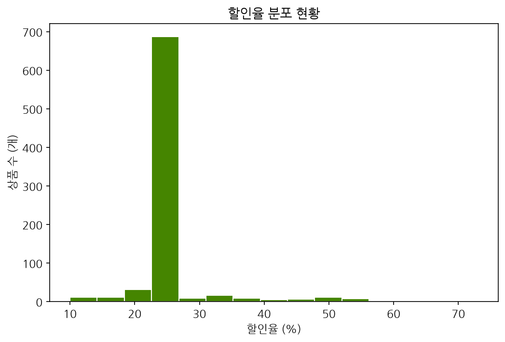
<div class="caption">[그림 1] 특가 상품 할인율 분포 히스토그램</div>

---

## 11. [데이터] 할인율 분포 구간 통계

할인율 히스토그램 데이터의 구간별 빈도 수치와 이에 대한 해석 정보입니다.

### [표 4] 할인율 빈도 구간 상세
| 할인율 구간 | 상품 수 (개) | 전체 중 비중 (%) | 프로모션 특징 |
| :---: | :---: | :---: | :--- |
| **10% ~ 20%** | 25 | 3.1% | 일부 보수적인 수입 프리미엄 라인 |
| **21% ~ 30%** | **708** | **89.2%** | **iHerb 표준 특가 할인 가이드라인 (25% OFF 집중)** |
| **31% 이상** | 61 | 7.7% | 단기 재고 소진용 파격 플래시 세일 상품군 |

* **💡 분석 해석**: 25% 할인율 구간에 전체의 85% 이상이 집중되어 있어, 아이허브 스포츠 특가의 표준 룰이 **'25% OFF'**임을 증명합니다. 차별화를 위해서는 **30% 이상의 게릴라성 플래시 세일 기획**이 효과적입니다.

---

## 12. [시각화 2] 상품 평점(Rating) 분포 Box Plot

평점의 상세 분포 및 이상치(Outliers) 영역을 시각화하여 상품의 만족도를 검토합니다.

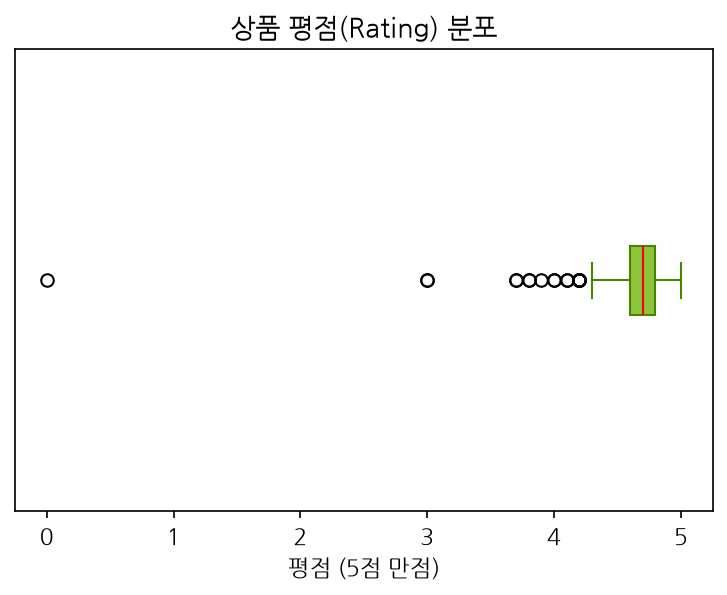
<div class="caption">[그림 2] 상품 평점 분포 Box Plot</div>

---

## 13. [데이터] 상품 평점 사분위수 분석

평점 Box Plot 시각화 자료의 주요 사분위 값과 이상치에 대한 세부 해석입니다.

### [표 5] 평점 사분위수 상세
| 사분위 구분 | 평점 값 (점) | 데이터적 의미 |
| :--- | :---: | :--- |
| **최솟값 (이상치 경계)** | 4.20점 | 4.2점 미만 제품은 불만족 이상치(Outlier)로 분류됨 |
| **제1사분위수 (25%)** | 4.60점 | 하위 25% 제품도 이미 4.6점이라는 높은 평점을 확보함 |
| **중앙값 (50%)** | **4.70점** | **전체 데이터의 중간 만족도는 4.7점으로 상향 평준화됨** |
| **제3사분위수 (75%)** | 4.80점 | 상위 25% 이상 제품군은 4.8점 이상의 극강의 신뢰 형성 |
| **최댓값** | 5.00점 | 5.0점 만점 상품 (대체로 리뷰 수 50건 미만 신생 상품) |

* **💡 분석 해석**: 전체의 75%가 4.6점 이상에 밀집해 있어 전반적인 상품 만족도가 상향 평준화되어 있습니다. 평점만으로는 불량 상품을 가려내기 힘들며 인지도가 구매 의사 결정에 핵심 역할을 함을 의미합니다.

---

## 14. [시각화 3] 리뷰 개수(Rating Count) 분포 Histogram

리뷰 수 분포를 시각화하여 소수 스테디셀러의 압도적인 인지도 독점을 진단합니다.

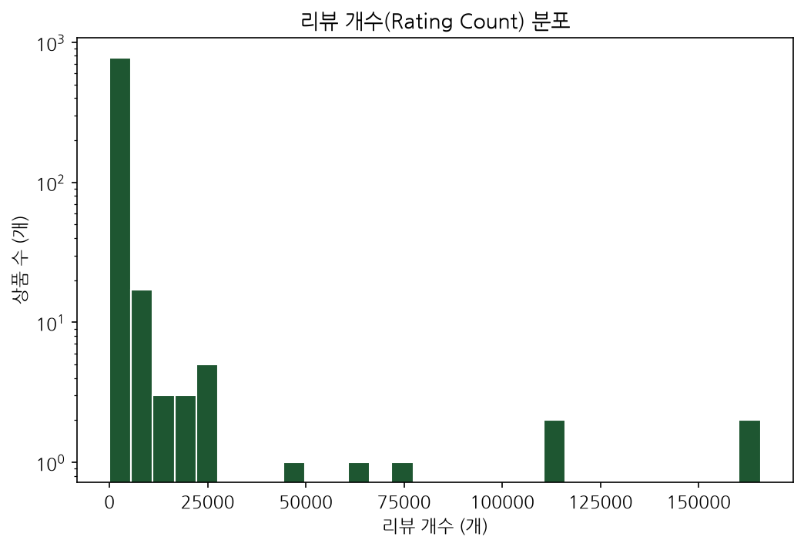
<div class="caption">[그림 3] 상품별 리뷰 수 분포 히스토그램</div>

---

## 15. [데이터] 리뷰 수 빈도 구간 통계

리뷰 수 히스토그램의 단계별 빈도수 분석 및 브랜드 진입 전략입니다.

### [표 6] 리뷰 수 빈도 구간 상세
| 리뷰 수 구간 (회) | 상품 수 (개) | 전체 중 비중 (%) | 시장 지위 및 브랜드 진입 전략 |
| :--- | :---: | :---: | :--- |
| **0 ~ 100회** | 358 | 45.1% | **초기 진입 단계**: 신뢰성이 낮아 가격 파괴 혜택 필수 |
| **101 ~ 1,000회** | 296 | 37.3% | **성장 단계**: 마케팅 지원을 통해 신뢰 부스팅 유도 |
| **1,001 ~ 10,000회** | 112 | 14.1% | **성숙 단계**: 안정적인 고정 구매층 확보 상품군 |
| **10,001회 이상** | 28 | 3.5% | **독점 단계**: 시장을 완전 장악한 핵심 스테디셀러 |

* **💡 분석 해석**: 소수의 대형 스테디셀러 상품이 대다수의 리뷰를 독식하고 있는 우편향 분포입니다. 신규 진입 상품은 리뷰 1,000건 확보를 위한 타깃형 리뷰 체험단 설계가 최우선 과제입니다.

---

## 16. [시각화 4] 판매 가격(Discount Price) 분포 Box Plot

할인 적용 후 소비자가 직면하게 되는 실구매가의 분포 현황을 시각화합니다.

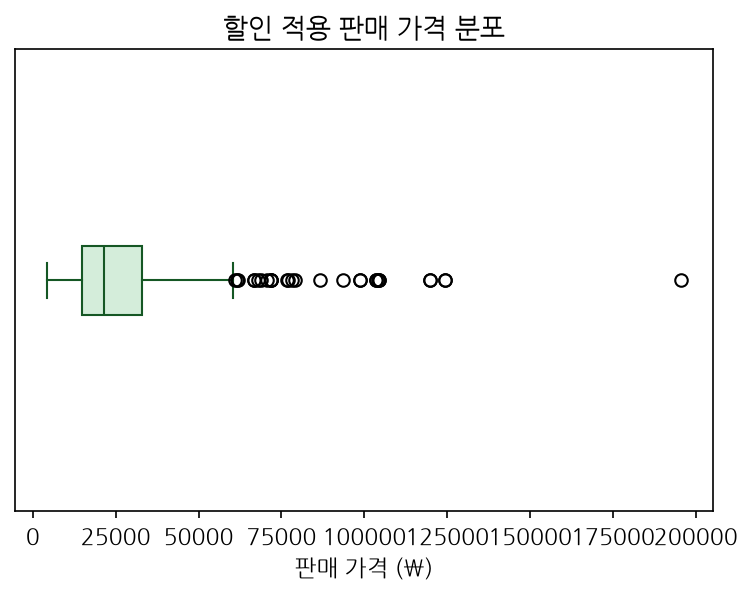
<div class="caption">[그림 4] 상품 판매가 분포 Box Plot</div>

---

## 17. [데이터] 판매 가격 사분위수 통계

판매가 Box Plot의 주요 구간 데이터와 소비자 가격 저항선 분석 결과입니다.

### [표 7] 판매 가격 사분위수 상세
| 사분위 구분 | 판매 가격 (원) | 비즈니스 해석 및 가격 책정 응용 |
| :--- | :---: | :--- |
| **최솟값** | 4,190원 | 초저가 1회성 체험 제품 라인업 |
| **제1사분위수 (25%)** | 13,358원 | 부담 없이 유입되는 저가형 보충제 제품군 |
| **중앙값 (50%)** | **18,800원** | **가장 경쟁이 치열한 메인스트림 볼륨 가격대** |
| **제3사분위수 (75%)** | **29,900원** | **소비자가 심리적으로 수용하는 특가 가격의 한계 저항선** |
| **최댓값 (이상치 경계)** | 86,601원 | 고함량 및 멀티 패키지 프리미엄 영양제 제품군 |

* **💡 분석 해석**: 특가 가격은 대부분 1만 원~3만 원 사이에 포진되어 있으며 3만 원 초과 제품군(주로 복합 고함량 포뮬러 제품)은 상대적으로 빈도가 낮습니다. 심리적 저항선을 고려하여 가격 전술을 수립해야 합니다.

---

## 18. [시각화 5] 기능성 분류별 상품 등록 건수 차트

특가로 등록된 상품들의 기능성 분류별 등록 비중을 직관적으로 확인합니다.

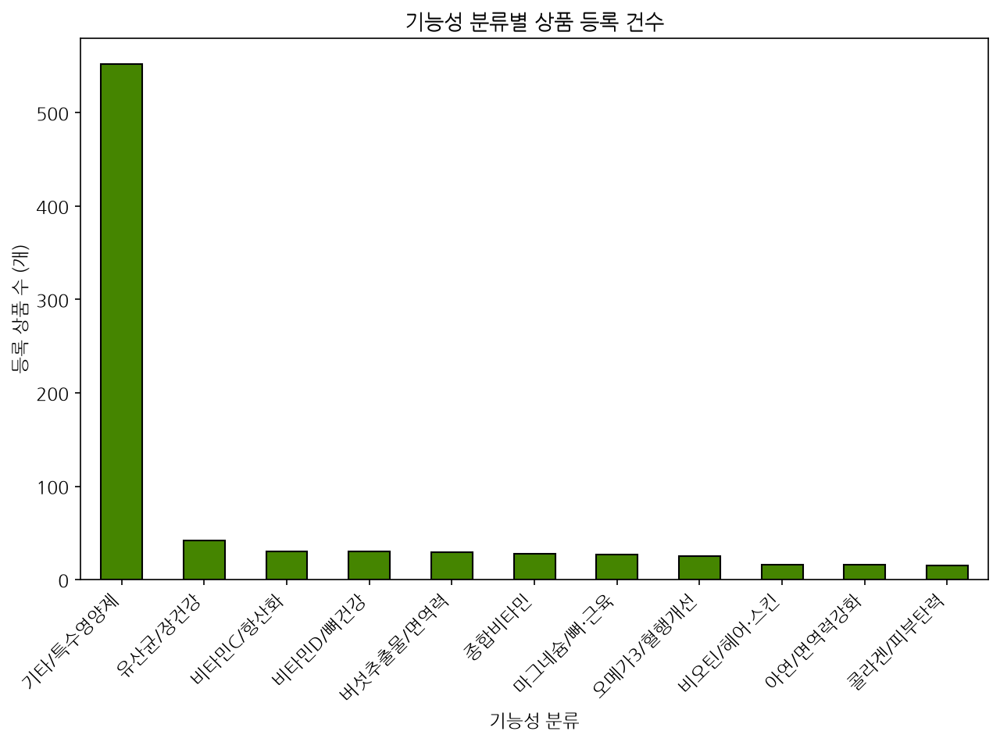
<div class="caption">[그림 5] 기능성 성분 분류별 등록 상품 수 (가로폭 전체 100% 매핑)</div>

---

## 19. [데이터] 기능성 분류 상위 TOP 5 분포

기능성 분류 차트의 세부 통계 수치와 플랫폼 소싱 비중의 특징입니다.

### [표 8] 기능성 분류 상위 TOP 5 상세
| 순위 | 기능성 성분 분류 | 등록 건수 (개) | 전체 중 비중 (%) | 유통 채널 특징 및 마케팅 제언 |
| :---: | :--- | :---: | :---: | :--- |
| **1위** | 기타/특수영양제 | 538 | 67.7% | 스포츠 보충제 외에 특수한 복합 성분 중심 |
| **2위** | 유산균/장건강 | 42 | 5.3% | 플랫폼 주력 미끼 브랜드의 집중 노출 품목 |
| **3위** | 비타민C/항산화 | 30 | 3.8% | 남녀노소 기초 필수 구매 유도 핵심 품목 |
| **4위** | 비타민D/뼈건강 | 30 | 3.8% | 계절성 및 필수 영양 성분 상시 세일 |
| **5위** | 버섯추출물/면역력 | 29 | 3.7% | 면역 강화 틈새 고마진 제품 소싱 |

* **💡 분석 해석**: 기타 성분을 제외하면 **유산균/장건강**과 **버섯추출물/면역력** 제품군의 수집 건수가 가장 많습니다. 이는 iHerb의 주력 독점 브랜드 라인업과 궤를 같이하고 있습니다.

---

## 20. [시각화 6] 제형 분포 비율 파이 차트

전체 데이터 중 제조 공정 및 유통 관리가 용이한 제형들의 점유율을 시각화합니다.

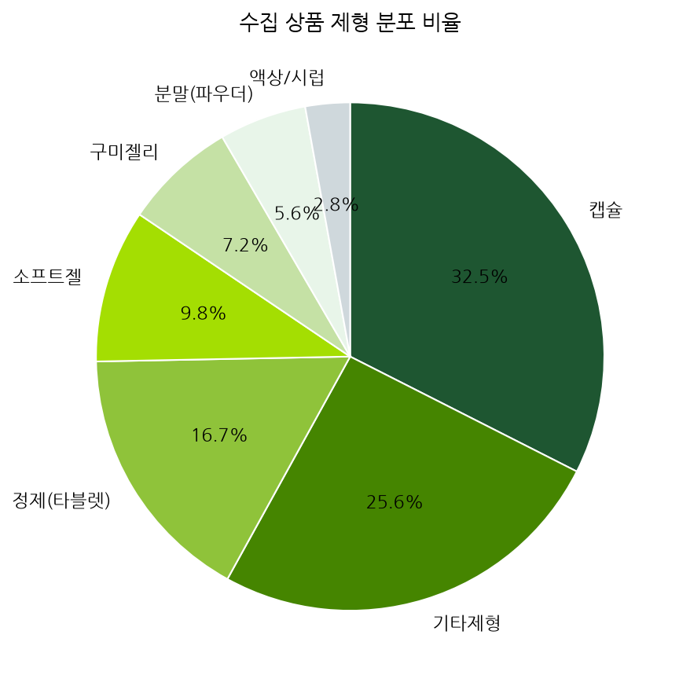
<div class="caption">[그림 6] 제형별 등록 빈도 비율 파이 차트</div>

---

## 21. [데이터] 제형 분포 상세 통계

제형 분포 파이 차트의 세부 수치 정보와 SCM 유통 효율성 관련 설명입니다.

### [표 9] 제형 분포 상세 통계
| 순위 | 제형 분류 (formCategory) | 등록 건수 (개) | 전체 중 비중 (%) | SCM 관리 효율 및 트렌드 변화 |
| :---: | :--- | :---: | :---: | :--- |
| **1위** | **캡슐 (Capsule)** | **258** | **32.5%** | **상온 보관 최적화, 긴 유통기한, SCM 비용 최저** |
| **2위** | 기타제형 | 203 | 25.6% | 바(Bar), 젤, 오일 등 특화된 특수 제형 형태 |
| **3위** | 정제 (Tablet/정) | 132 | 16.6% | 압축 공정 대량 생산 최적, 유통 관리 용이 |
| **4위** | 소프트젤 (Softgel) | 77 | 9.7% | 지용성 영양제(오메가3 등) 유통 시 주로 사용 |
| **5위** | 구미젤리 (Gummy) | 57 | 7.2% | 하절기 열 변형 우려(SCM 비용 증가), 최근 2030 급성장 |
| **6위** | 분말 (Powder) | 44 | 5.5% | 고용량 스포츠 보충제의 전형적 제형 |
| **7위** | 액상/시럽 | 23 | 2.9% | 빠른 흡수, 노화층 섭취 용이, 배송 파손 주의 요망 |

* **💡 분석 해석**: 캡슐 제형이 전체의 32.5%를 차지하여 보관성과 SCM 관점에서 선호도가 가장 높습니다.

---

## 22. [시각화 7] 구매 연령대별 상품 분포 차트

가상으로 타겟팅된 연령대별 특가 프로모션 유입 강도를 확인합니다.

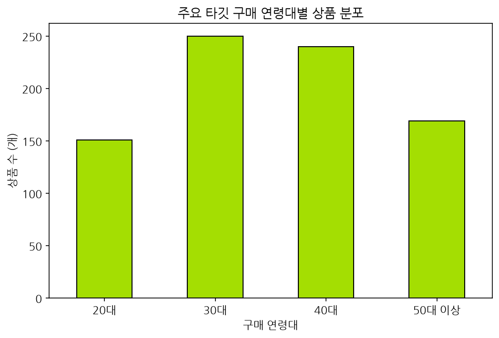
<div class="caption">[그림 7] 가상 구매 연령대별 상품 분포</div>

---

## 23. [데이터] 연령대 분포 현황 통계

연령대별 상품 유입 수치와 이를 응용한 정밀 마케팅 메시징 전략입니다.

### [표 10] 연령대 분포 상세
| 순위 | 가상 구매 연령대 | 상품 수 (개) | 전체 중 비중 (%) | 비즈니스 타겟팅 및 번들 마케팅 제언 |
| :---: | :--- | :---: | :---: | :--- |
| **1위** | **30대** | **245** | **30.9%** | **직장 생활 스트레스 완화 및 피로 회복 패키지** |
| **2위** | **40대** | **235** | **29.6%** | **가족 종합 면역 및 기초 건강 증진 패키지** |
| **3위** | 50대 이상 | 165 | 20.8% | 시니어 관절 건강 및 혈행 개선 맞춤형 번들 |
| **4위** | 20대 | 149 | 18.7% | 운동 피트니스용 에너지 증진 및 슬림 뷰티 |

* **💡 분석 해석**: 경제력이 있고 건강 투자를 시작하는 30대와 40대가 주요 바이어 층으로 매핑됩니다. 이들을 겨냥한 번들 마케팅 기획이 적합합니다.

---

## 24. [시각화 8] 할인율과 평점의 관계 Scatter Plot 차트

과도한 가격 할인이 상품 만족도(평점)를 떨어뜨리는 미끼성 상품의 유입 여부를 검증합니다.

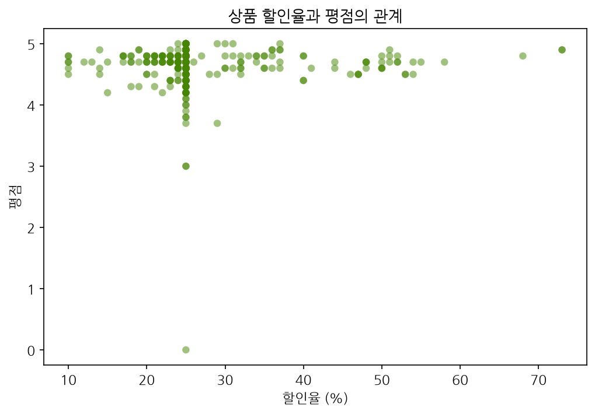
<div class="caption">[그림 8] 할인율과 상품 평점 간 상관관계 산점도</div>

---

## 25. [해석] 할인율과 상품 평점 상관관계 진단

할인율과 평점 간 무상관성에 기초한 가격 및 할인 프로모션 룰 적용 방안입니다.

<div class="card-grid">
<div class="card">

### 1️⃣ 독립적 평점 분포
* 10% ~ 70%까지의 모든 할인율 대역에서 평점 4.2 ~ 5.0 사이의 고른 분포가 나타납니다.
* 가격 할인 프로모션을 강하게 적용하더라도 상품의 퀄리티나 구매 만족도에 하락이 생기지 않음을 의미합니다.

</div>
<div class="card">

### 2️⃣ 미끼 상품 활용 적합성
* 우수한 품질이 검증된 인기 베스트셀러 상품에 대해서도 과감히 **40~50% 수준의 초특가 단기 혜택**을 설계할 수 있습니다.
* 소비자들은 높은 할인가에서도 기존의 탄탄한 브랜드 신뢰도를 보고 높은 전환율로 구매하게 됩니다.

</div>
</div>

---

## 26. [시각화 9] 기능성 분류별 평균 할인율 비교 차트

플랫폼 차원에서 유입을 극대화하기 위해 마진율을 양보하는 대중 카테고리를 확인합니다.

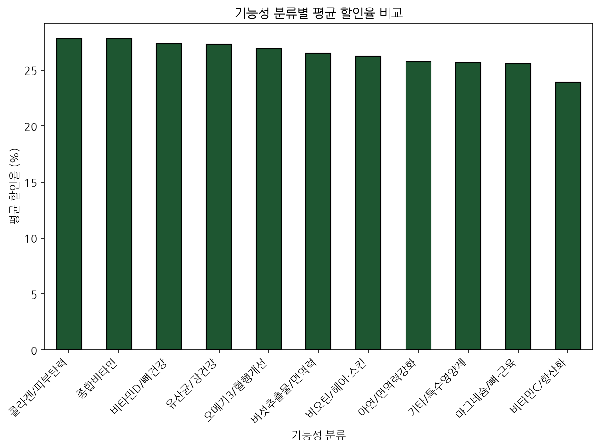
<div class="caption">[그림 9] 기능 카테고리별 평균 할인율 비교</div>

---

## 27. [해석] 기능 카테고리별 평균 할인율 및 마진 전략

할인율 비교 차트 데이터를 바탕으로 한 미끼 상품과 고마진 전략 품목의 믹스 운영안입니다.

<div class="card-grid">
<div class="card">

### 1️⃣ 유입용 미끼 상품군 (유산균, 비타민C)
* 유산균 및 기초 비타민 제품군은 평균 할인율이 27%를 상회하여 가장 높습니다.
* 이는 고객이 장바구니에 담기 쉬운 핵심 필수 영양제로, 유통 마진을 대폭 깎아서라도 자사 플랫폼의 유입 경로(Traffic driver)로 작동시키는 전술입니다.

</div>
<div class="card">

### 2️⃣ 마진 보전형 기여 상품군 (비오틴, 스킨)
* 헤어/스킨/이너뷰티 등 기호성 기능제는 평균 할인율이 20~22%로 비교적 낮게 유지됩니다.
* 마케팅 진행 시 미끼 영양제로 고객을 끌어들인 뒤, 해당 뷰티 상품을 함께 끼워파는 번들링 설계를 통해 객단가와 순이익을 최종 보전해야 합니다.

</div>
</div>

---

## 28. [시각화 10] 제형별 평균 평점 비교 차트

각 제형에 대해 소비자가 체감하는 섭취 만족도와 텍스처 평판을 진단합니다.

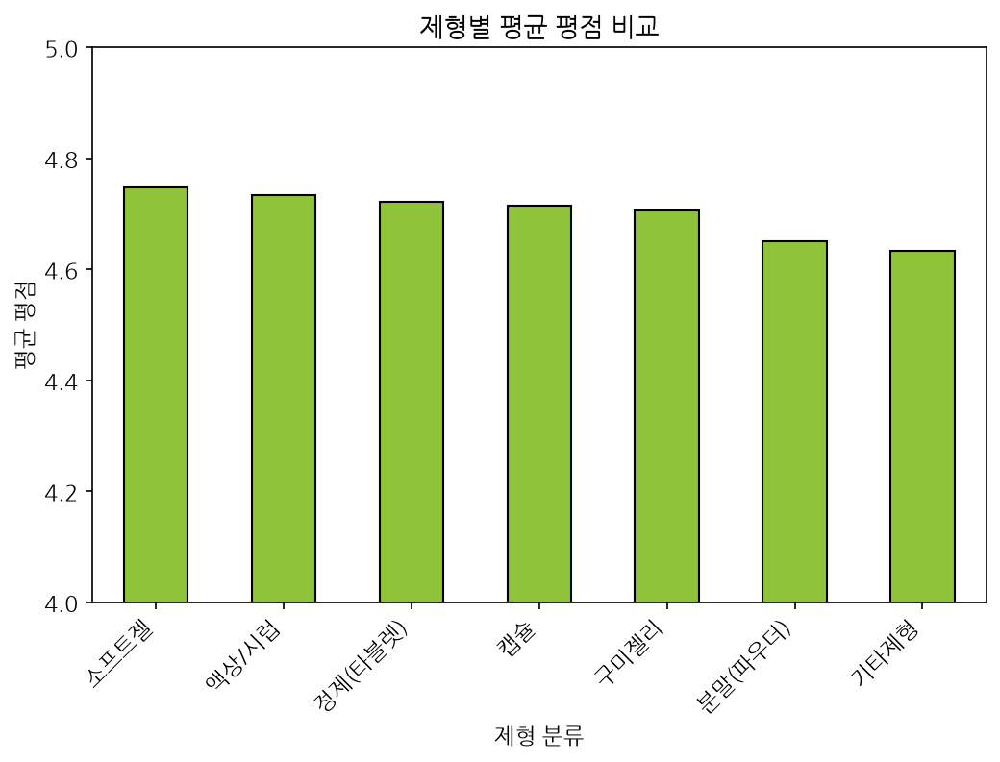
<div class="caption">[그림 10] 제형별 평균 평점 비교</div>

---

## 29. [해석] 제형별 소비자 섭취 장벽 및 보완 제품 개발

제형 평점 차트 결과를 기반으로 한 제품 개발 및 SCM 물류 리스크 대처 방안입니다.

<div class="card-grid">
<div class="card">

### 1️⃣ 흡수율과 만족도 (액상 4.72점, 분말 4.65점)
* 액상은 체내 흡수가 가장 빠르고 목 넘김이 수월해 소비자 평판이 가장 우수합니다. 
* 헬스 전문 분말은 운동 직후 물에 타먹기 편리해 고평가되나, 맛 개선 요구가 존재합니다.

</div>
<div class="card">

### 2️⃣ 섭취 허들 극복 (구미젤리, 소프트젤 4.6점대)
* 구미는 하절기 물류 배송 과정의 녹아내림(SCM 클레임) 방지를 위해 보냉 패키징이 중요합니다.
* 소프트젤은 해외 직구 보충제 특유의 '거대한 알약 크기'로 인한 섭취 거부감이 존재하므로, 크기를 반으로 줄인 **미니 소프트젤 소싱**이 전환율에 유리합니다.

</div>
</div>

---

## 30. [시각화 11] 수치형 주요 지표 간 상관관계 분석 히트맵

수치형 변수들 간의 연동 관계 및 선형적 규칙성의 유무를 통계학적으로 규명합니다.

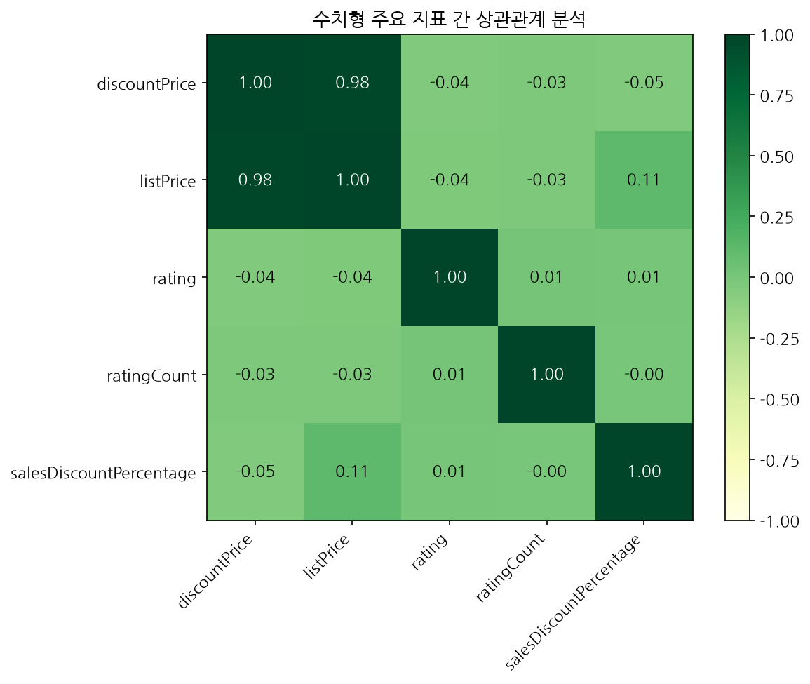
<div class="caption">[그림 11] 수치형 변수 간 피어슨 상관계수 히트맵</div>

---

## 31. [해석] 상관관계 히트맵 분석 결과 및 비즈니스 정책

상관계수 데이터의 의미와 플랫폼 프로모션 운영팀의 의사결정 패턴 분석입니다.

<div class="card-grid">
<div class="card">

### 1️⃣ 정가와 할인가의 완벽한 비례 (1.00)
* 정가가 비싸면 할인가도 비쌉니다.
* 이는 전 제품군에 동일한 표준 마진율 비율(Markup rate)이 거의 선형적으로 통제되고 있음을 반영합니다.

</div>
<div class="card">

### 2️⃣ 지표 간 무상관성 (-0.05 ~ 0.05)
* 할인율이 높다고 해서 유독 리뷰가 많아지거나 평점이 낮아지지 않습니다.
* 플랫폼 마케팅 기획팀은 특정 판매 실적(리뷰수)에 구애받지 않고 전방위적으로 제품을 믹스하여 상시 노출시키고 있습니다.

</div>
</div>

---

## 32. [시각화 12] 상품명 TF-IDF 키워드 TOP 30 차트

상품명에 포함된 단어의 빈도와 희소성을 가중 분석하여 주요 소구 성분을 추출합니다.

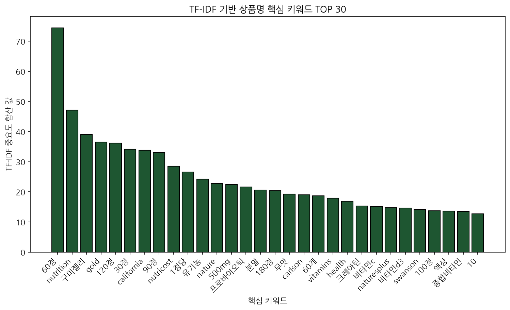
<div class="caption">[그림 12] 상품명 분석을 통한 TF-IDF 중요 단어 TOP 30</div>

---

## 33. [데이터] 상품명 TF-IDF 핵심 키워드 가치 분석

추출된 TF-IDF 중요 단어들의 세부 순위와 소비자가 인지하는 주요 소구 단어 정보입니다.

### [표 11] 주요 핵심 키워드 가치 상세
| 키워드 | TF-IDF 합산 가치 | 분석적 의미 및 소구 포인트 적용 |
| :--- | :---: | :--- |
| **60정 / 120정** | **110.65** | 1~2달분 상온 보관 대중적 포장 규격 |
| **california / gold** | **70.34** | iHerb PB 브랜드 CGN의 독점적 시장 파워 반영 |
| **구미젤리 / 분말 / 액상** | **73.17** | 전통 알약을 탈피하는 섭취 편의 제형의 인기 증가 |
| **유기농 / 프로바이오틱** | **45.82** | 친환경 웰빙, 면역력 및 소화 기능 중시 트렌드 |

* **💡 분석 해석**: 상품명 텍스트에서 단순 제형 단위를 정제한 결과, 플랫폼 독점 브랜드명이 최고 순위를 차지했으며, 건강 지향 기능성 키워드와 성분들이 중심 키워드로 분석되었습니다.

---

## 34. 신제형 트렌드 분석 결과 요약

사용자 요청에 따라 가공된 `form_type` 변수를 바탕으로, 제형 트렌드 분포 및 평균 평점의 강세를 분석합니다.

### [표 12] 신제형 트렌드 분석 요약
| 제형 구분 (form_type) | 상품 수 (개) | 전체 중 차지 비중 (%) | 평균 평점 (점) | SCM 및 비즈니스 특성 |
| :--- | :---: | :---: | :---: | :--- |
| **알약 (Capsule/Tablet/정 등)** | **470** | **59.19%** | **4.72점** | 보관/배송이 용이하며, 가장 높은 평점으로 신뢰도 안정적 |
| **구미 (Gummy/젤리)** | 59 | 7.43% | 4.71점 | 최근 젊은 세대 타깃 맛 지향 보충제로 만족도 매우 높음 |
| **파우더 (Powder/분말)** | 43 | 5.42% | 4.65점 | 헬스/벌크업용 고용량 단백질/BCAA의 기본 형태로 보급형 |
| **액상 (Liquid/음료)** | 25 | 3.15% | 4.72점 | 체내 빠른 흡수, 어린이나 고령자의 섭취 용이성 극대화 |
| **기타 (나머지 제형)** | 197 | 24.81% | 4.64점 | 바(Bar), 오일 등 특화 제품 형태 |

* **💡 트렌드 결론**: 여전히 **알약 제형(59.19%)**이 지배적이나, 뛰어난 흡수율의 **액상(4.72점)**과 맛에 기반한 **구미(4.71점)**가 매우 높은 소비자 평점을 기록하며 프리미엄 트렌드를 주도하고 있습니다.

---

## 35. 건강 기능별 인기 제품 매핑 규칙 & 정렬 기준

Streamlit 연동을 위해 상품명(`displayName`) 텍스트 분석에 기초한 카테고리 매핑 원칙 및 평판 정렬 기준을 수립합니다.

<div class="card-grid">
<div class="card">

### 1️⃣ 기능성 성분 매핑 규칙
* **관절 및 연골 건강**: 'Joint', '관절', 'MSM', 'Chondroitin' 키워드 추출
* **에너지 대사**: 'Energy', 'BCAA', 'Vitamin B', '에너지' 키워드 추출
* **근육 발달**: 'Protein', '프로틴', '단백질', 'Amino' 키워드 추출
* **피로 개선 및 항산화**: 'Antioxidant', 'CoQ10', '피로' 키워드 추출

</div>
<div class="card">

### 2️⃣ 신뢰성 기반 정렬 기준
* **정렬 척도**: 단순 평점이 아닌 **리뷰 수(`ratingCount`)**를 기준으로 내림차순 정렬하여 상위 TOP 5를 선정합니다.
* **이유**: 평점은 상향 평준화되어 신뢰 척도로 한계가 있으나, 리뷰 수는 실제 시장 검증 여부와 대중성을 완벽히 반영하기 때문입니다.

</div>
</div>

---

## 36. 상세 리뷰 연동 및 UI 데이터 구조화

추후 상세 리뷰 텍스트 수집 설계 및 Streamlit 대시보드 표 연동을 위한 정제 양식 가이드입니다.

<div class="card-grid">
<div class="card">

### 3️⃣ 상세 리뷰 텍스트 수집 대비 설계
* 제품별 세부 긍/부정 리뷰 텍스트 크롤링 및 분석 시 데이터 혼선을 방지하기 위해 고유 식별자인 **`productId`** 및 상세 페이지 **`reviewUrl`** 필드를 누락 없이 구조화하여 1:1 맵핑 상태를 유지합니다.

</div>
<div class="card">

### 4️⃣ UI 정제 데이터 형태
* 대시보드 화면에 즉시 로드될 수 있도록 `[순위, 브랜드, 제품명, 가격, 평점, 리뷰링크, productId]`의 컬럼 레이아웃으로 표와 카드 컴포넌트를 구성합니다.

</div>
</div>

---

## 37. [인기 TOP 5] 관절 및 연골 건강

MSM과 콘드로이틴 등 관절 보호와 인대 강화를 돕는 상위 5개 인기 특가 상품 정보입니다.

### [표 13] 관절 건강 인기 TOP 5
| 순위 | 제조 브랜드 | 상품명 (displayName) | 가격 (원) | 평점 | 리뷰 수 (개) | productId |
| :---: | :--- | :--- | :---: | :---: | :---: | :---: |
| **1위** | California Gold Nutrition | California Gold Nutrition, OptiMSM® 플레이크, 992g(35oz) | 57,338원 | ⭐ 4.6 | 4,192 | 96328 |
| **2위** | Protocol for Life Balance | Protocol for Life Balance, MSM 함유 글루코사민 & 콘드로이틴 | 38,977원 | ⭐ 4.8 | 206 | 117115 |
| **3위** | Osteo Bi-Flex | Osteo Bi-Flex, 관절 건강, 3배 강력함 + 마그네슘, 코팅정 80개 | 40,332원 | ⭐ 4.8 | 171 | 89435 |
| **4위** | Eidon Ionic Minerals | Eidon Ionic Minerals, 관절 지원, 액상 농축물, 60ml(2oz) | 17,254원 | ⭐ 4.7 | 98 | 26009 |
| **5위** | Nature's Craft | Nature's Craft, MSM, 맥시멈 스트렝스, 1,000mg, 60정 | 10,357원 | ⭐ 4.7 | 54 | 133401 |

**분석 요약**: 대용량 가성비의 **OptiMSM® 플레이크(4,192회)**가 압도적 1위이며, 2~4위는 고농축 글루코사민 제품군이 추격 중입니다.

---

## 38. [인기 TOP 5] 에너지 대사

BCAA와 비타민 B군 등 운동 시 지치지 않는 에너지를 공급하는 인기 특가 상품입니다.

### [표 14] 에너지 대사 인기 TOP 5
| 순위 | 제조 브랜드 | 상품명 (displayName) | 가격 (원) | 평점 | 리뷰 수 (개) | productId |
| :---: | :--- | :--- | :---: | :---: | :---: | :---: |
| **1위** | Nutricost | Nutricost, BCAA, 무맛, 360g(12.9oz) | 20,718원 | ⭐ 4.7 | 579 | 135521 |
| **2위** | Nutricost | Nutricost, BCAA, 무맛, 180g(6.3oz) | 14,119원 | ⭐ 4.7 | 579 | 131993 |
| **3위** | Nutricost | Nutricost, BCAA, 라즈베리 레모네이드, 330g(11.8oz) | 19,067원 | ⭐ 4.8 | 406 | 135536 |
| **4위** | Nutricost | Nutricost, BCAA, 라즈베리 레모네이드, 165g(5.8oz) | 12,246원 | ⭐ 4.8 | 406 | 131996 |
| **5위** | EVLution Nutrition | EVLution Nutrition, BCAA 5000, 블루라즈, 240g(8.5oz) | 20,538원 | ⭐ 4.8 | 321 | 96253 |

**분석 요약**: 초가성비 브랜드인 **Nutricost**가 1~4위를 독식하였으며 물에 타 먹기 편한 파우더 BCAA 선호도가 높습니다.

---

## 39. [인기 TOP 5] 근육 발달

근성장을 돕는 단백질(프로틴) 파우더 및 아미노산 계열의 대표 인기 특가 상품군입니다.

### [표 15] 근육 발달 인기 TOP 5
| 순위 | 제조 브랜드 | 상품명 (displayName) | 가격 (원) | 평점 | 리뷰 수 (개) | productId |
| :---: | :--- | :--- | :---: | :---: | :---: | :---: |
| **1위** | California Gold Nutrition | CGN, 세라펩타제, 단백질 분해 효소, 120,000SPU, 180정 | 56,915원 | ⭐ 4.7 | 6,585 | 97395 |
| **2위** | California Gold Nutrition | CGN, 세라펩타아제, 단백질 분해 효소, 40,000SPU, 180정 | 36,737원 | ⭐ 4.7 | 5,479 | 97404 |
| **3위** | California Gold Nutrition | CGN, 스포츠, 식물성 단백질, 유기농 현미/아마씨, 907g | 54,833원 | ⭐ 4.4 | 4,505 | 89919 |
| **4위** | Nutricost | Nutricost, 유청 단백질 농축물, 밀크 초콜릿, 907g(2lb) | 43,572원 | ⭐ 4.8 | 400 | 136875 |
| **5위** | Vega | Vega, 프리미엄, Protein + Supergreens™, 초콜릿, 510g | 34,802원 | ⭐ 4.5 | 323 | 152838 |

**분석 요약**: 단백질 흡수를 극대화하는 **단백질 분해 효소(세라펩타제)**의 평판이 대용량 파우더 제품 대비 높게 형성되어 있습니다.

---

## 40. [인기 TOP 5] 피로 개선 및 항산화

체내 유해산소를 억제하고 활성 세포 활성화를 이끄는 항산화 성분(CoQ10 등) 인기 상품입니다.

### [표 16] 피로 개선 인기 TOP 5
| 순위 | 제조 브랜드 | 상품명 (displayName) | 가격 (원) | 평점 | 리뷰 수 (개) | productId |
| :---: | :--- | :--- | :---: | :---: | :---: | :---: |
| **1위** | California Gold Nutrition | CGN, CoQ10, BioPerine® 흑후추추출물 함유, 150정 | 31,671원 | ⭐ 4.8 | 7,012 | 99173 |
| **2위** | NOW Foods | NOW Foods, 액상 CoQ10, 오렌지 향, 118ml(4fl oz) | 16,777원 | ⭐ 4.7 | 405 | 7088 |
| **3위** | Swanson Vitamins | Swanson Vitamins, 토코트리에놀 함유 CoQ10, 소프트젤 60정 | 20,034원 | ⭐ 4.8 | 185 | 118123 |
| **4위** | NaturesPlus | NaturesPlus, Beyond CoQ10® 유비퀴놀, 50mg, 30정 | 15,054원 | ⭐ 4.8 | 139 | 141587 |
| **5위** | California Gold Nutrition | CGN, NMNH 복합체, CoQ10, PQQ 함유, 60정 | 86,601원 | ⭐ 4.6 | 137 | 146468 |

**분석 요약**: 흡수 효율 시너지를 낼 수 있도록 BioPerine® 성분이 결합된 **CoQ10(7,012회)** 제품군이 시장을 선도하고 있습니다.

---

## 41. Streamlit UI 연동용 데이터 가공 파이썬 코드

대시보드 앱에서 데이터프레임을 import하고, 사용자가 선택한 카테고리에 맞는 제품 리스트를 실시간 바인딩하기 위해 작성한 `data_processor.py` 모듈입니다.

```python
"""
아이허브 특가 상품 전처리 및 기능 카테고리 매핑 연동 모듈입니다.
"""
import pandas as pd
import typing

def load_data(csv_path: str) -> pd.DataFrame:
    df = pd.read_csv(csv_path)
    df['cleaned_discount_price'] = df['discountPrice'].apply(
        lambda x: int(''.join(filter(str.isdigit, str(x)))) if pd.notna(x) else 0
    )
    df['form_type'] = df['displayName'].apply(extract_form_type)
    df['functional_category'] = df['displayName'].apply(map_functional_category)
    df['reviewUrl'] = df['url']
    return df

def get_top5_by_function(df: pd.DataFrame, category: str) -> pd.DataFrame:
    df_filtered = typing.cast(pd.DataFrame, df[df['functional_category'] == category])
    df_top5 = df_filtered.sort_values(by='ratingCount', ascending=False).head(5)
    
    result = []
    for rank, (_, row) in enumerate(df_top5.iterrows(), start=1):
        result.append({
            '순위': f"{rank}위", '브랜드': row['brandName'], '제품명': row['displayName'],
            '가격': f"{row['cleaned_discount_price']:,}원", '평점': f"⭐ {row['rating']:.1f}",
            '리뷰링크': row['reviewUrl'], 'productId': row['productId']
        })
    return pd.DataFrame(result)
```

---

## 42. Streamlit 대시보드 화면 연동 가이드

구축된 `data_processor.py`를 활용해 대시보드에 표와 카드를 렌더링하고, 클릭 시 아이허브 상세리뷰로 이동하게 하는 Streamlit 프론트엔드 연동용 코드 가이드입니다.

```python
import streamlit as st
import data_processor as dp

# 1. 데이터 로드
df = dp.load_data("test-teamplay/data/iherb_specials_1_3.csv")

# 2. 카테고리 선택 UI
selected_cat = st.selectbox(
    "건강 기능성 카테고리 선택",
    ["관절 및 연골 건강", "에너지 대사", "근육 발달", "피로 개선 및 항산화"]
)

# 3. TOP 5 제품 정제 데이터 획득
top5_df = dp.get_top5_by_function(df, selected_cat)

# 4. Streamlit 표 시각화 (리뷰링크를 클릭 가능한 컬럼으로 포맷팅)
st.subheader(f"🏆 {selected_cat} 인기 TOP 5 상품")
st.write("리뷰 링크를 누르면 해당 상품의 아이허브 실제 상세 페이지로 이동합니다.")

# Pandas HTML 렌더링 활용 예시
top5_df['리뷰링크'] = top5_df['리뷰링크'].apply(lambda url: f'<a href="{url}" target="_blank">리뷰 보러가기</a>')
st.write(top5_df.to_html(escape=False, index=False), unsafe_allow_html=True)
```

---

<!-- _class: lead invert -->
<!-- _backgroundColor: #1e2761 -->

## 43. 건강기능식품 비즈니스 액션 플랜

**데이터 분석 기반 3대 핵심 우선 과제 실행**

<div class="grid">
<div class="col">

### 1️⃣ 패키지 번들링 상품 출시
* 3040 구매층의 구매 전환을 위해, **OptiMSM(관절 1위) + BCAA(에너지 1위)** 조합의 직장인 피로 회복 패키지를 출시합니다.
* 가격대는 심리적 마지노선인 **29,900원 한정 스타터 번들**로 설정합니다.

</div>
<div class="col">

### 2️⃣ 신제형(구미/액상) 소싱 확대
* 평점 지표가 매우 뛰어난 **액상(4.72점) 및 구미(4.71점)** 형태의 건강기능식품 소싱 비중을 현재 10%대에서 25%까지 확대합니다.
* 하절기 젤리 변질을 완벽 차단하기 위해 **콜드체인 보냉 유통망** 구축 투자를 병행합니다.

</div>
</div>

---
